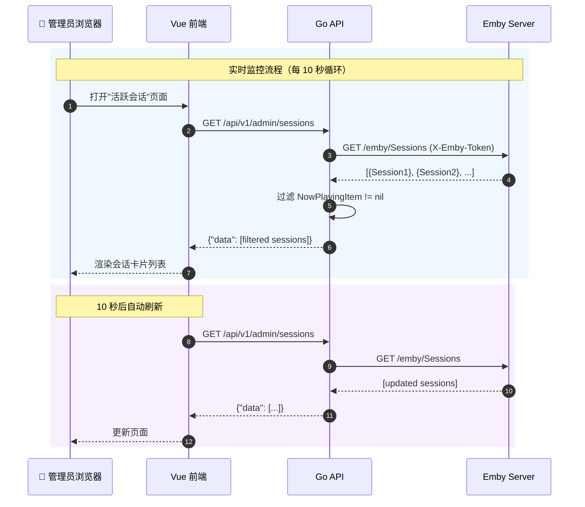
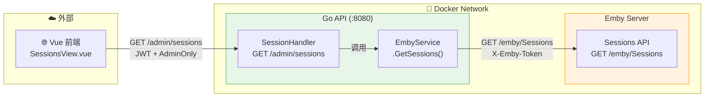

# 活跃会话监控功能实现方案

## 背景与目标

管理员需要实时监控 Emby 服务器上正在播放的会话，了解谁在看什么、用什么设备、播放方式（DirectPlay/Transcode）等信息，用于服务器负载监控和用户活动管理。

**本方案实现**：
1. 通过 Emby Sessions API 获取当前活跃播放会话
2. 仅管理员可访问的监控页面
3. 支持 10 秒自动刷新，实时查看播放状态
4. PlayMethod 颜色标签区分 DirectPlay/Transcode，直观反映服务器负载

**不做的事**：
- 不做数据库持久化（会话是实时快照，存储无意义）
- 不做 WebSocket 实时推送（轮询足够，会话数量少）
- 不做会话踢出/终止功能（MVP 仅做查看）
- 不做与 Ember 用户的关联匹配（Emby 已返回 UserName）

**前提条件**：Emby 服务器正常运行，已配置 `EMBY_URL` 和 `EMBY_API_KEY`

---

## 一、架构设计

### 1.1 数据流



### 1.2 服务架构图



### 1.3 关键设计决策

**为什么不存数据库**：
- 会话是 Emby 内存中的实时快照，服务重启即消失
- 数据的所有权属于 Emby，Ember 只是展示窗口
- 存储实时数据需要处理过期清理、数据同步等复杂问题，收益为零

**为什么用轮询而非 WebSocket**：
- 同时在线播放的会话通常不超过 10-20 个，数据量极小
- 10 秒轮询的 HTTP 开销可以忽略不计
- WebSocket 需要维护连接状态、处理重连，复杂度远超收益
- Emby 自身的 Sessions API 也是 HTTP GET，不提供 WebSocket 推送

**为什么 GetSessions() 加到 EmbyService 而非新建 Service**：
- `EmbyService` 就是 Emby HTTP 客户端层，`GetUsers()`、`GetMediaStats()`、`QueryPlaybackStats()` 都在这里
- Sessions API 是同层次的 Emby API 代理调用，不存在额外业务逻辑
- 新建 Service 只会增加无意义的间接层

**为什么 Handler 用独立文件**：
- `SystemHandler` 负责系统维护（cron、连接测试）
- 活跃会话是独立的监控领域，一个 handler 对应一个功能域

---

## 二、Emby Sessions API 参考

### 端点

```
GET /emby/Sessions
```

### 认证

```
X-Emby-Token: {EMBY_API_KEY}
```

### 响应体（数组）

```json
[
  {
    "Id": "4de66e1e6b8a4cae89542dc6f7ee7623",
    "UserId": "e8837bc1ad67520e8cd2f629e3155721",
    "UserName": "John",
    "Client": "Emby Theater",
    "DeviceName": "LIVINGROOM-PC",
    "DeviceId": "LIVINGROOM-PC",
    "RemoteEndPoint": "192.168.1.4",
    "ApplicationVersion": "3.0.5243.22734",
    "LastActivityDate": "2014-05-15T09:52:52.5898360Z",
    "NowPlayingItem": {
      "Name": "The Matrix",
      "Id": "movie-001",
      "Type": "Movie",
      "MediaType": "Video",
      "RunTimeTicks": 81840000000,
      "SeriesName": "Parks and Recreation",
      "IndexNumber": 17,
      "ParentIndexNumber": 5,
      "ProductionYear": 2013
    },
    "PlayState": {
      "PositionTicks": 100000000,
      "CanSeek": true,
      "IsPaused": false,
      "IsMuted": false,
      "VolumeLevel": 75,
      "PlayMethod": "DirectStream"
    }
  }
]
```

### 关键字段说明

| 字段 | 说明 |
|------|------|
| `NowPlayingItem` | **仅在有活跃播放时存在**，判断是否正在播放的唯一标准 |
| `RunTimeTicks` / `PositionTicks` | 单位：ticks（1 秒 = 10,000,000 ticks），需要 ÷ 10000000 转换为秒 |
| `PlayMethod` | `DirectPlay`（直接播放，零负载）/ `DirectStream`（直连流，轻量）/ `Transcode`（转码，高 CPU） |
| `Type` | `Movie` 或 `Episode` |
| `SeriesName` + `ParentIndexNumber` + `IndexNumber` | 仅 Episode 类型有值，用于格式化为 `SeriesName S01E02` |

---

## 三、Go API 变更

### 3.1 变更文件清单

| 文件 | 操作 | 说明 |
|------|------|------|
| `services/api/internal/services/emby.go` | **修改** | 新增 3 个 struct + `GetSessions()` 方法 |
| `services/api/internal/handlers/session.go` | **新建** | SessionHandler + GetActiveSessions |
| `services/api/cmd/server/main.go` | **修改** | 创建 handler + 注册路由 |

### 3.2 修改：EmbyService 新增 GetSessions

**文件**：`services/api/internal/services/emby.go`（在文件末尾 line 621 后追加）

**新增类型**：

```go
// EmbyNowPlayingItem 当前播放媒体信息
type EmbyNowPlayingItem struct {
	Name              string `json:"Name"`
	ID                string `json:"Id"`
	Type              string `json:"Type"`              // "Movie" 或 "Episode"
	MediaType         string `json:"MediaType"`          // "Video"
	RunTimeTicks      int64  `json:"RunTimeTicks"`       // 总时长（ticks，÷10000000=秒）
	SeriesName        string `json:"SeriesName,omitempty"`        // 剧集名（仅 Episode）
	IndexNumber       int    `json:"IndexNumber,omitempty"`       // 集号（仅 Episode）
	ParentIndexNumber int    `json:"ParentIndexNumber,omitempty"` // 季号（仅 Episode）
	ProductionYear    int    `json:"ProductionYear,omitempty"`    // 年份
}

// EmbyPlayState 播放状态
type EmbyPlayState struct {
	PositionTicks int64  `json:"PositionTicks"` // 当前进度（ticks）
	IsPaused      bool   `json:"IsPaused"`
	IsMuted       bool   `json:"IsMuted"`
	PlayMethod    string `json:"PlayMethod"` // "DirectPlay" / "DirectStream" / "Transcode"
}

// EmbySession Emby 会话信息
type EmbySession struct {
	ID                 string              `json:"Id"`
	UserID             string              `json:"UserId"`
	UserName           string              `json:"UserName"`
	Client             string              `json:"Client"`             // 客户端名称（Emby Web, Infuse...）
	DeviceName         string              `json:"DeviceName"`         // 设备名称
	DeviceID           string              `json:"DeviceId"`
	RemoteEndPoint     string              `json:"RemoteEndPoint"`     // 客户端 IP
	ApplicationVersion string              `json:"ApplicationVersion"`
	LastActivityDate   string              `json:"LastActivityDate"`
	NowPlayingItem     *EmbyNowPlayingItem `json:"NowPlayingItem,omitempty"` // 仅播放中存在
	PlayState          *EmbyPlayState      `json:"PlayState,omitempty"`
}
```

**新增方法**：

```go
// GetSessions 获取 Emby 当前正在播放的会话
func (s *EmbyService) GetSessions() ([]EmbySession, error) {
	if s.baseURL == "" || s.apiKey == "" {
		return nil, errors.New("Emby 配置未设置（EMBY_URL 或 EMBY_API_KEY）")
	}

	url := fmt.Sprintf("%s/emby/Sessions", s.baseURL)
	req, err := http.NewRequest("GET", url, nil)
	if err != nil {
		return nil, err
	}

	req.Header.Set("X-Emby-Token", s.apiKey)

	resp, err := s.client.Do(req)
	if err != nil {
		return nil, fmt.Errorf("无法连接到 Emby 服务器：%v", err)
	}
	defer resp.Body.Close()

	body, err := io.ReadAll(resp.Body)
	if err != nil {
		return nil, err
	}

	if resp.StatusCode != http.StatusOK {
		return nil, fmt.Errorf("获取 Emby 会话列表失败：HTTP %d: %s", resp.StatusCode, string(body))
	}

	var sessions []EmbySession
	if err := json.Unmarshal(body, &sessions); err != nil {
		return nil, err
	}

	// 只返回正在播放的会话（有 NowPlayingItem 的）
	playing := make([]EmbySession, 0)
	for _, session := range sessions {
		if session.NowPlayingItem != nil {
			playing = append(playing, session)
		}
	}

	return playing, nil
}
```

**设计要点**：
- 在 Service 层过滤 `NowPlayingItem != nil`，不依赖 Emby 的 `?IsPlaying=true` 参数（版本兼容性不一致）
- Ember 内部 API 字段使用 camelCase；在 Handler 层做 DTO 映射，避免把 Emby 的 PascalCase 数据模型泄漏到项目内部
- 复用现有的 `s.client`（10 秒超时）和 `X-Emby-Token` 认证模式

### 3.3 新建：SessionHandler

**新文件**：`services/api/internal/handlers/session.go`

```go
package handlers

import (
	"net/http"

	"github.com/gin-gonic/gin"
	"github.com/konghang/ember/backend/internal/services"
)

// SessionHandler 活跃会话处理器
type SessionHandler struct {
	embyService *services.EmbyService
}

// NewSessionHandler 创建活跃会话处理器
func NewSessionHandler() *SessionHandler {
	return &SessionHandler{
		embyService: services.NewEmbyService(),
	}
}

// GetActiveSessions 获取当前活跃播放会话
// GET /api/v1/admin/sessions
func (h *SessionHandler) GetActiveSessions(c *gin.Context) {
	sessions, err := h.embyService.GetSessions()
	if err != nil {
		c.JSON(http.StatusInternalServerError, gin.H{"error": err.Error()})
		return
	}

	c.JSON(http.StatusOK, gin.H{"data": sessions})
}
```

**设计要点**：
- Handler 直接持有 `EmbyService`，不创建中间 Service 层（零业务逻辑，纯透传）
- 响应格式 `{"data": [...]}` 遵循项目简单列表返回规范（参考 `rankingHandler.GetLatestRanking`）
- 错误格式 `{"error": "xxx"}` 遵循项目统一错误格式

### 3.4 修改：main.go — 路由注册

**文件**：`services/api/cmd/server/main.go`

#### 变更 1：创建 Handler（第 48 行后）

在 `rankingHandler := handlers.NewRankingHandler()` 之后追加：

```go
sessionHandler := handlers.NewSessionHandler()
```

#### 变更 2：注册路由（第 96-98 行 "系统管理" 区域后）

在 `admin.POST("/system/test-emby", ...)` 之后追加：

```go
// 活跃会话监控
admin.GET("/sessions", sessionHandler.GetActiveSessions)
```

---

## 四、前端变更

### 4.1 变更文件清单

| 文件 | 操作 | 说明 |
|------|------|------|
| `services/web/src/types/api.ts` | **修改** | 新增 3 个接口定义 |
| `services/web/src/api/admin.ts` | **修改** | 新增 `getActiveSessions()` |
| `services/web/src/views/admin/SessionsView.vue` | **新建** | 监控页面 |
| `services/web/src/router/index.ts` | **修改** | 添加路由 |
| `services/web/src/components/console/Sidebar.vue` | **修改** | 添加菜单项 |

### 4.2 修改：types/api.ts

**文件**：`services/web/src/types/api.ts`（在文件末尾追加）

```typescript
// ==================== 活跃会话 ====================
export interface ActiveNowPlayingItem {
  name: string
  id: string
  type: string              // "Movie" | "Episode"
  mediaType: string
  runTimeTicks: number      // ticks（÷10000000=秒）
  seriesName?: string       // 仅 Episode
  indexNumber?: number      // 集号，仅 Episode
  parentIndexNumber?: number // 季号，仅 Episode
  productionYear?: number
}

export interface ActivePlayState {
  positionTicks: number     // ticks
  isPaused: boolean
  isMuted: boolean
  playMethod: string        // "DirectPlay" | "DirectStream" | "Transcode"
}

export interface ActiveSession {
  id: string
  userId: string
  userName: string
  client: string
  deviceName: string
  deviceId: string
  remoteEndpoint: string
  applicationVersion: string
  lastActivityDate: string
  nowPlayingItem?: ActiveNowPlayingItem
  playState?: ActivePlayState
}
```

**注意**：Ember 内部 API 使用 camelCase；后端会把 Emby 的原始字段映射成内部字段命名。

### 4.3 修改：admin.ts

**文件**：`services/web/src/api/admin.ts`（在文件末尾追加）

```typescript
// ==================== 活跃会话 ====================
export function getActiveSessions(opts?: { silent?: boolean }): Promise<{ data: ActiveSession[] }> {
  return request({
    url: '/admin/sessions',
    method: 'get',
    silent: opts?.silent === true
  })
}
```

同时在文件顶部 import 中追加 `ActiveSession` 类型：

```typescript
import type {
  // ... 现有类型 ...
  ActiveSession
} from '@/types/api'
```

### 4.4 新建：SessionsView.vue

**新文件**：`services/web/src/views/admin/SessionsView.vue`

**页面结构**：

```
┌──────────────────────────────────────────────────────────┐
│ [播放图标] 活跃会话                    [自动刷新开关] [刷新] │
│ 当前有 N 个会话正在播放                                    │
├──────────────────────────────────────────────────────────┤
│ 无会话时：                                                │
│ ┌────────────────────────────────────────────────────┐   │
│ │  📭 当前没有活跃的播放会话                           │   │
│ └────────────────────────────────────────────────────┘   │
├──────────────────────────────────────────────────────────┤
│ 有会话时：卡片列表                                        │
│ ┌────────────────────────────────────────────────────┐   │
│ │ 用户: John           播放方式: [DirectPlay ■ 绿色]  │   │
│ │ 🎬 The Matrix (2013)                               │   │
│ │ [█████████████░░░░░░░░░░] 45:30 / 2:16:24          │   │
│ │ 📱 LIVINGROOM-PC · Emby Theater · 192.168.1.4      │   │
│ └────────────────────────────────────────────────────┘   │
│                                                          │
│ ┌────────────────────────────────────────────────────┐   │
│ │ 用户: Jane           播放方式: [Transcode ■ 橙色]   │   │
│ │ 📺 Parks and Recreation S05E17     ⏸ 已暂停         │   │
│ │ [████████░░░░░░░░░░░░░░] 22:10 / 48:00              │   │
│ │ 📱 iPhone-Jane · Infuse · 10.0.0.15                 │   │
│ └────────────────────────────────────────────────────┘   │
└──────────────────────────────────────────────────────────┘
```

**核心逻辑**：

#### 自动刷新

```typescript
const autoRefresh = ref(true)
const REFRESH_INTERVAL = 10000 // 10 秒
let timer: ReturnType<typeof setInterval> | null = null

function startAutoRefresh() {
  stopAutoRefresh()
  if (autoRefresh.value) {
    timer = setInterval(fetchSessions, REFRESH_INTERVAL)
  }
}

function stopAutoRefresh() {
  if (timer) {
    clearInterval(timer)
    timer = null
  }
}

watch(autoRefresh, (val) => {
  val ? startAutoRefresh() : stopAutoRefresh()
})

onMounted(() => {
  fetchSessions()
  startAutoRefresh()
})

onUnmounted(() => {
  stopAutoRefresh()
})
```

#### 媒体名称格式化

```typescript
function formatMediaName(item: EmbyNowPlayingItem): string {
  // 剧集：SeriesName S01E02
  if (item.SeriesName && item.ParentIndexNumber != null && item.IndexNumber != null) {
    const season = String(item.ParentIndexNumber).padStart(2, '0')
    const episode = String(item.IndexNumber).padStart(2, '0')
    return `${item.SeriesName} S${season}E${episode}`
  }
  // 电影：Name (Year)
  const year = item.ProductionYear ? ` (${item.ProductionYear})` : ''
  return `${item.Name}${year}`
}
```

#### 进度计算（Ticks 转换）

```typescript
// 1 秒 = 10,000,000 ticks
function ticksToSeconds(ticks: number): number {
  return Math.floor(ticks / 10000000)
}

function formatDuration(totalSeconds: number): string {
  const hours = Math.floor(totalSeconds / 3600)
  const minutes = Math.floor((totalSeconds % 3600) / 60)
  const seconds = totalSeconds % 60
  if (hours > 0) {
    return `${hours}:${String(minutes).padStart(2, '0')}:${String(seconds).padStart(2, '0')}`
  }
  return `${minutes}:${String(seconds).padStart(2, '0')}`
}

function progressPercent(session: EmbySession): number {
  if (!session.NowPlayingItem?.RunTimeTicks || !session.PlayState?.PositionTicks) return 0
  return (session.PlayState.PositionTicks / session.NowPlayingItem.RunTimeTicks) * 100
}
```

#### PlayMethod 标签颜色

| PlayMethod | 含义 | 标签颜色 | CSS 类 |
|------------|------|---------|--------|
| `DirectPlay` | 直接播放，零服务器负载 | 绿色 | `bg-green-100 text-green-700` |
| `DirectStream` | 直连流，轻量处理 | 蓝色 | `bg-blue-100 text-blue-700` |
| `Transcode` | 实时转码，高 CPU 负载 | 橙色 | `bg-orange-100 text-orange-700` |

这对管理员最有价值——Transcode 会话是服务器负载的主要来源，需要重点关注。

#### 暂停状态

`PlayState.IsPaused` 为 true 时，在媒体名称后显示灰色标签 `⏸ 已暂停`。

#### UI 风格

复用项目既有设计语言：
- 卡片：`bg-white rounded-2xl border border-gray-100 shadow-sm`
- 动画：`animate-fade-in`
- 响应式：Tailwind 网格布局
- 参考文件：`RankingsView.vue`、`DashboardView.vue`

### 4.5 修改：router/index.ts

**文件**：`services/web/src/router/index.ts`

在 `settings` 路由（第 67-70 行）之后追加：

```typescript
{
  path: 'sessions',
  name: 'console-sessions',
  meta: { role: 'admin' },
  component: () => import('../views/admin/SessionsView.vue'),
},
```

### 4.6 修改：Sidebar.vue

**文件**：`services/web/src/components/console/Sidebar.vue`

在第 5 行 import 区域追加 `DataLine` 图标：

```typescript
import {
  Odometer,
  VideoPlay,
  Trophy,
  User,
  Ticket,
  Setting,
  Monitor,
  SwitchButton,
  DataLine  // 新增
} from '@element-plus/icons-vue'
```

在管理控制台 children 数组中，"系统设置"（第 56-60 行）之前追加：

```typescript
{
  title: '活跃会话',
  path: '/console/sessions',
  icon: DataLine,
  role: 'admin'
},
```

`DataLine` 图标表达"实时数据/监控"含义，区别于已被 logo 使用的 `Monitor`。

---

## 五、API 端点汇总

| 方法 | 路径 | 认证 | 说明 |
|------|------|------|------|
| GET | `/api/v1/admin/sessions` | JWT + AdminOnly | 获取正在播放的会话列表 |

### 响应格式

```json
{
  "data": [
    {
      "id": "session-xyz789",
      "userId": "e8837bc1ad67520e8cd2f629e3155721",
      "userName": "John",
      "client": "Emby Theater",
      "deviceName": "LIVINGROOM-PC",
      "deviceId": "LIVINGROOM-PC",
      "remoteEndpoint": "192.168.1.4",
      "applicationVersion": "3.0.5243.22734",
      "lastActivityDate": "2014-05-15T09:52:52Z",
      "nowPlayingItem": {
        "name": "The Matrix",
        "id": "movie-001",
        "type": "Movie",
        "mediaType": "Video",
        "runTimeTicks": 81840000000,
        "productionYear": 2013
      },
      "playState": {
        "positionTicks": 100000000,
        "isPaused": false,
        "isMuted": false,
        "playMethod": "DirectStream"
      }
    }
  ]
}
```

---

## 六、环境变量变更

**无新增环境变量。** 完全复用现有的 `EMBY_URL` 和 `EMBY_API_KEY`。

---

## 七、实施顺序

### Phase 1：后端

1. 修改 `services/api/internal/services/emby.go` — 新增 struct + `GetSessions()` 方法
2. 新建 `services/api/internal/handlers/session.go` — SessionHandler
3. 修改 `services/api/cmd/server/main.go` — 创建 handler + 注册路由
4. 编译验证：`cd services/api && go build ./...`

### Phase 2：前端

5. 修改 `services/web/src/types/api.ts` — 新增 TypeScript 接口
6. 修改 `services/web/src/api/admin.ts` — 新增 API 函数
7. 新建 `services/web/src/views/admin/SessionsView.vue` — 监控页面
8. 修改 `services/web/src/router/index.ts` — 添加路由
9. 修改 `services/web/src/components/console/Sidebar.vue` — 添加菜单项
10. 编译验证：`cd services/web && npm run build`

---

## 八、文件变更汇总

| 操作 | 文件路径 | 改动量 |
|------|----------|--------|
| **修改** | `services/api/internal/services/emby.go` | +70 行（3 struct + 1 方法） |
| **新建** | `services/api/internal/handlers/session.go` | ~35 行 |
| **修改** | `services/api/cmd/server/main.go` | +2 行 |
| **修改** | `services/web/src/types/api.ts` | +30 行 |
| **修改** | `services/web/src/api/admin.ts` | +8 行 |
| **新建** | `services/web/src/views/admin/SessionsView.vue` | ~180 行 |
| **修改** | `services/web/src/router/index.ts` | +5 行 |
| **修改** | `services/web/src/components/console/Sidebar.vue` | +6 行 |

**总计**：2 个新文件，6 个修改文件

---

## 九、验证方式

### 9.1 编译验证

```bash
# Go API
cd services/api && go build ./...

# 前端
cd services/web && npm run build
```

### 9.2 端到端测试

1. 确保 `EMBY_URL` 和 `EMBY_API_KEY` 已配置
2. 启动 Go API 和前端
3. 在 Emby 上播放一个视频
4. 以管理员身份登录 Ember 前端
5. 进入"活跃会话"页面
6. 验证：
   - 能看到正在播放的会话卡片
   - 用户名、媒体名称、进度条、设备信息正确
   - PlayMethod 标签颜色正确（DirectPlay 绿色 / Transcode 橙色）
   - 暂停视频后，标签变为"已暂停"
   - 停止播放后，会话从列表中消失
   - 自动刷新开关工作正常

### 9.3 异常场景验证

| 场景 | 预期行为 |
|------|---------|
| Emby 服务器不可达 | API 返回 500 错误，前端显示错误提示 |
| Emby 无活跃会话 | API 返回 `{"data": []}`，前端显示空状态 |
| 非管理员访问 | API 返回 403，前端路由守卫重定向到 dashboard |
| 网络超时 | `EmbyService.client` 10 秒超时，返回错误 |

---

## 十、关键文件路径索引

### 需要阅读理解的现有文件

| 文件 | 用途 |
|------|------|
| `services/api/internal/services/emby.go` | Emby API 客户端（扩展点，line 621 后追加） |
| `services/api/internal/handlers/system.go` | Handler 参考模式 |
| `services/api/cmd/server/main.go` | 路由注册（line 48, 96-98） |
| `services/web/src/api/admin.ts` | 管理员 API 函数参考 |
| `services/web/src/views/console/RankingsView.vue` | 前端卡片样式参考 |
| `services/web/src/components/console/Sidebar.vue` | 导航菜单结构（line 42-61） |

### Emby API 参考

| 资源 | 链接 |
|------|------|
| Sessions API 文档 | https://dev.emby.media/reference/RestAPI/SessionsService.html |
| Session 数据结构 | https://github.com/MediaBrowser/Emby/wiki/Remote-control |
| Emby REST API 总览 | https://dev.emby.media/doc/restapi/index.html |
