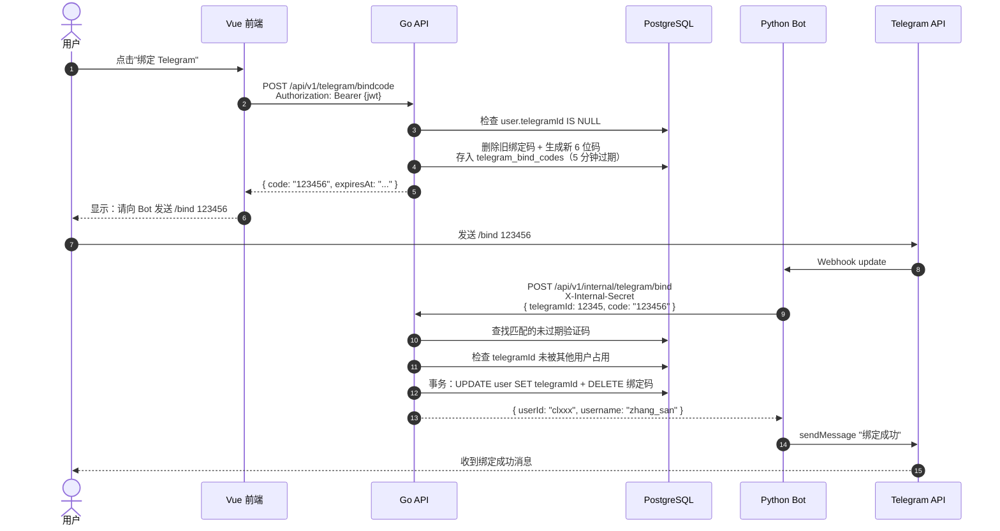
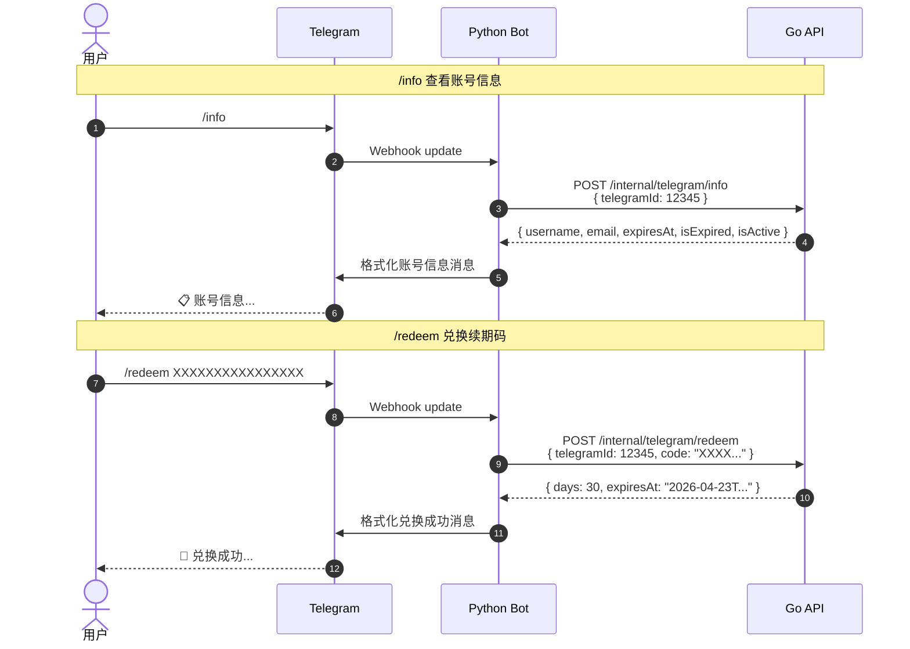

# Telegram 账号绑定与 Bot 核心功能实现方案

## 背景与目标

当前 Ember 的 Telegram Bot 仅承担管理员单向通知功能（订阅审批、新用户注册通知、排行榜推送）。用户无法将网站账号与 Telegram 关联，也无法通过 Bot 执行任何自助操作。

**目标**：让用户可以绑定 Telegram 账号，绑定后通过 Bot 查看账号信息、兑换续期码——等于把网站的高频自助功能搬到 Telegram 上。

**Phase 1 范围**：
- 绑定/解绑 Telegram 账号
- Bot 查看账号信息（到期时间、状态）
- Bot 兑换续期码

**不做的事**：
- Admin 功能不搬迁（现有 approve/reject 按钮已够用）
- 求片、排行榜、媒体库等第二期再做
- Bot 不做用户注册（注册流程涉及邮箱验证、Emby 账号创建，不适合 Bot 场景）

---

## 一、架构设计

### 1.1 绑定流程



### 1.2 Bot 命令交互流程



### 1.3 关键设计决策

**为什么 Bot 不直接连数据库，而是走 Internal API**：
- 保持单一数据源 — 所有业务逻辑集中在 Go API，兑换续期的事务逻辑（验证码校验 + Emby 解封 + 原子递增 usedCount）已经在 `RedemptionService` 里实现好了
- Bot 只做"用户交互 → 调 API → 格式化回复"三步流水线，不引入 DB 依赖
- 与现有 Internal API 模式一致（Bot 审批订阅已经走 `/api/v1/internal/subscriptions/:id/approve`）

**为什么绑定用验证码而不是 Deep Link**：
- Deep Link（`t.me/bot?start=xxx`）需要生成一个临时 token 嵌入 URL，用户点击后 Bot 收到 `/start xxx`，再用 token 换取身份。本质上也是"验证码"，只是换了个载体
- 验证码方案更简单：复用现有 `EmailVerification` 的 6 位码模式，无需额外的 token 签发/验证机制
- 用户操作步骤差异不大：复制验证码发给 Bot vs 点击链接跳转到 Bot，都是两步

**为什么 Internal API 全用 POST**：
- Bot 端调用都携带 JSON body（`telegramId`、`code` 等），GET 语义上不适合承载 body
- 这些调用本质是 RPC 风格（"执行某个动作"），POST 更语义化
- 与现有 Internal API（`PUT /subscriptions/:id/approve`）风格略有差异，但 POST 对于新增的查询+操作类端点更自洽

---

## 二、数据模型变更

### 2.1 修改 User 模型

**文件**: `services/api/internal/models/user.go`

在第 19 行 `EmbyDisabled` 字段之后新增：

```go
TelegramID *int64 `json:"telegramId,omitempty" gorm:"column:telegramId;uniqueIndex"`
```

| 属性 | 值 | 说明 |
|------|-----|------|
| Go 类型 | `*int64` | 可空，未绑定时为 nil/NULL |
| JSON | `telegramId,omitempty` | 驼峰命名，未绑定时不输出 |
| GORM | `column:telegramId;uniqueIndex` | 显式列名 + 唯一索引 |

**为什么是 int64**：Telegram User ID 是 int64 范围（当前最大值已超过 `2^32`，Go 的 `int64` 完全覆盖）。

**唯一索引保证**：同一个 Telegram 账号不能绑定多个 Ember 用户。PostgreSQL 的唯一索引默认允许多个 NULL（部分索引行为），不会影响未绑定的用户。

### 2.2 新增 TelegramBindCode 模型

**新文件**: `services/api/internal/models/telegram_bind_code.go`

完全复用 `EmailVerification`（`models/email_verification.go`）的结构模式：

```go
package models

import (
	"time"

	"gorm.io/gorm"
)

// TelegramBindCode Telegram 绑定验证码
type TelegramBindCode struct {
	ID        string    `json:"id" gorm:"column:id;type:varchar(25);primaryKey"`
	UserID    string    `json:"userId" gorm:"column:userId;size:25;not null;index"`
	Code      string    `json:"-" gorm:"column:code;size:6;not null"`
	ExpiresAt time.Time `json:"expiresAt" gorm:"column:expiresAt;not null"`
	CreatedAt time.Time `json:"createdAt" gorm:"column:createdAt;autoCreateTime"`
}

func (TelegramBindCode) TableName() string {
	return "telegram_bind_codes"
}

func (t *TelegramBindCode) BeforeCreate(tx *gorm.DB) error {
	if t.ID == "" {
		t.ID = generateCUID()
	}
	return nil
}

// IsExpired 检查验证码是否过期
func (t *TelegramBindCode) IsExpired() bool {
	return t.ExpiresAt.Before(time.Now().UTC())
}
```

**与 EmailVerification 的区别**：
- 按 `UserID` 索引（而非 `Email`），因为绑定码是给已登录用户生成的
- 没有 `IP` 字段 — 绑定码由已认证用户生成，不需要 IP 级别限流
- `Code` 字段 `json:"-"` — 验证码不在 API 响应中返回（前端通过 `GenerateBindCode` 接口的特定响应获取）

---

## 三、Go API 变更

### 3.1 错误常量

**修改文件**: `services/api/internal/services/errors.go`

在现有 `var` 块（第 5-22 行）末尾追加：

```go
// Telegram 绑定相关
ErrTelegramAlreadyBound     = errors.New("该 Telegram 账号已绑定其他用户")
ErrTelegramBindCodeInvalid  = errors.New("绑定验证码无效或已过期")
ErrTelegramNotBound         = errors.New("尚未绑定 Telegram 账号")
ErrUserAlreadyBoundTelegram = errors.New("该账号已绑定 Telegram")
```

### 3.2 新增 TelegramService

**新文件**: `services/api/internal/services/telegram.go`

#### 结构体与请求/响应定义

```go
package services

import (
	"time"

	"github.com/konghang/ember/backend/internal/db"
	"github.com/konghang/ember/backend/internal/models"
)

type TelegramService struct{}

// BindResult 绑定成功返回
type BindResult struct {
	UserID   string `json:"userId"`
	Username string `json:"username"`
}

// AccountInfoResponse Bot 端查询账号信息的响应
type AccountInfoResponse struct {
	Username     string     `json:"username"`
	Email        string     `json:"email"`
	ExpiresAt    *time.Time `json:"expiresAt"`
	IsExpired    bool       `json:"isExpired"`
	IsActive     bool       `json:"isActive"`
	EmbyDisabled bool       `json:"embyDisabled"`
}

// TelegramBindRequest Bot 调 Internal API 验证绑定
type TelegramBindRequest struct {
	TelegramID int64  `json:"telegramId" binding:"required"`
	Code       string `json:"code" binding:"required,len=6"`
}

// TelegramRedeemRequest Bot 调 Internal API 兑换
type TelegramRedeemRequest struct {
	TelegramID int64  `json:"telegramId" binding:"required"`
	Code       string `json:"code" binding:"required"`
}

// TelegramIDRequest Bot 调 Internal API 查询账号信息
type TelegramIDRequest struct {
	TelegramID int64 `json:"telegramId" binding:"required"`
}
```

#### 方法详细设计

**方法 1: GenerateBindCode(userID) → (code string, expiresAt time.Time, error)**

```
1. 查询用户 WHERE id = userID
2. 检查 user.TelegramID != nil → 返回 ErrUserAlreadyBoundTelegram
3. 删除该用户所有旧绑定码：DELETE FROM telegram_bind_codes WHERE userId = ?
4. 生成 6 位验证码（复用 email.go 的 generateVerificationCode()）
5. 创建 TelegramBindCode{UserID, Code, ExpiresAt: now + 5min}
6. 返回 code, expiresAt
```

**方法 2: VerifyBind(telegramID, code) → (*BindResult, error)**

```
1. 查找匹配验证码：WHERE code = ? AND expiresAt > NOW() ORDER BY createdAt DESC LIMIT 1
2. 未找到 → 返回 ErrTelegramBindCodeInvalid
3. 查找 telegramID 是否已绑定：WHERE telegramId = ?
   - 若已存在 → 返回 ErrTelegramAlreadyBound
4. 开启事务：
   a. UPDATE users SET telegramId = ? WHERE id = bindCode.UserID
   b. DELETE FROM telegram_bind_codes WHERE userId = bindCode.UserID
5. 查询用户名
6. 返回 BindResult{UserID, Username}
```

**方法 3: Unbind(userID) → error**

```
1. 查询用户 WHERE id = userID
2. 检查 user.TelegramID == nil → 返回 ErrTelegramNotBound
3. UPDATE users SET telegramId = NULL WHERE id = userID
```

**方法 4: GetAccountInfo(telegramID) → (*AccountInfoResponse, error)**

```
1. 查询用户 WHERE telegramId = ?
2. 未找到 → 返回 ErrTelegramNotBound
3. 返回 AccountInfoResponse{Username, Email, ExpiresAt, user.IsExpired(), IsActive, EmbyDisabled}
```

**方法 5: RedeemByTelegram(telegramID, code) → (*RedeemCodeResponse, error)**

```
1. 查询用户 WHERE telegramId = ?
2. 未找到 → 返回 ErrTelegramNotBound
3. 委托给现有的 RedemptionService.RedeemCode(user.ID, &RedeemCodeRequest{Code: code})
```

**方法 6: CleanupExpiredBindCodes() → (int64, error)**

```
1. DELETE FROM telegram_bind_codes WHERE expiresAt < NOW()
2. 返回 RowsAffected
```

### 3.3 新增 TelegramHandler

**新文件**: `services/api/internal/handlers/telegram.go`

```go
package handlers

import (
	"net/http"

	"github.com/gin-gonic/gin"
	"github.com/konghang/ember/backend/internal/services"
)

type TelegramHandler struct {
	telegramService *services.TelegramService
}

func NewTelegramHandler() *TelegramHandler {
	return &TelegramHandler{
		telegramService: &services.TelegramService{},
	}
}
```

| Handler 方法 | HTTP 端点 | 认证方式 | 用户识别方式 |
|-------------|----------|---------|------------|
| `GenerateBindCode` | `POST /telegram/bindcode` | JWT（用户端） | `c.Get("userID")` |
| `Unbind` | `DELETE /telegram/unbind` | JWT（用户端） | `c.Get("userID")` |
| `VerifyBind` | `POST /internal/telegram/bind` | X-Internal-Secret | 请求体 `telegramId` |
| `GetAccountInfo` | `POST /internal/telegram/info` | X-Internal-Secret | 请求体 `telegramId` |
| `RedeemByTelegram` | `POST /internal/telegram/redeem` | X-Internal-Secret | 请求体 `telegramId` |

**GenerateBindCode 实现模式**：

```go
func (h *TelegramHandler) GenerateBindCode(c *gin.Context) {
	userID, _ := c.Get("userID")

	code, expiresAt, err := h.telegramService.GenerateBindCode(userID.(string))
	if err != nil {
		// 根据 err 类型返回 400 或 500
		c.JSON(http.StatusBadRequest, gin.H{"error": err.Error()})
		return
	}

	c.JSON(http.StatusOK, gin.H{
		"code":      code,
		"expiresAt": expiresAt,
	})
}
```

**VerifyBind 实现模式**：

```go
func (h *TelegramHandler) VerifyBind(c *gin.Context) {
	var req services.TelegramBindRequest
	if err := c.ShouldBindJSON(&req); err != nil {
		c.JSON(http.StatusBadRequest, gin.H{"error": "参数错误"})
		return
	}

	result, err := h.telegramService.VerifyBind(req.TelegramID, req.Code)
	if err != nil {
		c.JSON(http.StatusBadRequest, gin.H{"error": err.Error()})
		return
	}

	c.JSON(http.StatusOK, result)
}
```

其他 Handler 方法遵循同样的模式：解析请求 → 调 Service → 返回结果/错误。

### 3.4 路由注册

**修改文件**: `services/api/cmd/server/main.go`

**位置 1**：Handler 创建区（约第 50 行），在 `paymentHandler` 之后新增：

```go
telegramHandler := handlers.NewTelegramHandler()
```

**位置 2**：`authenticated` 路由组（约第 135 行），新增用户端路由：

```go
// Telegram 绑定
authenticated.POST("/telegram/bindcode", telegramHandler.GenerateBindCode)
authenticated.DELETE("/telegram/unbind", telegramHandler.Unbind)
```

**位置 3**：`internal` 路由组（约第 128 行），新增 Bot 端路由：

```go
internal.POST("/telegram/bind", telegramHandler.VerifyBind)
internal.POST("/telegram/info", telegramHandler.GetAccountInfo)
internal.POST("/telegram/redeem", telegramHandler.RedeemByTelegram)
```

### 3.5 数据库迁移

**修改文件**: `services/api/internal/db/db.go`

在 `AutoMigrate()` 函数（第 201 行）的模型列表中追加：

```go
&models.TelegramBindCode{},
```

**新文件**: `infrastructure/database/20260223_01_add_telegram_binding.sql`

用于 `AUTO_MIGRATE=false` 的生产环境手动迁移：

```sql
BEGIN;

-- 1. User 表新增 telegramId 字段
ALTER TABLE users
  ADD COLUMN IF NOT EXISTS "telegramId" bigint;

-- 部分唯一索引：多个 NULL 不冲突
CREATE UNIQUE INDEX IF NOT EXISTS idx_users_telegram_id
  ON users ("telegramId")
  WHERE "telegramId" IS NOT NULL;

-- 2. 绑定验证码表
CREATE TABLE IF NOT EXISTS telegram_bind_codes (
  id          varchar(25)  PRIMARY KEY,
  "userId"    varchar(25)  NOT NULL,
  code        varchar(6)   NOT NULL,
  "expiresAt" timestamptz  NOT NULL,
  "createdAt" timestamptz  NOT NULL DEFAULT now()
);

CREATE INDEX IF NOT EXISTS idx_telegram_bind_codes_user_id
  ON telegram_bind_codes ("userId");

COMMIT;
```

### 3.6 过期绑定码清理

**修改文件**: `services/api/cmd/server/main.go`

在第 236 行的验证码清理 cron 回调函数中，追加 Telegram 绑定码清理：

```go
// 现有的 emailService.CleanupExpired() 之后追加：
telegramService := &services.TelegramService{}
if count, err := telegramService.CleanupExpiredBindCodes(); err != nil {
    log.Printf("[Cron] 清理过期绑定码失败：%v", err)
} else if count > 0 {
    log.Printf("[Cron] 已清理 %d 条过期绑定码", count)
}
```

---

## 四、Python Bot 变更

### 4.1 API Client 新增方法

**修改文件**: `services/bot/app/clients/api_client.py`

新增 3 个 async 函数，遵循现有模式（`httpx.AsyncClient` + `X-Internal-Secret` header）：

```python
async def verify_telegram_bind(telegram_id: int, code: str) -> dict | None:
    """调用 Internal API 验证 Telegram 绑定"""
    url = f"{API_URL}/api/v1/internal/telegram/bind"
    headers = {"X-Internal-Secret": INTERNAL_API_SECRET}
    try:
        async with httpx.AsyncClient(timeout=10.0) as client:
            resp = await client.post(url, headers=headers, json={
                "telegramId": telegram_id,
                "code": code,
            })
        if resp.status_code == 200:
            return resp.json()
        return {"error": resp.json().get("error", "绑定失败")}
    except Exception:
        return None


async def get_account_info(telegram_id: int) -> dict | None:
    """调用 Internal API 查询用户账号信息"""
    url = f"{API_URL}/api/v1/internal/telegram/info"
    headers = {"X-Internal-Secret": INTERNAL_API_SECRET}
    try:
        async with httpx.AsyncClient(timeout=10.0) as client:
            resp = await client.post(url, headers=headers, json={
                "telegramId": telegram_id,
            })
        if resp.status_code == 200:
            return resp.json()
        return {"error": resp.json().get("error", "查询失败")}
    except Exception:
        return None


async def redeem_by_telegram(telegram_id: int, code: str) -> dict | None:
    """调用 Internal API 兑换续期码"""
    url = f"{API_URL}/api/v1/internal/telegram/redeem"
    headers = {"X-Internal-Secret": INTERNAL_API_SECRET}
    try:
        async with httpx.AsyncClient(timeout=10.0) as client:
            resp = await client.post(url, headers=headers, json={
                "telegramId": telegram_id,
                "code": code,
            })
        if resp.status_code == 200:
            return resp.json()
        return {"error": resp.json().get("error", "兑换失败")}
    except Exception:
        return None
```

**返回值约定**：
- 成功：返回 `dict`（API 的 JSON 响应）
- 业务错误：返回 `{"error": "错误描述"}`
- 网络/未知异常：返回 `None`

### 4.2 消息格式化

**修改文件**: `services/bot/app/formatters/message_formatter.py`

新增 3 个格式化函数：

```python
def format_bind_success(data: dict) -> str:
    """绑定成功消息"""
    username = escape(str(data.get("username", "")))
    return (
        "\u2705 <b>\u7ed1\u5b9a\u6210\u529f</b>\n\n"
        f"\ud83d\udc64 \u5df2\u7ed1\u5b9a\u8d26\u53f7\uff1a<b>{username}</b>\n\n"
        "\u73b0\u5728\u53ef\u4ee5\u4f7f\u7528\u4ee5\u4e0b\u547d\u4ee4\uff1a\n"
        "  /info \u2014 \u67e5\u770b\u8d26\u53f7\u4fe1\u606f\n"
        "  /redeem <code>\u5151\u6362\u7801</code> \u2014 \u7eed\u671f"
    )


def format_account_info(data: dict) -> str:
    """账号信息消息"""
    username = escape(str(data.get("username", "")))
    email = escape(str(data.get("email", "") or "-"))
    is_expired = data.get("isExpired", False)
    is_active = data.get("isActive", True)
    expires_at = str(data.get("expiresAt", "") or "")

    expires_display = escape(expires_at[:10]) if expires_at else "\u6c38\u4e45\u6709\u6548"

    if not is_expired and is_active:
        status_emoji, status_text = "\ud83d\udfe2", "\u6b63\u5e38"
    elif is_expired:
        status_emoji, status_text = "\ud83d\udd34", "\u5df2\u8fc7\u671f"
    else:
        status_emoji, status_text = "\ud83d\udd34", "\u5df2\u7981\u7528"

    lines = [
        "\ud83d\udccb <b>\u8d26\u53f7\u4fe1\u606f</b>",
        "",
        f"\ud83d\udc64 \u7528\u6237\u540d\uff1a<b>{username}</b>",
        f"\ud83d\udce7 \u90ae\u7bb1\uff1a{email}",
        f"{status_emoji} \u72b6\u6001\uff1a{status_text}",
        f"\u23f3 \u6709\u6548\u671f\u81f3\uff1a{expires_display}",
    ]

    if is_expired:
        lines.append("")
        lines.append("\ud83d\udca1 \u4f7f\u7528 /redeem <code>\u5151\u6362\u7801</code> \u7eed\u671f")

    return "\n".join(lines)


def format_redeem_success(data: dict) -> str:
    """兑换成功消息"""
    days = data.get("days", 0)
    expires_at = str(data.get("expiresAt", "") or "")
    expires_display = escape(expires_at[:10]) if expires_at else "-"

    return (
        "\ud83c\udf89 <b>\u5151\u6362\u6210\u529f</b>\n\n"
        f"\ud83d\udcc5 \u7eed\u671f\u5929\u6570\uff1a<b>{days}</b> \u5929\n"
        f"\u23f3 \u65b0\u5230\u671f\u65f6\u95f4\uff1a{expires_display}"
    )
```

消息输出效果预览：

**绑定成功**：
```
✅ 绑定成功

👤 已绑定账号：zhang_san

现在可以使用以下命令：
  /info — 查看账号信息
  /redeem 兑换码 — 续期
```

**账号信息**：
```
📋 账号信息

👤 用户名：zhang_san
📧 邮箱：user@example.com
🟢 状态：正常
⏳ 有效期至：2026-04-23

💡 使用 /redeem 兑换码 续期      ← 仅过期时显示
```

**兑换成功**：
```
🎉 兑换成功

📅 续期天数：30 天
⏳ 新到期时间：2026-04-23
```

### 4.3 命令处理器

**修改文件**: `services/bot/app/handlers/telegram_handler.py`

新增 3 个命令处理函数，统一模式：检查私聊 → 校验参数 → 调 API → 判断响应 → 回复：

```python
async def handle_bind(update: Update, context: ContextTypes.DEFAULT_TYPE) -> None:
    """处理 /bind <验证码> 命令 — 绑定 Telegram 账号"""
    message = update.message
    if message is None:
        return

    # 仅私聊可用
    if message.chat.type != "private":
        await message.reply_text("\u26a0\ufe0f \u8bf7\u5728\u79c1\u804a\u4e2d\u4f7f\u7528\u6b64\u547d\u4ee4")
        return

    args = context.args or []
    if len(args) != 1 or len(args[0]) != 6:
        await message.reply_text(
            "\ud83d\udcdd <b>\u4f7f\u7528\u65b9\u5f0f</b>\n\n"
            "/bind <code>\u9a8c\u8bc1\u7801</code>\n\n"
            "\u8bf7\u5148\u5728 Ember \u7f51\u7ad9\u751f\u6210\u7ed1\u5b9a\u9a8c\u8bc1\u7801\u3002",
            parse_mode="HTML",
        )
        return

    telegram_id = message.from_user.id
    result = await api_client.verify_telegram_bind(telegram_id, args[0])

    if result is None:
        await message.reply_text("\u274c \u670d\u52a1\u6682\u4e0d\u53ef\u7528\uff0c\u8bf7\u7a0d\u540e\u91cd\u8bd5")
        return
    if "error" in result:
        await message.reply_text(f"\u274c {escape(result['error'])}", parse_mode="HTML")
        return

    await message.reply_text(format_bind_success(result), parse_mode="HTML")


async def handle_info(update: Update, context: ContextTypes.DEFAULT_TYPE) -> None:
    """处理 /info 命令 — 查看账号信息"""
    message = update.message
    if message is None:
        return

    if message.chat.type != "private":
        await message.reply_text("\u26a0\ufe0f \u8bf7\u5728\u79c1\u804a\u4e2d\u4f7f\u7528\u6b64\u547d\u4ee4")
        return

    telegram_id = message.from_user.id
    result = await api_client.get_account_info(telegram_id)

    if result is None:
        await message.reply_text("\u274c \u670d\u52a1\u6682\u4e0d\u53ef\u7528\uff0c\u8bf7\u7a0d\u540e\u91cd\u8bd5")
        return
    if "error" in result:
        await message.reply_text(f"\u274c {escape(result['error'])}", parse_mode="HTML")
        return

    await message.reply_text(format_account_info(result), parse_mode="HTML")


async def handle_redeem(update: Update, context: ContextTypes.DEFAULT_TYPE) -> None:
    """处理 /redeem <兑换码> 命令 — 兑换续期码"""
    message = update.message
    if message is None:
        return

    if message.chat.type != "private":
        await message.reply_text("\u26a0\ufe0f \u8bf7\u5728\u79c1\u804a\u4e2d\u4f7f\u7528\u6b64\u547d\u4ee4")
        return

    args = context.args or []
    if len(args) != 1:
        await message.reply_text(
            "\ud83d\udcdd <b>\u4f7f\u7528\u65b9\u5f0f</b>\n\n"
            "/redeem <code>\u5151\u6362\u7801</code>",
            parse_mode="HTML",
        )
        return

    telegram_id = message.from_user.id
    result = await api_client.redeem_by_telegram(telegram_id, args[0])

    if result is None:
        await message.reply_text("\u274c \u670d\u52a1\u6682\u4e0d\u53ef\u7528\uff0c\u8bf7\u7a0d\u540e\u91cd\u8bd5")
        return
    if "error" in result:
        await message.reply_text(f"\u274c {escape(result['error'])}", parse_mode="HTML")
        return

    await message.reply_text(format_redeem_success(result), parse_mode="HTML")
```

### 4.4 注册 CommandHandler

**修改文件**: `services/bot/app/server.py`

在第 34-35 行现有 handler 注册之后，新增 import 和命令注册：

```python
# 新增 import
from telegram.ext import CommandHandler
from app.handlers.telegram_handler import handle_bind, handle_info, handle_redeem

# 在 tg_app.add_handler(MessageHandler(...)) 之后新增
tg_app.add_handler(CommandHandler("bind", handle_bind))
tg_app.add_handler(CommandHandler("info", handle_info))
tg_app.add_handler(CommandHandler("redeem", handle_redeem))
```

---

## 五、Vue 前端变更

### 5.1 类型定义

**修改文件**: `services/web/src/types/api.ts`

1. `UserInfo` 接口新增字段：

```typescript
telegramId?: number
```

2. 新增响应类型：

```typescript
export interface TelegramBindCodeResponse {
  code: string
  expiresAt: string
}
```

### 5.2 API 函数

**修改文件**: `services/web/src/api/console.ts`

```typescript
// ==================== Telegram 绑定 ====================

export function generateTelegramBindCode(): Promise<TelegramBindCodeResponse> {
  return request({
    url: '/telegram/bindcode',
    method: 'post'
  })
}

export function unbindTelegram(): Promise<{ message: string }> {
  return request({
    url: '/telegram/unbind',
    method: 'delete'
  })
}
```

### 5.3 Dashboard UI

**修改文件**: `services/web/src/views/console/DashboardView.vue`

在"账号设置"区域（约第 311 行 `lg:col-span-2` 面板）内，"联系邮箱"和"修改密码"之后新增 Telegram 绑定区块。

**script setup 新增**：

```typescript
import { generateTelegramBindCode, unbindTelegram } from '@/api/console'
import type { TelegramBindCodeResponse } from '@/types/api'

const telegramBindCode = ref<TelegramBindCodeResponse | null>(null)
const generatingBindCode = ref(false)
const unbinding = ref(false)

const isTelegramBound = computed(() => !!userStore.profile?.telegramId)

const handleGenerateBindCode = async () => {
  generatingBindCode.value = true
  try {
    telegramBindCode.value = await generateTelegramBindCode()
  } catch {
    // axios 拦截器已处理错误展示
  } finally {
    generatingBindCode.value = false
  }
}

const handleUnbindTelegram = async () => {
  unbinding.value = true
  try {
    await unbindTelegram()
    ElMessage.success('已解除 Telegram 绑定')
    // 刷新用户信息
    await userStore.fetchProfile()
    telegramBindCode.value = null
  } catch {
    // axios 拦截器已处理
  } finally {
    unbinding.value = false
  }
}
```

**template 新增**（在账号设置 grid 末尾）：

```html
<!-- Telegram 绑定 -->
<div class="space-y-4 md:col-span-2 pt-6 border-t border-gray-100">
  <h4 class="font-bold text-gray-900 text-sm flex items-center gap-2">
    Telegram 绑定
  </h4>

  <!-- 已绑定 -->
  <div v-if="isTelegramBound" class="bg-green-50 p-4 rounded-xl border border-green-100">
    <div class="flex items-center justify-between">
      <div class="flex items-center gap-2">
        <div class="w-2 h-2 bg-green-500 rounded-full"></div>
        <span class="text-sm font-bold text-green-800">已绑定</span>
        <span class="text-xs text-green-600 font-mono">ID: {{ userStore.profile?.telegramId }}</span>
      </div>
      <button
        @click="handleUnbindTelegram"
        :disabled="unbinding"
        class="text-xs text-red-500 hover:text-red-700 font-bold cursor-pointer"
      >
        {{ unbinding ? '解绑中...' : '解除绑定' }}
      </button>
    </div>
  </div>

  <!-- 未绑定 -->
  <div v-else>
    <!-- 未生成验证码 -->
    <div v-if="!telegramBindCode">
      <p class="text-xs text-gray-500 mb-3">
        绑定 Telegram 后可通过 Bot 查看账号信息、兑换续期码。
      </p>
      <button
        @click="handleGenerateBindCode"
        :disabled="generatingBindCode"
        class="px-4 py-2 bg-blue-500 text-white rounded-lg hover:bg-blue-600
               transition-colors text-sm font-bold cursor-pointer disabled:opacity-70"
      >
        {{ generatingBindCode ? '生成中...' : '生成绑定验证码' }}
      </button>
    </div>

    <!-- 已生成验证码 -->
    <div v-else class="bg-blue-50 p-4 rounded-xl border border-blue-100 space-y-3">
      <div class="text-center">
        <p class="text-xs text-blue-600 mb-2">请向 Bot 发送以下命令：</p>
        <code class="block bg-white px-4 py-3 rounded-lg border border-blue-200
                     text-2xl font-mono font-bold text-blue-900 tracking-widest select-all">
          /bind {{ telegramBindCode.code }}
        </code>
      </div>
      <p class="text-xs text-gray-500 text-center">验证码 5 分钟内有效</p>
      <button
        @click="handleGenerateBindCode"
        :disabled="generatingBindCode"
        class="w-full text-xs text-blue-600 hover:text-blue-800 font-bold cursor-pointer text-center"
      >
        重新生成
      </button>
    </div>
  </div>
</div>
```

---

## 六、边界情况处理

| 场景 | 处理方式 | 层级 |
|------|---------|------|
| TelegramID 已绑定其他用户 | `VerifyBind` 返回 `ErrTelegramAlreadyBound` | Go Service |
| 用户已绑定 Telegram，再点生成码 | `GenerateBindCode` 返回 `ErrUserAlreadyBoundTelegram` | Go Service |
| 验证码过期（5 分钟） | `VerifyBind` 查询条件 `expiresAt > NOW()` 自动过滤 | Go Service |
| Bot 在群聊中收到命令 | Handler 检查 `chat.type != "private"` → 提示私聊使用 | Bot Handler |
| `/bind` 参数非 6 位 | Handler 校验 `len(args[0]) != 6` → 提示正确用法 | Bot Handler |
| 未绑定用户使用 /info 或 /redeem | API 返回 `ErrTelegramNotBound` → Bot 提示"尚未绑定" | Go Service |
| 删除用户后 TelegramID 悬空 | Bot 查 `WHERE telegramId = ?` 查不到 → 返回"尚未绑定" | Go Service |
| 并发绑定（两人用同一码） | 唯一索引 + 事务保证原子性 | PostgreSQL |

---

## 七、文件变更清单

| # | 文件路径 | 操作 | 说明 |
|---|---------|------|------|
| 1 | `services/api/internal/models/user.go` | 修改 | +1 字段 `TelegramID` |
| 2 | `services/api/internal/models/telegram_bind_code.go` | **新建** | 绑定验证码模型 |
| 3 | `services/api/internal/services/errors.go` | 修改 | +4 个 error 常量 |
| 4 | `services/api/internal/services/telegram.go` | **新建** | TelegramService（6 个方法 + 请求/响应结构体） |
| 5 | `services/api/internal/handlers/telegram.go` | **新建** | TelegramHandler（5 个端点） |
| 6 | `services/api/internal/db/db.go` | 修改 | AutoMigrate 新增 TelegramBindCode |
| 7 | `services/api/cmd/server/main.go` | 修改 | handler 创建 + 路由注册 + cron 清理 |
| 8 | `infrastructure/database/20260223_01_add_telegram_binding.sql` | **新建** | 手动迁移 SQL |
| 9 | `services/bot/app/clients/api_client.py` | 修改 | +3 个 API 方法 |
| 10 | `services/bot/app/formatters/message_formatter.py` | 修改 | +3 个格式化函数 |
| 11 | `services/bot/app/handlers/telegram_handler.py` | 修改 | +3 个命令处理器 |
| 12 | `services/bot/app/server.py` | 修改 | import + 注册 CommandHandler |
| 13 | `services/web/src/types/api.ts` | 修改 | UserInfo + TelegramBindCodeResponse |
| 14 | `services/web/src/api/console.ts` | 修改 | +2 个 API 函数 |
| 15 | `services/web/src/views/console/DashboardView.vue` | 修改 | Telegram 绑定 UI 区块 |

---

## 八、执行阶段建议

| 阶段 | 范围 | 涉及文件 |
|------|------|---------|
| Phase 1: 后端数据层 | User 模型 + TelegramBindCode 模型 + error 常量 | #1, #2, #3 |
| Phase 2: 后端业务层 | TelegramService + TelegramHandler + 路由注册 + 迁移 | #4, #5, #6, #7 |
| Phase 3: 手动迁移 SQL | 生产环境 SQL 脚本 | #8 |
| Phase 4: Bot 端 | API Client → 格式化 → 命令处理器 → 注册 | #9, #10, #11, #12 |
| Phase 5: 前端 | 类型 → API → Dashboard UI | #13, #14, #15 |

---

## 九、验证方式

### 编译验证

```bash
cd services/api && go build ./...
cd services/web && npm run build
```

### 端到端功能验证（手动）

1. 网站点击"生成绑定验证码" → 显示 6 位码和 `/bind` 指令
2. 向 Bot 发送 `/bind 123456` → 收到"绑定成功"
3. 发送 `/info` → 显示账号信息（用户名、邮箱、到期时间、状态）
4. 发送 `/redeem XXXXXXXXXXXXXXXX` → 兑换成功/失败
5. 网站点击"解除绑定" → TelegramID 清空，Bot `/info` 返回"尚未绑定"
6. 已绑定用户再次点击"生成验证码" → 提示"该账号已绑定 Telegram"
7. 验证码 5 分钟后 → Bot `/bind` 返回"验证码无效或已过期"
8. 用另一个 Telegram 绑定同一用户 → 提示"该账号已绑定 Telegram"
9. 用已绑定 Telegram 绑定另一个用户 → 提示"该 Telegram 账号已绑定其他用户"
10. 群聊中发 `/bind` → 提示"请在私聊中使用此命令"
