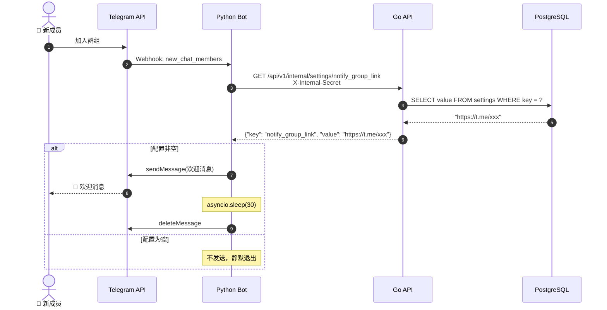

# Telegram 群组欢迎消息功能实现方案

## 背景与目标

当有新成员加入 Telegram 群组时，Bot 自动发送一条欢迎消息（告知入库通知群组链接），30 秒后自动删除，保持群聊清洁。

**关键设计**：通知群组链接通过数据库 Settings 表管理，管理员在 Web 后台即可配置，无需重启 Bot，无需新增环境变量。

**不做的事**：不做自定义欢迎语模板、不做多群组差异化欢迎。

---

## 一、架构设计

### 1.1 数据流



### 1.2 关键设计决策

**为什么用 Settings 表而不是环境变量**：
- 管理员在 Web 后台改配置，无需重启 Bot
- `notify_group_link` 为空 = 功能关闭，非空 = 功能开启，一个字段同时承担"开关"和"配置值"
- 与现有 `registration_mode`、`default_trial_days` 管理方式一致

**为什么每次都调 API 取配置而不缓存**：
- 新成员加入频率低（不是高频事件），每次一个 HTTP 请求无压力
- 管理员改配置后立即生效，无缓存失效问题
- 零额外状态，零额外复杂度

---

## 二、Go API 变更

### 2.1 变更文件清单

| 文件 | 操作 | 说明 |
|------|------|------|
| `services/api/internal/db/db.go` | **修改** | seedDefaultSettings 新增配置项 |
| `services/api/internal/services/setting.go` | **修改** | SetSetting 白名单追加 |
| `services/api/internal/handlers/setting.go` | **修改** | 新增 GetSettingByKey 方法 |
| `services/api/cmd/server/main.go` | **修改** | internal 路由组追加 |

### 2.2 修改：db.go — seedDefaultSettings

**文件**：`services/api/internal/db/db.go` 第 144 行 `seedDefaultSettings()` 函数

追加一行：
```go
func seedDefaultSettings() {
    // ... 现有的 default_trial_days 和 registration_mode ...

    if err := DB.FirstOrCreate(&models.Setting{Key: "notify_group_link"}, models.Setting{Value: ""}).Error; err != nil {
        log.Printf("⚠️  初始化 notify_group_link 失败：%v", err)
    }
}
```

默认值为空字符串 = 功能关闭。

### 2.3 修改：setting.go — SetSetting 白名单

**文件**：`services/api/internal/services/setting.go` 第 34 行

当前：
```go
if key != "registration_mode" && key != "default_trial_days" {
    return ErrSettingNotFound
}
```

改为：
```go
if key != "registration_mode" && key != "default_trial_days" && key != "notify_group_link" {
    return ErrSettingNotFound
}
```

`notify_group_link` 无需额外校验——任意字符串均可（空字符串 = 关闭，非空 = 群组链接）。

### 2.4 修改：setting.go — GetSettingByKey handler

**文件**：`services/api/internal/handlers/setting.go`（追加到文件末尾）

```go
// GetSettingByKey 获取单个配置值（内部服务调用）
// GET /api/v1/internal/settings/:key
func (h *SettingHandler) GetSettingByKey(c *gin.Context) {
    key := c.Param("key")
    value := h.service.GetSetting(key)
    c.JSON(http.StatusOK, gin.H{"key": key, "value": value})
}
```

`GetSetting(key)` 已有（setting.go 第 15 行），key 不存在时返回空字符串。

### 2.5 修改：main.go — 注册内部路由

**文件**：`services/api/cmd/server/main.go` 第 102-108 行 internal 路由组

追加一行：
```go
internal := api.Group("/internal")
internal.Use(middleware.InternalAuth())
{
    internal.PUT("/subscriptions/:id/approve", subscriptionHandler.ApproveSubscription)
    internal.PUT("/subscriptions/:id/reject", subscriptionHandler.RejectSubscription)
    internal.GET("/settings/:key", settingHandler.GetSettingByKey)  // 新增
}
```

---

## 三、Python Bot 变更

### 3.1 变更文件清单

| 文件 | 操作 | 说明 |
|------|------|------|
| `services/bot/app/clients/api_client.py` | **修改** | 新增 get_setting 函数 |
| `services/bot/app/handlers/telegram_handler.py` | **修改** | 新增 handle_new_member + _delete_later |
| `services/bot/app/server.py` | **修改** | 注册 MessageHandler |

### 3.2 修改：api_client.py — 新增读取配置

**文件**：`services/bot/app/clients/api_client.py`（追加到文件末尾）

```python
async def get_setting(key: str) -> str:
    """从 Go API 读取 Settings 表配置值"""
    url = f"{API_URL}/api/v1/internal/settings/{key}"
    headers = {"X-Internal-Secret": INTERNAL_API_SECRET}
    try:
        async with httpx.AsyncClient(timeout=5.0) as client:
            resp = await client.get(url, headers=headers)
        if resp.status_code == 200:
            return resp.json().get("value", "")
    except Exception:
        pass
    return ""
```

复用现有的 `API_URL` 和 `INTERNAL_API_SECRET`（config.py 第 13、16 行），遵循 `_call_subscription_action` 的 httpx 模式。失败时静默返回空字符串（= 不发送欢迎消息）。

### 3.3 修改：telegram_handler.py — 欢迎消息 handler

**文件**：`services/bot/app/handlers/telegram_handler.py`

在文件顶部 import 追加：
```python
import asyncio
from app.clients import api_client
```

在文件末尾追加：

```python
async def handle_new_member(update: Update, context: ContextTypes.DEFAULT_TYPE) -> None:
    """新成员加入群组时发送欢迎消息，30 秒后自动删除"""
    message = update.message
    if message is None or message.new_chat_members is None:
        return

    # 过滤 Bot 用户，只欢迎真人
    new_users = [u for u in message.new_chat_members if not u.is_bot]
    if not new_users:
        return

    # 从 Settings 表读取通知群组链接（空 = 功能关闭）
    notify_link = await api_client.get_setting("notify_group_link")
    if not notify_link:
        return

    names = ", ".join(u.first_name for u in new_users)
    text = (
        f"👋 欢迎 <b>{escape(names)}</b> 加入！\n\n"
        f"📢 入库通知群组：{escape(notify_link)}\n"
        f"⏳ 本消息将在 30 秒后自动删除"
    )

    sent = await message.reply_text(text, parse_mode="HTML")

    # 非阻塞延迟删除：asyncio.create_task 把任务丢到事件循环后台
    asyncio.create_task(_delete_later(context.bot, sent.chat_id, sent.message_id, 30))


async def _delete_later(bot, chat_id: int, message_id: int, delay: int) -> None:
    """延迟删除消息，失败静默忽略"""
    await asyncio.sleep(delay)
    try:
        await bot.delete_message(chat_id=chat_id, message_id=message_id)
    except Exception:
        pass  # 消息已被手动删除或 Bot 无权限
```

### 3.4 修改：server.py — 注册 handler

**文件**：`services/bot/app/server.py`

在第 10 行 import 区域追加：
```python
from telegram.ext import Application, CallbackQueryHandler, MessageHandler, filters
```

在第 19 行 import 区域追加：
```python
from app.handlers.telegram_handler import (
    handle_callback,
    handle_new_member,          # 新增
    send_registration_notification,
    send_subscription_notification,
)
```

在第 32 行（`tg_app.add_handler(CallbackQueryHandler(handle_callback))` 之后）追加：
```python
tg_app.add_handler(MessageHandler(filters.StatusUpdate.NEW_CHAT_MEMBERS, handle_new_member))
```

---

## 四、前端变更

### 4.1 修改：SettingsView.vue

**文件**：`services/web/src/views/admin/SettingsView.vue`

#### 变更 1：form ref 追加字段（第 22-25 行）

```typescript
const form = ref({
  registration_mode: 'open',
  default_trial_days: 7,
  notify_group_link: ''          // 新增
})
```

#### 变更 2：fetchSettings 追加读取（第 39-45 行）

```typescript
const fetchSettings = async () => {
  const list = await getSettings()
  const mode = list.find(item => item.key === 'registration_mode')
  const trial = list.find(item => item.key === 'default_trial_days')
  const notifyLink = list.find(item => item.key === 'notify_group_link')  // 新增
  if (mode?.value) form.value.registration_mode = mode.value
  if (trial?.value) form.value.default_trial_days = Number(trial.value) || 7
  if (notifyLink?.value !== undefined) form.value.notify_group_link = notifyLink.value  // 新增
}
```

#### 变更 3：handleSaveSettings 追加保存（第 47-56 行）

```typescript
const handleSaveSettings = async () => {
  saving.value = true
  try {
    await updateSetting('registration_mode', { value: form.value.registration_mode })
    await updateSetting('default_trial_days', { value: String(form.value.default_trial_days) })
    await updateSetting('notify_group_link', { value: form.value.notify_group_link })  // 新增
    ElMessage.success('配置保存成功')
  } finally {
    saving.value = false
  }
}
```

#### 变更 4：模板中新增输入框（第 188 行之后，grid 内）

在"默认试用天数"输入框之后追加：

```html
<el-form-item label="入库通知群组">
  <el-input
    v-model="form.notify_group_link"
    placeholder="https://t.me/your_notify_group"
    clearable
  />
  <p class="text-xs text-gray-400 mt-2">
    新成员加入群组时展示的通知群组链接。留空则不发送欢迎消息。
  </p>
</el-form-item>
```

---

## 五、Telegram 消息示例

```
┌─────────────────────────────────────────────┐
│ 👋 欢迎 张三 加入！                          │
│                                              │
│ 📢 入库通知群组：https://t.me/xxx            │
│ ⏳ 本消息将在 30 秒后自动删除                 │
└─────────────────────────────────────────────┘

         ↓ 30 秒后 ↓

       (消息已删除)
```

---

## 六、文件变更汇总

| 操作 | 文件 | 改动量 |
|------|------|--------|
| 修改 | `services/api/internal/db/db.go` | +3 行（seed） |
| 修改 | `services/api/internal/services/setting.go` | +1 条件（白名单） |
| 修改 | `services/api/internal/handlers/setting.go` | +8 行（GetSettingByKey） |
| 修改 | `services/api/cmd/server/main.go` | +1 行（internal 路由） |
| 修改 | `services/bot/app/clients/api_client.py` | +12 行（get_setting） |
| 修改 | `services/bot/app/handlers/telegram_handler.py` | +30 行（handler） |
| 修改 | `services/bot/app/server.py` | +3 行（import + 注册 handler） |
| 修改 | `services/web/src/views/admin/SettingsView.vue` | +15 行（表单字段） |

**总计**：0 个新文件，8 个修改文件，~70 行代码

---

## 七、前提条件

- Bot 必须被添加到群组且设为**管理员**
- Bot 需要有**删除消息**权限（否则 30 秒后删除会静默失败，但欢迎消息仍会发出）

---

## 八、验证方式

### 8.1 编译验证

```bash
cd services/api && go build ./...
cd services/web && npm run build
```

### 8.2 端到端测试

1. 启动 Go API、Python Bot、前端
2. 登录管理员后台 → 系统设置 → 填入通知群组链接（如 `https://t.me/your_notify_group`）→ 保存
3. 邀请测试用户加入群组
4. 检查：群组出现欢迎消息，30 秒后自动消失
5. 清空通知群组链接 → 保存 → 再邀请测试用户 → 不发送欢迎消息

### 8.3 异常场景

| 场景 | 预期行为 |
|------|---------|
| `notify_group_link` 为空 | 不发送欢迎消息，静默退出 |
| Go API 不可用 | `get_setting` 返回空字符串，不发送欢迎消息 |
| Bot 不是群管理员 | 欢迎消息发出但 30 秒后删除失败（静默忽略） |
| Bot 加入群组自身 | `is_bot` 过滤，不触发欢迎 |
| 多人同时加入 | 合并为一条欢迎消息（`names = ", ".join(...)`） |

---

## 九、关键文件路径索引

| 文件 | 用途 |
|------|------|
| `services/api/internal/models/setting.go` | Setting KV 模型（已有） |
| `services/api/internal/services/setting.go` | SettingService — GetSetting/SetSetting 白名单 |
| `services/api/internal/handlers/setting.go` | Setting Handler — 新增 GetSettingByKey |
| `services/api/internal/db/db.go:144` | seedDefaultSettings — 初始化默认值 |
| `services/api/cmd/server/main.go:102-108` | internal 路由组 |
| `services/bot/app/clients/api_client.py` | Bot → API 客户端 |
| `services/bot/app/handlers/telegram_handler.py` | Telegram 消息处理器 |
| `services/bot/app/server.py:31-32` | Handler 注册点 |
| `services/web/src/views/admin/SettingsView.vue` | Settings 管理页面 |
