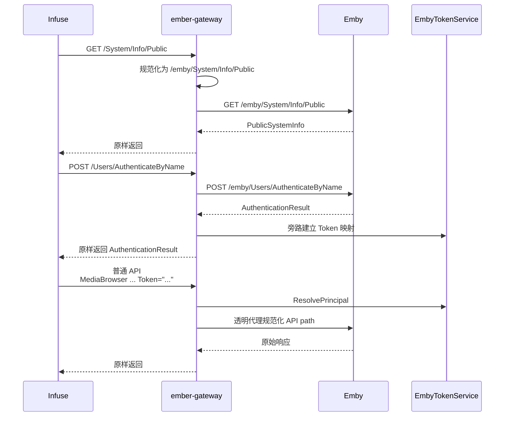

# Ember Gateway 透明代理与 Web 访问控制实现方案

> 状态：主体完成，v2.0.3 已发布，待受控实机验收
> 负责人：Ember
> 更新时间：2026-08-30

## 背景

`ember-gateway` 已经具备 Emby 登录响应观察、AccessToken 映射、本地用户资格门控、PlaybackInfo 证明、115 直连决策和 Emby 视频回退能力。但当前路由合同仍围绕 `/emby/...` 特定路径设计，没有完整承担“客户端访问 Emby 的唯一公网入口”职责。

2026-08-23 的生产访问日志已经确认：Infuse `8.5` 首次连接时会在尚未取得用户 AccessToken 前请求根路径 `GET /System/Info/Public`，当时已部署的旧 Gateway 将其归类为普通受保护请求并返回 `401`，日志为 `code=token_header_invalid`。因此登录链路会在用户名密码认证之前中断。

同日补充的脱敏请求日志进一步确认：AuthenticateByName 已返回 `200` 并成功建立认证映射，但 Infuse 随后的根 `GET /Users/{Id}/Views` 不发送 `X-Emby-Token`，而是在 `X-Emby-Authorization: MediaBrowser ... Token="..."` 中携带非空 Token；只读取 `X-Emby-Token` 的旧门控因此再次返回本地 `401`，请求没有到达 Emby。

固定的 Emby SDK `4.9.3.0` OpenAPI 同时给出两个容易混淆的事实：Server base URL 包含 `/emby`，接口 path 本身写作 `/System/Info/Public`、`/Users/AuthenticateByName` 等根路径形态；生成的 `SystemInfoPublic` 参考页又把该接口标记为需要用户认证。真实 Infuse 的登录前行为与生成文档的认证标记存在冲突，不能继续靠路径名或经验猜测。

现有 [Emby 115 直连播放网关实现方案](./emby-115-direct-play-gateway.md) 负责 115 Provider、DirectPlay 和播放回退；本计划单独负责 Gateway 的通用反向代理、客户端路径兼容、登录前 bootstrap 和 Emby Web Surface 控制。两者共用同一个 `ember-gateway` 进程，但职责和验收条件不同。

## 目标

本方案要实现：

1. 让 `ember-gateway` 成为兼容 Emby 客户端的完整透明反向代理，未命中特殊处理器的合法 Emby API 请求默认转发到既有 Emby Server。
2. 同时兼容客户端根 API 路径和历史 `/emby/...` 路径，不依赖外部 Nginx 做隐式 rewrite，也不产生重复 `/emby/emby/...`。
3. 为登录前请求建立最小、精确、版本化的 bootstrap allowlist，先解决 Infuse `GET /System/Info/Public` 无法进入登录流程的问题，同时保持任意匿名代理失败关闭。
4. 保留现有 `AuthenticateByName`、PlaybackInfo、视频 115 直连和回退处理；图片、字幕、会话事件及其他普通接口默认透明代理。
5. 增加一个全局 Emby Web Surface 开关，管理员可禁止通过 Gateway 打开 Emby 网页端，同时不影响 Infuse 等原生客户端使用受保护 API。
6. 对路径分类、认证分支、特殊处理和上游结果打印脱敏日志，能够区分“被策略拒绝”“上游代理失败”“115 加速回退”和“普通代理成功”，不新增日志表。

## 非目标

本次明确不做：

- 不按用户、套餐、设备或客户端名称分别开放 Emby Web；首期只有全局开关。
- 不把 `User-Agent`、`Client` 或 `Device` 当作强认证依据，也不承诺阻止伪装成 API 客户端的自定义程序。
- 不替代 Emby 自身用户权限、媒体库授权、远程访问和会话管理。
- 不支持 Jellyfin、多 Emby Server、Emby Connect、Quick Connect 或 PIN 登录。
- 不顺带改写 HLS、DASH、转码 manifest 或未知插件协议。
- 不把所有匿名根路径转发给 Emby；匿名访问仍只允许版本合同和真实客户端证据共同支持的精确路由。
- 不在本计划中新增 115 表、直连会话表、播放策略表或容量回收任务。
- 不把生成文档与真实客户端冲突的认证语义直接当成已确认事实；证据不足的 Header、WebSocket 和静态资源路径继续标记“未证实”。

## 当前事实

### 相关文档与实现

- 系统边界：[系统架构](../../system-architecture.md)
- Emby 版本化协议：[Emby 4.9 系列播放代理 API 合同](../../reference/emby-playback-proxy-contract.md)
- 客户端能力矩阵：[Emby Gateway 客户端兼容矩阵](../../reference/emby-client-compatibility-matrix.md)
- 115 播放链路：[115 Cookie 直连播放端到端流程参考](../../reference/p115-playback-end-to-end-flow.md)
- 115 专项计划：[Emby 115 直连播放网关实现方案](./emby-115-direct-play-gateway.md)
- 部署入口：[Docker Compose 部署说明](../../../infrastructure/docker/README.md)
- Gateway HTTP 核心：`services/api/internal/playbackgateway/`
- Gateway 运行时：`services/api/internal/playbackgateway/runtime.go`
- 设置中心：`services/api/internal/config/`、`services/web/src/views/admin/SettingsView.vue`

### 已由代码确认

- 当前 `classifyRoute` 在规范化后按固定语义段大小写不敏感地识别 AuthenticateByName、SystemInfoPublic、公开用户、PlaybackInfo 和视频流；Web Surface 另行精确识别 Branding Configuration 与无 Token Item Image，尾斜杠、非法 Index、额外层级和 encoded path 不放宽。
- SystemInfoPublic 是唯一无本地鉴权的公开 API 路由；认证接受唯一严格应用头或目标 Web 的严格 query 应用元数据，Public users 同时接受这两种载体，Branding Configuration 只接受 query 载体并受 Web 开关控制。其余请求从直接 Token Header、固定 query aliases 或严格应用头中取得逐字节一致的 AccessToken 并调用 `ResolvePrincipal`。
- root 与 `/emby` 形态的 `GET System/Info/Public` 都透明代理到上游；family/前缀大小写不敏感，其他 method、尾斜杠和 encoded path 不继承公开权限。
- PlaybackInfo、视频流是普通代理上的选择性处理器；Playing、Progress、Stopped、携 Token 图片、字幕和其他未知受保护接口没有独立处理器时会走普通代理。只有目标 Web 已确认的精确无 Token Item Image 进入 Web Surface。
- 外部 Nginx 示例把请求原样 `proxy_pass` 到 Gateway，没有路径 rewrite；路径规范化应由 Gateway 单点负责。
- Gateway 与 API 共用一个镜像和一个 `ember` 二进制，分别以 `ember gateway`、`ember api` 运行；本计划不改变进程和镜像模型。
- 通用 ConfigService 读取使用进程内 60 秒缓存；API 保存只会失效 API 进程缓存，不能让独立 Gateway 实时感知 Web 开关。

### 已由生产日志确认

2026-08-23 已确认：

- Gateway 已完成上游身份核对并监听 `:8081`，接受的目标 Emby 版本为 `4.9.3.0`，ServerId 长度为 `32`；日志未暴露 ServerId 原值。
- 客户端：`Infuse-Direct/8.5`
- 首次连接请求：`GET /System/Info/Public`
- 初始旧 Gateway 响应：`401`
- Gateway 分支：`code=token_header_invalid`
- `v2.0.1` 部署后同一路径进入 `code=application_header_invalid route=public_bootstrap pathMode=root`，证明路径已修复但应用头门控仍错误。
- 同一目标 Emby `4.9.3.0` 的精确接口已实测无需登录即可返回 PublicSystemInfo。
- SystemInfoPublic 放行后，Infuse AuthenticateByName 已实测使用唯一 `X-Emby-Authorization` 和大小写敏感的 `MediaBrowser` scheme。
- Emby `4.9.3.0` 的 Infuse 认证成功响应已实测使用 `Content-Encoding: deflate`，目标 Web 认证成功响应已实测使用 `Content-Encoding: br`、`Content-Type: application/json; charset=utf-8` 和 `Content-Length: 1302`。
- AuthenticateByName 已返回 `200` 并成功建立 Token 映射；随后 Infuse 通过 `X-Emby-Authorization: MediaBrowser ... Token="..."` 请求根 `/Users/{Id}/Views`，`X-Emby-Token` 缺失，旧门控在上游调用前返回本地 `401`。
- 内嵌 Token 修复后，Views、VirtualFolders、DisplayPreferences、Items、Latest 与 Resume 已通过 Gateway 并取得上游 `200`，确认登录和普通资源代理闭环。
- 同一轮 Infuse 并发扫库曾有 `find_mapping/find_user_by_id` 两次旧式 `503`，周围请求仍成功；旧日志只能看到 `*errors.errorString`，不能证明连接池耗尽。新实现区分取消/deadline、一次安全只读重试与真正 Store failure。
- Infuse 在用户条目详情 `200` 后直接请求 `/Videos/{Id}/stream?MediaSourceId=...&Static=true`，没有 Container/PlaySessionId；Gateway 保守 fallback 后，目标 Emby 因 `/stream` 缺少官方必填 Container 返回 `404`。
- 2026-08-30 目标 Emby Web `4.9.3.0` 已实测以四个必填 `X-Emby-*` query 字段和可选语言字段请求 Public users、Branding Configuration 与 AuthenticateByName；Public users 修复后已取得上游 `200`，后两者被旧 Gateway 在 `0ms` 内本地 `401`，分别命中 `token_missing` 与 `application_header_invalid`。
- query 认证放行后 AuthenticateByName 已取得上游 `200`，但旧旁路将目标 Web 的 Brotli 响应归为 `encoding_unsupported`，浏览器仍收到成功响应而 Gateway 没有建立 Token 映射；紧随其后的 `/Sessions/Capabilities/Full`、`/UserSettings/{UserId}` 和 `/embywebsocket` 因 `token_rejected` 本地 `401`。
- Brotli 修复后目标日志已确认认证映射成功，Sessions Capabilities 与 UserSettings 分别取得上游 `204/200`；同一页面随后批量请求无 Token `/emby/Items/{Id}/Images/Primary?maxHeight/maxWidth/tag/quality`，旧 Gateway 以 `token_missing` 在 `0ms` 内本地 `401`。固定 SDK 把 GET/HEAD Item Image 标为需要用户认证，目标 Web 行为与生成标记再次冲突。
- 无 Index Surface 部署后 Primary 图片已取得真实上游 `200`；详情页继续请求无 Token `/emby/Items/72567/Images/Backdrop/0` 与 `/1`，旧 6 段边界仍本地 `401`。固定 SDK 为该路径定义必填 int32 Index，目标行为证明 Web Surface 需要同时覆盖这一个规范数字段。
- 用户条目 Container 快照已命中并追加参数，但同一目标 Emby 仍返回 `404`，证明仅补 Container 不足；参考网关在缺播放上下文时会主动补取 PlaybackInfo。
- 按需 PlaybackInfo 随后已在目标环境返回 `proofCount=1`，但 115 账号不可用后的补齐参数 plain fallback 仍由 Emby 返回 `404`；因此本地视频 fallback 必须与 115 决策 URL 分离。
- 2026-08-29 浏览器直接访问 Gateway `8081` 会请求 `GET /` 与 `GET /favicon.ico`；两者当前均按 `protected + passthrough` 返回本地 `401`，没有到达 Emby。

这些证据证明目标 Emby 版本、登录/资源协议、按需 PlaybackInfo proof，以及原始、Container-only、补齐参数 plain fallback 都 `404`；没有公开 ServerId 原值，也没有证明 DirectStreamUrl/扩展名 fallback、字幕、进度和 302 行为。

### 已由固定版本 SDK 确认

- Emby SDK `4.9.3.0` OpenAPI 的 server base URL 是 `http://emby.media/emby`。
- OpenAPI path 使用 `/System/Info/Public`、`/Users/AuthenticateByName`、`/Items/{Id}/PlaybackInfo`、`/Videos/{Id}/stream` 等根路径形态。
- OpenAPI 还定义了受保护的 `GET /web/ConfigurationPage`、`ConfigurationPages`、`strings`、`stringset`；这些 API 不能因为 `/web` 前缀继承匿名静态资源权限。
- 固定 SDK WebSocket 文档使用服务根地址 Upgrade，并通过 `api_key + deviceId` 建连；根路径 WebSocket 必须继续走 Token 门控，不受 Web UI 开关影响。
- 生成的 `SystemInfoPublic` 文档把接口标记为需要用户认证，但真实 Infuse 在登录前调用它，目标 Emby 又确认无登录可访问；实现以运行证据为准，并在版本合同中保留这一生成文档偏差。

## 已确认决策

| 维度 | 决策 |
| --- | --- |
| 公网入口 | `ember-gateway` 是用户访问 Emby 的唯一公网入口；原始 Emby 只允许 Gateway 和运维网络访问 |
| 默认行为 | 已解析为合法 Principal 的普通 Emby API 默认透明代理，只有少数固定路由进入特殊处理器 |
| 匿名行为 | 精确 `GET System/Info/Public` 和开关允许的 Web 页面/静态资源可无本地用户 Token；Web Surface 收窄包含单层语言 JSON、`/emby/Branding/Css.css`、携严格 query 元数据的 `GET /emby/Branding/Configuration`，以及无 Token 的精确 `/emby/Items/{Id}/Images/{Type}` 与可选规范非负 int32 `{Index}`。Public users 与 AuthenticateByName 可使用同一严格 query 形态；其他 bootstrap、受保护 `/web` API 与未知路径继续失败关闭 |
| 客户端路径 | 同时接受根 API 路径和 `/emby/...` API 路径 |
| 上游 API 路径 | 转发给 Emby 时规范化为单一 `/emby/...`，禁止双前缀 |
| Web Surface | 与 API 路径分开识别，由后台数据库配置控制；默认开启，保存后最多 5 秒生效 |
| 外部反向代理 | 只负责 HTTPS、域名和原样转发，不承担 Emby 路径 rewrite |
| 特殊处理 | 登录、PlaybackInfo、视频直连继续由既有处理器负责；其余接口走默认代理 |
| 配置真相源 | 只使用 ConfigService 和通用 `settings`；不定义同名环境变量，不使用启动快照或跨进程缓存 |
| 日志 | 只写应用日志，不新建数据库日志表；不记录 Token、密码、Cookie、完整 URL/query 或响应体 |

## 方案设计

### 1. 用户可见行为

- Infuse 可直接把 Gateway 域名作为 Emby Server 地址，不需要用户手工补 `/emby`。
- 历史上已经使用 `/emby` 前缀的客户端继续可用，不会被拼成 `/emby/emby/...`。
- 登录、浏览媒体库、获取图片与字幕、上报播放进度及普通代理播放保持 Emby 原有状态、Header 和响应体语义。
- 115 条件成立时视频请求仍返回 302；115 不可用、账号未配置、源路径未映射或直链失败时仍回退普通 Emby 播放。
- Web Surface 开启时，Gateway 透明提供 Emby Web；关闭时不访问上游，明确属于 Emby Web 页面和静态资源的 `GET` 返回固定、无外部依赖且禁止缓存的中文友好 HTML `404`，`HEAD` 返回同状态及等价响应头但无正文。
- Web Surface 关闭不影响已认证 Emby API；不能使用 `User-Agent` 粗暴拦截浏览器请求。

### 2. 请求处理流水线

```mermaid
flowchart TD
    Client[Emby 客户端请求] --> Normalize[解析原始路径与 Surface]
    Normalize --> Health{Gateway /health?}
    Health -- 是 --> HealthResponse[返回 Gateway 健康状态]
    Health -- 否 --> Web{Emby Web Surface?}
    Web -- 是 --> WebSwitch{Web 是否开启?}
    WebSwitch -- 否 --> NotFound[固定友好 HTML 404]
    WebSwitch -- 是 --> WebProxy[按 Web 原始路径透明代理]
    Web -- 否 --> Bootstrap{精确 bootstrap?}
    Bootstrap -- SystemInfoPublic --> BootstrapProxy[无本地鉴权透明代理]
    Bootstrap -- 其他 --> AppMetadata[校验唯一应用 Header 或严格 Web query 元数据]
    AppMetadata --> BootstrapRoute{登录认证?}
    BootstrapRoute -- 是 --> AuthObserve[透明代理并观察登录响应]
    BootstrapRoute -- 否 --> AuthenticatedBootstrapProxy[透明代理 bootstrap]
    Bootstrap -- 否 --> Principal[归一唯一且一致的 Header/query Token 来源并 ResolvePrincipal]
    Principal --> Route{特殊路由?}
    Route -- PlaybackInfo --> ProofObserve[透明代理并观察短期证明]
    Route -- Video --> DirectPlay[尝试 115 302，失败回退 Emby]
    Route -- 其他 --> DefaultProxy[普通 Emby API 透明代理]
```



实现时认证路由仍属于 bootstrap 特例，但在逻辑上先完成 Surface 和路径规范化，再基于规范化后的 API path 分类，避免根路径与 `/emby` 路径各维护一套处理器。

### 3. 路径与 Surface 规范化

Gateway 内部引入一个只描述路由事实的规范化结果，至少包含：

- 原始客户端 path：仅供本次转发，不写日志。
- 规范化 API path：用于认证、PlaybackInfo、视频等路由分类。
- 上游 path：用于 ReverseProxy 转发。
- Surface：`gateway-health`、`emby-api`、`emby-web` 或 `unsupported`。

已确认的映射规则：

| 客户端请求 | 内部 API path | 上游 path | 说明 |
| --- | --- | --- | --- |
| `/System/Info/Public` | `/emby/System/Info/Public` | `/emby/System/Info/Public` | Infuse 已实测使用根路径 |
| `/Users/AuthenticateByName` | `/emby/Users/AuthenticateByName` | `/emby/Users/AuthenticateByName` | 根路径兼容 |
| `/Items/{Id}/PlaybackInfo` | `/emby/Items/{Id}/PlaybackInfo` | `/emby/Items/{Id}/PlaybackInfo` | 继续复用现有证明处理器 |
| `/Videos/{Id}/...` | `/emby/Videos/{Id}/...` | `/emby/Videos/{Id}/...` | 继续复用现有 115 决策 |
| `/emby/...` | 保持单一 `/emby/...` | 保持单一 `/emby/...` | 兼容历史地址，禁止重复前缀 |
| 已确认的 Emby Web 路径 | 不进入 API 分类 | 保持 Web 合同要求的原始路径 | 由 Web Surface 开关控制 |
| `/web/strings/{locale}.json` | 不进入 API 分类 | 保持原始 path/query | 只接受单层有界 locale `.json`，精确 `/web/strings` API 仍受保护 |
| `/emby/Branding/Css.css` | 不进入普通 API 分类 | 保持原始 path/query | 精确登录前 Web 资产；root 和其他 Branding 不继承 |
| `/emby/Branding/Configuration` | 不进入普通 API 分类 | 保持原始 path/query | 仅精确 GET 与严格 Web query 元数据进入 Web Surface |
| `/emby/Items/{Id}/Images/{Type}` 或追加 `/{Index}` | 无 Token 时不进入普通 API 分类 | 保持原始 path/query | 仅精确 GET/HEAD、有界动态段和可选规范非负 int32 Index 进入 Web Surface；携 Token 时仍受保护 |

不能把“所有根路径一律加 `/emby`”作为实现，因为 Emby Web 页面、静态资源、WebSocket 或根跳转未必使用 API base path。编码前必须先用固定 `4.9.3.0` Web 资源和 mock 夹具补齐最小 Surface 矩阵，确认 `/web`、入口跳转、静态资源、Branding 和 WebSocket 的真实 path 与认证要求；未确认路径不得凭经验加入匿名 allowlist。

路径规范化必须保留原始 query、method、请求体和合法 Header；拒绝 encoded slash、控制字符、重复前缀、路径清理后语义变化及其他可能绕过精确路由判断的变体。

### 4. 登录前 bootstrap

首期 bootstrap 目标集合：

| Method | 规范化 API path | 处理 |
| --- | --- | --- |
| `GET` | `/emby/System/Info/Public` | 无本地鉴权，透明代理并记录脱敏上游状态 |
| `POST` | `/emby/Users/AuthenticateByName` | 接受严格应用 Header 或目标 Web 的严格 query 元数据，保持登录响应观察与 Token 映射 |
| `GET` | `/emby/Users/Public` | 接受严格应用 Header，或目标 Web 的四个必填 query 应用元数据后透明代理 |
| `GET`, `HEAD` | `/emby/Users/{Id}/Images/{Type}` | 保持现有精确无 Index 图片形态 |
| `GET`, `HEAD` | `/emby/Branding/Css.css` | 无本地 Token 门控，由 Web 开关控制并透明交给 Emby |
| `GET` | `/emby/Branding/Configuration` | 只接受严格 Web query 元数据，由 Web 开关控制并透明交给 Emby |

`System/Info/Public` 的官方生成文档与真实行为冲突，现已按运行证据收口：

1. Infuse `8.5` 在取得用户 Token 前请求该路径，且不满足严格应用头解析。
2. 同一目标 Emby `4.9.3.0` 已确认无登录直接返回 PublicSystemInfo。
3. Gateway 只对精确 `GET` 取消本地鉴权，保留原始 Header 和上游响应权威。
4. 上游状态使用固定 route/pathMode/statusCode 日志观察，不记录 Header、URL 或响应体。

运行日志新增的 Web 登录前证据只扩展五个精确边界：单层语言 JSON、`/emby/Branding/Css.css`、携四个必填 query 应用元数据的 Public users、Branding Configuration 和 AuthenticateByName。公开头像不继承 query 元数据；root/其他 Branding、Quick Connect、其他 method 或路径变体仍失败关闭。

### 5. 默认透明代理与选择性处理

成功解析 Principal 后，Gateway 使用“默认代理，少数拦截”的结构：

| 路由 | Gateway 附加行为 | 上游语义 |
| --- | --- | --- |
| `AuthenticateByName` | 观察成功响应并建立不可逆 Token 映射 | 原始响应保持权威 |
| `PlaybackInfo` | 观察合格成功响应并生成进程内短期证明 | 原始请求/响应透明 |
| `Videos/{Id}/...` | 尝试 115 直连；不适用或失败时回退 | fallback 保持原始请求 |
| `Sessions/Playing*` 等进度接口 | 首期不改写，仅通过默认代理 | Emby 自身处理进度同步 |
| 携 Token 图片、字幕、媒体库及其他受保护 API | 无特殊处理 | 默认透明代理；无 Token 精确 Item Image 由 Web Surface 单独控制 |

特殊处理器只消费规范化 API path，不自行重复判断根路径和 `/emby` 前缀。新增特殊处理器前仍必须先补对应 Emby 版本合同和 mock 测试。

### 6. Web Surface 全局开关

新增 ConfigService 数据库配置项：

| Key | 类型 | 默认值 | 生效方式 | 用途 |
| --- | --- | --- | --- | --- |
| `PLAYBACK_GATEWAY_WEB_ENABLED` | boolean | `true` | 保存后最多 5 秒 | 是否允许通过 Gateway 访问已确认的 Emby Web Surface |

该配置复用通用 `settings` 表和现有设置 API，不新增业务表或 SQL migration，不定义 `EnvKey`，配置定义标记 `restartRequired=false`。Gateway 只对已识别 Web Surface 请求读取 5 秒进程缓存，正值和默认值对应的缺失记录都会缓存，TTL 到期后的并发刷新合并为一次带 request context 的数据库读取，刷新错误同样退避 5 秒；普通 Emby API、视频和根路径 WebSocket 不读取该项。API 更新提交后，Gateway 最多在 5 秒内读取新值，因此不依赖跨进程通知或重启。

动态读取失败时固定返回空体 `503` 并记录脱敏 `web_surface_config_unavailable`；不能沿用旧值继续开放，也不能把数据库故障误报成“Web 已关闭”。

管理员设置入口放在现有“媒体集成”职责下，只增加一个开关和至多一条简短风险说明。前端实现必须遵守 Ember 风格，设计和交互基线以 [Web 设计规范](../../reference/web-design-guide.md) 为准；本计划没有偏离规范的特例。

关闭时只拒绝经合同确认属于 Web UI 的 `GET/HEAD /`、`/favicon.ico` 与 `/web` 页面/静态资源，不拒绝普通 Emby API，也不基于浏览器 UA 判断。根路径 WebSocket Upgrade 和固定 `/web/ConfigurationPage(s)|strings|stringset` API 继续走现有 Token 门控，不继承 Web UI 匿名权限。

这个开关控制的是 Gateway 暴露面，不是强客户端身份认证。要使它有实际意义，原始 Emby 公网入口仍必须隔离；否则用户可以绕过 Gateway 直接访问 Emby Web。

### 7. 数据与模型

本计划首期不新增数据库表、模型字段、索引或约束，不需要 SQL migration。

- 全局 Web 开关复用通用 `settings` 表。
- 现有 `emby_access_tokens` 继续负责 Gateway 身份映射，不增加 Token 明文字段。
- 现有 `playback_transfer_tasks` 继续只记录 115 传输 provenance。
- 将来若增加按用户或套餐控制 Web/API 的策略，必须另建计划并重新评估模型与 migration，不能把策略 JSON 塞进现有 Token 映射。

### 8. 日志与安全边界

关键日志使用固定字段和稳定 code，至少能区分：

- `surface=emby_api|emby_web`。
- `pathMode=root|emby_prefixed`，不记录原始 path、query 或媒体文件名。
- SystemInfoPublic 的上游状态，以及其他 bootstrap 因应用头无效被拒绝。
- Web Surface 因全局开关被拒绝。
- 普通代理上游不可用。
- 现有视频 `decision=redirect|fallback|reject`。

禁止记录 AccessToken、Authorization 原值、用户名密码、Cookie、完整 URL/query、115 URL、上游响应体或静态资源完整文件名。PlaybackInfo 响应级合同成立后的 MediaSource 观察与 DirectPlay 最终决策按 2026-08-29 运维授权记录 quoted 完整合法媒体 Path、proof 结果和映射字段；普通成功 API 请求不应逐请求刷大量日志，只对登录链路、策略拒绝、路径兼容分支和失败点保留足够诊断信息。

### 9. 关键流程

#### 9.1 Infuse 首次连接与登录



#### 9.2 普通 API 和视频请求

1. 解析 Surface 和路径模式，得到唯一规范化 API path。
2. 非 bootstrap 请求从 `X-Emby/X-MediaBrowser` Token Header、固定 query aliases 或严格应用头中收集候选；只有所有非空值完全相同才执行映射和实时用户资格检查，原始请求不重写。
3. PlaybackInfo 观察证明；视频流尝试 115 302；其他请求直接代理。
4. 115 任一步骤不适用或失败时，合法 Principal 的视频请求回退 Emby，不拒绝正常播放。
5. 上游状态、普通 Header 和响应体保持 Emby 权威；Gateway 不重编码未知 JSON。

#### 9.3 Web Surface

1. 先根据固定合同识别 Web 页面/静态资源 Surface，不把其 path 当作 Emby API 前缀处理；单层有界语言 JSON 与精确 `/emby/Branding/Css.css` 是目标 Web 已确认的登录前资产，无 Token 的精确 `/emby/Items/{Id}/Images/{Type}` 与可选规范非负 int32 Index 是登录后已确认的 Web 图片资源。
2. 开关关闭时不访问 Emby；`GET` 返回固定中文友好 HTML `404`，`HEAD` 返回同状态及等价响应头但无正文。
3. 开关开启时按合同要求的原始 path 代理，并保留 WebSocket upgrade 等已确认传输语义。
4. Web 页面后续调用受保护 API 时，仍必须经过同一 Token 门控；打开网页入口不等于绕过用户资格。

### 10. 失败路径与边界条件

- 根路径无法安全规范化：返回固定客户端错误，不尝试猜测上游 path。
- encoded slash、重复前缀或大小写变体试图命中特殊路由：不继承 bootstrap/特殊权限，按受保护或不支持路径处理。
- AuthenticateByName、公开用户或公开头像应用元数据缺失、重复或格式非法：空体 `401`，不访问 Emby；AuthenticateByName 与 Public users 可二选一使用 Header 或 query bundle，混用返回 `401`。Branding Configuration 只接受 query bundle；SystemInfoPublic 与精确 Branding CSS 不使用该门控。
- AccessToken 缺失、未映射、已撤销或身份错配：保持现有 `401`；用户不可用或到期保持 `403`。
- Web Surface 已关闭：返回固定且禁止缓存的中文友好 HTML `404`，不向上游发送请求；`HEAD` 不写正文。
- Item Image 只有精确 `/emby` GET/HEAD、无 Token、动态段有界且可选 Index 为规范非负 int32 时进入 Web Surface；携 Token 请求走普通身份门控，root、非法 Index、修改、深层和 encoded path 返回现有受保护结果。
- Web 路径归属未确认：不因猜测扩大匿名或 Web allowlist；先补合同。
- 上游不可用：保持固定空体 `502` 和脱敏错误类型。
- 115 不适用或失败：仅影响加速，合法用户回退 Emby 正常播放。
- 配置读取失败：Gateway 启动失败关闭；不能静默把 Web 开关或上游配置切到不确定值。
- 原始 Emby 仍公网可达：视为部署不合规；Gateway 的 Token 撤销和 Web 开关都可被绕过。

## 分阶段落地

### 阶段 0：合同与失败测试

- 把 2026-08-23 Infuse 根路径实证同步到版本合同。
- 使用生产日志和目标 Emby 只读结果确认 `System/Info/Public` 无需应用头或用户 Token，不保存 Header 原值。
- 固定 root、`/emby`、Web、WebSocket、Branding 和不支持路径的 Surface 矩阵。
- 先补会失败的 Gateway 测试，覆盖路径规范化、双前缀、bootstrap 和 Web 开关。

### 阶段 1：根 API 兼容与完整默认代理

- 提取统一的路径/Surface 规范化边界。
- 让根路径和 `/emby` 路径复用同一套分类与特殊处理器。
- 在证据成立后精确支持登录前 `System/Info/Public`。
- 保持默认受保护 API 透明代理和现有 115 fallback。

截至 2026-08-23，本阶段代码已完成：Gateway 按稳定 `4.9` OpenAPI API family 规范化 root/`/emby` path，语义段与 Gateway 消费的 query key 大小写不敏感，重复逻辑来源失败关闭；AuthenticateByName、PlaybackInfo、视频和进度继续复用既有处理器。Infuse `8.5` 的 SystemInfoPublic、MediaBrowser 登录/内嵌 Token 和普通资源 API 已实机通过；通用 Token carrier、Yamby 空数组保持、取消/deadline 和 Store 安全重试已有 fake 测试，其他播放器与真实播放仍待验证。

### 阶段 2：Web Surface 控制（已完成）

- 完成 Emby Web 入口、静态资源和 WebSocket 版本合同。
- 接入仅由数据库设置中心托管的 `PLAYBACK_GATEWAY_WEB_ENABLED`；后台保存后最多 5 秒生效，不新增环境变量或重启要求。
- 锁定关闭时不访问上游、开启时页面和 API 均可工作的测试。

截至 2026-08-30，本阶段代码与文档已完成：设置中心自动展示媒体集成 boolean 配置并标记“立即生效”；Gateway 对 Web Surface 使用 5 秒进程缓存，正值与缺失默认值均缓存，并发刷新合并，默认开启、关闭时返回固定友好 HTML `404`、刷新读取失败 `503`；固定 `/web` API、携 Token Web path 和根 WebSocket 保持身份门控。语言 JSON、Branding CSS、Public users、Branding Configuration、AuthenticateByName query 元数据与无 Token Item Image 已用精确 Surface 和 fake 合同收口；Public users、Branding、Brotli 登录映射、Sessions Capabilities、UserSettings 与无 Index Primary 图片已获得目标上游成功状态，Backdrop Index 修复后的目标状态和 WebSocket 仍属于阶段 3 实机验收，不得由 fake 结果代替。

### 阶段 3：受控实机验收

- 使用目标生产版本记录 Infuse 平台、精确版本和日期。
- 验证系统信息、用户名密码登录、媒体库、图片、字幕、PlaybackInfo、普通 Emby 视频回退、115 302 和 Playing/Progress/Stopped。
- 分别验证 Web 开启/关闭；确认关闭 Web 不影响 Infuse。
- 验证语言 JSON、Branding CSS、Public users、Branding Configuration、query 形态 AuthenticateByName 与无 Token Item Image 分别到达上游并返回目标 Emby 的真实状态，确认登录页完成登录并显示海报。
- 验收前确认原始 Emby 公网入口已隔离；否则只能证明功能，不能证明安全边界。

## 影响范围

- API：修改 `internal/playbackgateway` 的路径分类、ReverseProxy director/Rewrite、bootstrap 和 Web Surface；ConfigService 增加全局开关定义。
- Web：在现有设置中心增加一个全局开关；不新增独立页面。
- Bot：无。
- 数据库：首期无 schema 变化；复用 `settings` 表。
- 配置/部署：Nginx 继续原样转发；runbook 必须明确原始 Emby 隔离、Web 开关和 query Token access log 脱敏，禁止记录 `$request/$request_uri/$args`。
- 文档：同步 `docs/system-architecture.md`、Emby 代理合同、115 端到端流程、部署说明和配置参考。

## 验证方式

### 自动化测试

- TDD：先补根路径当前返回 `401`、双前缀风险、Web 关闭仍访问上游等失败用例，再做最小实现。
- Gateway fake upstream 测试覆盖：root/`/emby` 与大小写 path、Header/query/应用头 Token carriers、多来源一致/冲突、method/query/body/Header/响应透传、encoded path、Yamby 空数组、499/504/502 和错误脱敏。
- bootstrap 测试覆盖：`System/Info/Public` 无鉴权精确 method/path、上游状态透传，Public users query 元数据，以及其他 bootstrap 的应用头和未知匿名路径拒绝。
- 特殊处理回归覆盖：AuthenticateByName Header/query 两种元数据载体、Token 映射、外部 Token 拒绝、PlaybackInfo 证明、视频 302、115 失败 fallback、进度事件普通代理。
- Web Surface 测试覆盖：开关默认值、配置解析、开启代理、关闭时 GET 友好 HTML/HEAD 空正文/禁止缓存/不触发 upstream、Branding Configuration 严格 query/path/method、Item Image GET/HEAD/root/无 Index/Index 0 与 int32 上界/前导零/负数/符号/非数字/溢出/修改/encoded/动态段边界、携映射 Token 回到受保护路由、API 不受误伤、WebSocket/静态资源合同。
- ConfigService/API/Web 测试覆盖：boolean DTO 为 camelCase、设置保存与读取、跨进程生效语义、页面开关成功/失败状态。
- 所有 Emby 上游均使用 fake/`httptest`，不得请求真实 Emby 或外网。

计划执行的本地验证命令：

```bash
go -C services/api test ./internal/playbackgateway ./internal/config ./internal/app
go -C services/api test ./...
go -C services/api vet ./...
go -C services/api build ./...
npm --prefix services/web run test
npm --prefix services/web run build
```

### 手工验收

手工验收属于阶段 3，必须由用户明确授权且不能通过 Codex 启动项目服务。需要区分记录：

- fake 自动化通过。
- 编译通过。
- 目标 Emby/Infuse 真实登录通过。
- 普通 Emby 视频 fallback 通过。
- 115 302 通过。
- Web 开关开启/关闭通过。
- 原始 Emby 入口隔离通过。

任何一层未执行，都不能用其他层的结果代替。

## 已完成项与剩余项

### 已完成基线

- Gateway 独立进程、固定 `:8081` 监听和同镜像双容器部署入口。
- Emby `>= 4.9.0.0 && < 4.10.0.0` 启动版本核对。
- AuthenticateByName 透明代理和 AccessToken 映射；原生客户端严格应用头与目标 Web 严格 query 元数据复用同一响应观察和映射边界。
- 所有现有受保护 `/emby/...` 请求的 Principal 门控与默认代理。
- PlaybackInfo 证明、115 视频 302/fallback、普通进度接口透传能力。
- 2026-08-23 生产日志确认 Infuse 根 `System/Info/Public` 兼容缺口。
- 已按支持范围内稳定 OpenAPI API family 并集把 root path 规范化为单一 `/emby/...`，已有 `/emby` 请求保持兼容，重复前缀失败关闭。
- 已把层级精确、语义段大小写兼容的 root/`/emby` `GET System/Info/Public` 拆为唯一无本地鉴权的公开透明代理，并让 root AuthenticateByName、PlaybackInfo、视频与进度请求复用现有处理器。
- 已按 Infuse `8.5` 实测兼容精确 `X-Emby-Authorization: MediaBrowser ...`，同时保留 SDK `Emby` scheme 和全部 Header 唯一性、字段、Token、quoted-string 严格校验。
- 已按目标 Emby Web `4.9.3.0` 日志把严格 query 应用元数据收窄到 Public users、Branding Configuration 和 AuthenticateByName；Header/query 混用、非法 query 与登录外部 Token 失败关闭，Branding Configuration 携已映射 Token 时回到普通受保护路由。
- 已把目标 Web 登录后无 Token Item Image 收窄为 `/emby/Items/{Id}/Images/{Type}` 与可选规范非负 int32 Index 的精确 GET/HEAD Surface；开关关闭不访问上游，携 Token 时回到普通受保护路由，root、非法 Index、修改、深层和 encoded path 失败关闭。
- 已按目标 Emby 实测的 deflate 与目标 Web 实测的 Brotli 认证响应建立 `identity/gzip/deflate/br` 白名单旁路解析：原响应透明返回，只解压有界旁路副本，失败时不建立映射且不泄露响应内容；其中 gzip 为 fake 合同测试覆盖的兼容能力，不表述为目标环境实测行为。
- 已为每个 Gateway 请求增加统一 Debug 级别 `request_completed` 脱敏日志，覆盖有界 method/Host/原始 path、query key、route、status/outcome/耗时，以及认证 Header 数量、scheme 和 Token presence；默认 Info 不逐请求输出，任何级别下 query value、Header 原值、Cookie 与 Token 永不进入日志。
- 已按真实 `/Users/{Id}/Views` 日志兼容 Infuse 的 MediaBrowser 内嵌 Token，并以此演进为下述通用 carrier 矩阵，不保留 Infuse 专用认证分支。
- 已把受保护 Token 扩展为能力矩阵：`X-Emby/X-MediaBrowser` 直接 Header、固定大小写不敏感 query aliases 和严格应用头；多来源只同值接受，不根据 Infuse/SenPlayer/Yamby 名称改变认证。
- 已为固定特殊 path 和 `UserId/MediaSourceId/PlaySessionId/Static/Container` query key 增加大小写兼容，同时保持原始转发字节；PlaybackInfo 的空 `MediaStreams` 不重编码。
- 已让 AuthenticationResult、PlaybackInfo 与用户条目观察共用 `identity/gzip/deflate/br` 有界旁路解码，客户端原始压缩状态/Header/字节保持不变；损坏和解码后超限的 Brotli 只禁用旁路结果，不改变上游响应。
- 已按官方 BaseItemDto 合同旁路观察精确用户条目响应，仅缓存有界 `mapping/item/mediaSource -> container`；plain stream 完全缺 Container 时只为 Emby fallback 追加参数，固定记录 `container_recovered`，不生成 PlaySessionId、不放宽 115。
- 已为 plain static stream 缺 PlaySessionId 的形态增加当前用户态按需 PlaybackInfo：先复用最新证明，未命中则以内嵌/归一后的用户 Token 请求内部 Emby，singleflight 合并并发，验证 item/source/PlaySessionId/Container 后写入原证明缓存并补齐当前请求。
- 已根据固定 SDK 字段和 Emby 官方 Web 播放器行为分离 115 决策与正常 fallback：优先采用严格验证的 DirectStreamUrl，删除全部 URL Token 并复用当前用户 Header；缺失时使用 `stream.{Container}`，失败才保留补齐后的 plain stream。
- 按需 resolver 成功后重新进入既有 115 决策；115 不适用或失败不会阻断本地视频的独立 Emby fallback。resolver 失败仍保持原请求或 Container 快照降级，不使用管理员 API Key、不伪造播放成功。
- 已把 Store 请求取消/deadline 映射为 `499/504`，只对明确未发送的幂等读错误重试一次，最终真实失败自动记录脱敏 SQLSTATE/连接池计数。
- 已用 fake 和 race 测试覆盖 method/query/Header/body/响应透传、Token 门控、登录映射、证明、视频 redirect/fallback、未知/Web Surface 不改写和错误日志脱敏。
- API 全量 `go test ./...`、`go vet ./...` 和 `go build ./...` 已通过；自动化没有请求真实 Emby 或 115。
- 2026-08-24 实机日志已确认 115 账号不可用时，权威扩展名 Emby fallback 返回 `206` 并可播放，Playing/Progress 返回 `204`。
- 2026-08-29 实机日志已确认 `Size=0` 条目可进入 source 路径映射、首次保留式转存并返回 `302`，后续预存命中重复请求也返回 `302`；这只证明 Gateway 决策与响应，不证明 115 CDN 完整媒体字节。
- `v2.0.3` 已包含 Web query 登录、Brotli 认证映射、无 Token Item Image、5 秒 Web 开关缓存和关闭时中文友好 `404` 页面；代码、fake 合同与发布材料已收口。

### 剩余项

- Backdrop Index 修复后的真实图片状态、完整 Web 页面资源、网页播放和登录后根 WebSocket `101` 仍未实机确认。
- Web 开关关闭后的中文友好 `404` 页面仍需在真实浏览器和外层反向代理下验收，确认代理不会替换响应 HTML；同时复验关闭 Web 不影响 Infuse API、视频和 WebSocket。
- 115 CDN 完整媒体字节、HEAD/Range、字幕、Stopped 和其他客户端仍需受控实机验收。
- 原始 Emby 公网入口隔离确认。

## 落地后文档处理

实现完成后必须：

1. 把稳定的 Gateway Surface、路径规范化、bootstrap、默认代理和 Web 开关职责写入 `docs/system-architecture.md`。
2. 把确认后的 Emby `4.9` root/base path、`System/Info/Public`、Web 资源和 WebSocket 合同写入 `docs/reference/emby-playback-proxy-contract.md`。
3. 更新 `docs/reference/p115-playback-end-to-end-flow.md` 的完整时序、验证证据和审查问题状态。
4. 更新配置参考、部署说明和反向代理示例，明确 Nginx 不 rewrite、原始 Emby 必须隔离、query Token value 不得进入 access log。
5. 当代码、测试、部署文档和真实 Infuse/Web 验收全部完成，且稳定事实已提炼到 reference/architecture 后，把本计划状态改为“已完成”，迁入 `docs/archive/plan/architecture/`。

以下任一项未完成时不得归档：root 与 `/emby` 兼容测试、bootstrap 合同、Web 开关边界、普通播放 fallback、文档同步或明确记录的实机验证结论。
