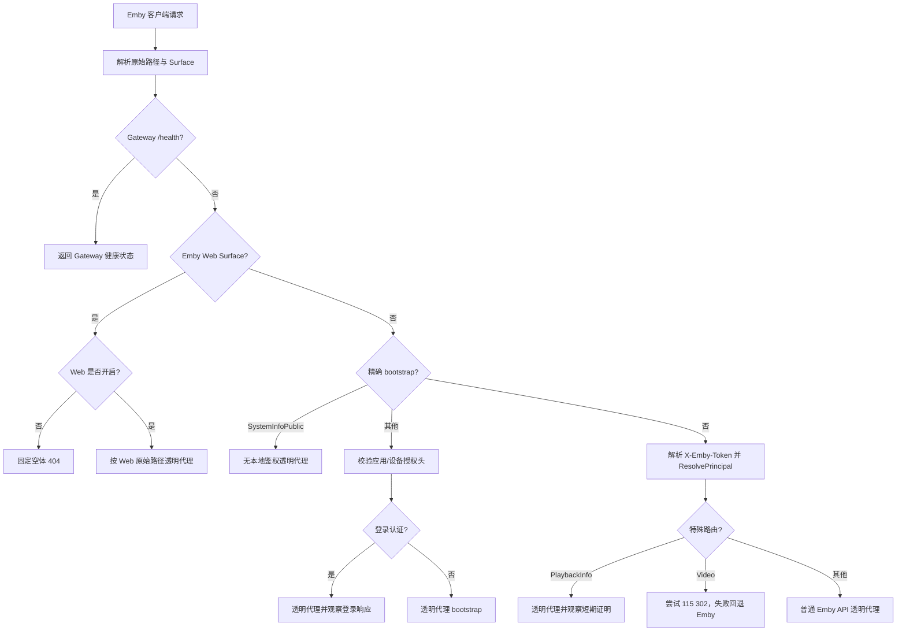
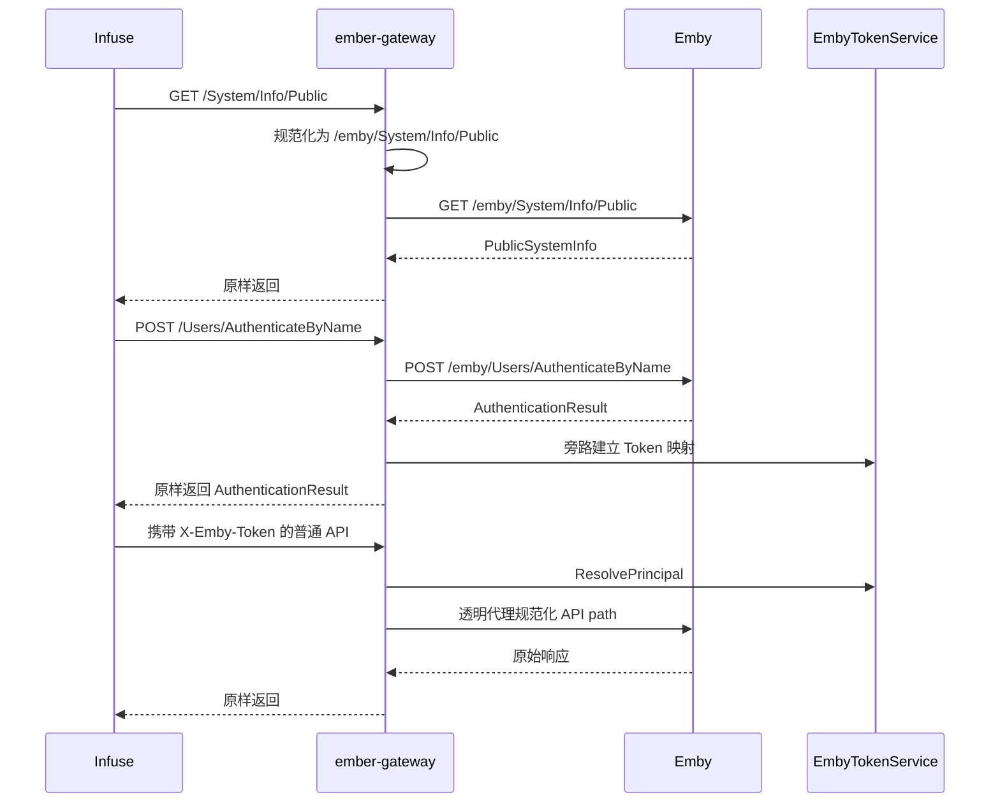

# Ember Gateway 透明代理与 Web 访问控制实现方案

> 状态：进行中
> 负责人：Ember
> 更新时间：2026-08-23

## 背景

`ember-gateway` 已经具备 Emby 登录响应观察、AccessToken 映射、本地用户资格门控、PlaybackInfo 证明、115 直连决策和 Emby 视频回退能力。但当前路由合同仍围绕 `/emby/...` 特定路径设计，没有完整承担“客户端访问 Emby 的唯一公网入口”职责。

2026-08-23 的生产访问日志已经确认：Infuse `8.5` 首次连接时会在尚未取得用户 AccessToken 前请求根路径 `GET /System/Info/Public`，当时已部署的旧 Gateway 将其归类为普通受保护请求并返回 `401`，日志为 `code=token_header_invalid`。因此登录链路会在用户名密码认证之前中断。

固定的 Emby SDK `4.9.3.0` OpenAPI 同时给出两个容易混淆的事实：Server base URL 包含 `/emby`，接口 path 本身写作 `/System/Info/Public`、`/Users/AuthenticateByName` 等根路径形态；生成的 `SystemInfoPublic` 参考页又把该接口标记为需要用户认证。真实 Infuse 的登录前行为与生成文档的认证标记存在冲突，不能继续靠路径名或经验猜测。

现有 [Emby 115 直连播放网关实现方案](./emby-115-direct-play-gateway.md) 负责 115 Provider、DirectPlay 和播放回退；本计划单独负责 Gateway 的通用反向代理、客户端路径兼容、登录前 bootstrap 和 Emby Web Surface 控制。两者共用同一个 `ember-gateway` 进程，但职责和验收条件不同。

## 目标

本方案要实现：

1. 让 `ember-gateway` 成为兼容 Emby 客户端的完整透明反向代理，未命中特殊处理器的合法 Emby API 请求默认转发到既有 Emby Server。
2. 同时兼容客户端根 API 路径和历史 `/emby/...` 路径，不依赖外部 Nginx 做隐式 rewrite，也不产生重复 `/emby/emby/...`。
3. 为登录前请求建立最小、精确、版本化的 bootstrap allowlist，先解决 Infuse `GET /System/Info/Public` 无法进入登录流程的问题，同时保持任意匿名代理失败关闭。
4. 保留现有 `AuthenticateByName`、PlaybackInfo、视频 115 直连和回退处理；图片、字幕、会话事件及其他普通接口默认透明代理。
5. 增加一个全局 Emby Web Surface 开关，管理员可禁止通过 Gateway 打开 Emby 网页端，同时不影响 Infuse 等原生客户端使用受保护 API。
6. 对路径分类、认证分支、特殊处理和上游结果打印脱敏日志，能够区分“被策略拒绝”“上游代理失败”“115 加速回退”和“普通代理成功”，不新增日志表。

## 非目标

本次明确不做：

- 不按用户、套餐、设备或客户端名称分别开放 Emby Web；首期只有全局开关。
- 不把 `User-Agent`、`Client` 或 `Device` 当作强认证依据，也不承诺阻止伪装成 API 客户端的自定义程序。
- 不替代 Emby 自身用户权限、媒体库授权、远程访问和会话管理。
- 不支持 Jellyfin、多 Emby Server、Emby Connect、Quick Connect 或 PIN 登录。
- 不顺带改写 HLS、DASH、转码 manifest 或未知插件协议。
- 不把所有匿名根路径转发给 Emby；匿名访问仍只允许版本合同和真实客户端证据共同支持的精确路由。
- 不在本计划中新增 115 表、直连会话表、播放策略表或容量回收任务。
- 不把生成文档与真实客户端冲突的认证语义直接当成已确认事实；证据不足的 Header、WebSocket 和静态资源路径继续标记“未证实”。

## 当前事实

### 相关文档与实现

- 系统边界：[系统架构](../../system-architecture.md)
- Emby 版本化协议：[Emby 4.9 系列播放代理 API 合同](../../reference/emby-playback-proxy-contract.md)
- 115 播放链路：[115 Cookie 直连播放端到端流程参考](../../reference/p115-playback-end-to-end-flow.md)
- 115 专项计划：[Emby 115 直连播放网关实现方案](./emby-115-direct-play-gateway.md)
- 部署入口：[Docker Compose 部署说明](../../../infrastructure/docker/README.md)
- Gateway HTTP 核心：`services/api/internal/playbackgateway/`
- Gateway 运行时：`services/api/internal/playbackgateway/runtime.go`
- 设置中心：`services/api/internal/config/`、`services/web/src/views/admin/SettingsView.vue`

### 已由代码确认

- 当前 `classifyRoute` 在规范化后识别 AuthenticateByName、SystemInfoPublic、公开用户、PlaybackInfo 和视频流等精确路径。
- SystemInfoPublic 是唯一无本地鉴权的公开路由；认证和其他 public bootstrap 校验应用头，其余请求提取唯一 `X-Emby-Token` 并调用 `ResolvePrincipal`。
- root 与 `/emby` 形态的精确 `GET System/Info/Public` 都透明代理到上游，其他 method、大小写、尾斜杠和 encoded path 不继承公开权限。
- PlaybackInfo、视频流是普通代理上的选择性处理器；Playing、Progress、Stopped、图片、字幕和其他未知受保护接口没有独立处理器时会走普通代理。
- 外部 Nginx 示例把请求原样 `proxy_pass` 到 Gateway，没有路径 rewrite；路径规范化应由 Gateway 单点负责。
- Gateway 与 API 共用一个镜像和一个 `ember` 二进制，分别以 `ember gateway`、`ember api` 运行；本计划不改变进程和镜像模型。

### 已由生产日志确认

2026-08-23 已确认：

- Gateway 已完成上游身份核对并监听 `:8081`，接受的目标 Emby 版本为 `4.9.3.0`，ServerId 长度为 `32`；日志未暴露 ServerId 原值。
- 客户端：`Infuse-Direct/8.5`
- 首次连接请求：`GET /System/Info/Public`
- 当前响应：`401`
- Gateway 分支：`code=token_header_invalid`
- `v2.0.1` 部署后同一路径进入 `code=application_header_invalid route=public_bootstrap pathMode=root`，证明路径已修复但应用头门控仍错误。
- 同一目标 Emby `4.9.3.0` 的精确接口已实测无需登录即可返回 PublicSystemInfo。
- SystemInfoPublic 放行后，Infuse AuthenticateByName 已实测使用唯一 `X-Emby-Authorization` 和大小写敏感的 `MediaBrowser` scheme。
- Emby `4.9.3.0` 的认证成功响应已实测使用 `Content-Encoding: deflate`，Content-Type 为 JSON；原始压缩长度约 `1.2 KiB`。

这些证据证明目标 Emby 版本、root path、SystemInfoPublic 无登录语义、AuthenticateByName Header/scheme 和 deflate 响应编码；没有公开 ServerId 原值，也没有证明 Token 映射后的后续请求、PlaybackInfo、视频路径和 302 行为。

### 已由固定版本 SDK 确认

- Emby SDK `4.9.3.0` OpenAPI 的 server base URL 是 `http://emby.media/emby`。
- OpenAPI path 使用 `/System/Info/Public`、`/Users/AuthenticateByName`、`/Items/{Id}/PlaybackInfo`、`/Videos/{Id}/stream` 等根路径形态。
- 生成的 `SystemInfoPublic` 文档把接口标记为需要用户认证，但真实 Infuse 在登录前调用它，目标 Emby 又确认无登录可访问；实现以运行证据为准，并在版本合同中保留这一生成文档偏差。

## 已确认决策

| 维度 | 决策 |
| --- | --- |
| 公网入口 | `ember-gateway` 是用户访问 Emby 的唯一公网入口；原始 Emby 只允许 Gateway 和运维网络访问 |
| 默认行为 | 已解析为合法 Principal 的普通 Emby API 默认透明代理，只有少数固定路由进入特殊处理器 |
| 匿名行为 | 只允许精确 `GET System/Info/Public` 无本地鉴权；其他 bootstrap 和未知路径继续失败关闭 |
| 客户端路径 | 同时接受根 API 路径和 `/emby/...` API 路径 |
| 上游 API 路径 | 转发给 Emby 时规范化为单一 `/emby/...`，禁止双前缀 |
| Web Surface | 与 API 路径分开识别，由独立全局开关控制；默认开启以保持现有用户可见行为 |
| 外部反向代理 | 只负责 HTTPS、域名和原样转发，不承担 Emby 路径 rewrite |
| 特殊处理 | 登录、PlaybackInfo、视频直连继续由既有处理器负责；其余接口走默认代理 |
| 配置真相源 | 复用 ConfigService 和通用 `settings`，不增加第二套环境变量配置 |
| 日志 | 只写应用日志，不新建数据库日志表；不记录 Token、密码、Cookie、完整 URL/query 或响应体 |

## 方案设计

### 1. 用户可见行为

- Infuse 可直接把 Gateway 域名作为 Emby Server 地址，不需要用户手工补 `/emby`。
- 历史上已经使用 `/emby` 前缀的客户端继续可用，不会被拼成 `/emby/emby/...`。
- 登录、浏览媒体库、获取图片与字幕、上报播放进度及普通代理播放保持 Emby 原有状态、Header 和响应体语义。
- 115 条件成立时视频请求仍返回 302；115 不可用、账号未配置、源路径未映射或直链失败时仍回退普通 Emby 播放。
- Web Surface 开启时，Gateway 透明提供 Emby Web；关闭时，明确属于 Emby Web 页面和静态资源的请求返回固定空体 `404`，且不访问上游。
- Web Surface 关闭不影响已认证 Emby API；不能使用 `User-Agent` 粗暴拦截浏览器请求。

### 2. 请求处理流水线



实现时认证路由仍属于 bootstrap 特例，但在逻辑上先完成 Surface 和路径规范化，再基于规范化后的 API path 分类，避免根路径与 `/emby` 路径各维护一套处理器。

### 3. 路径与 Surface 规范化

Gateway 内部引入一个只描述路由事实的规范化结果，至少包含：

- 原始客户端 path：仅供本次转发，不写日志。
- 规范化 API path：用于认证、PlaybackInfo、视频等路由分类。
- 上游 path：用于 ReverseProxy 转发。
- Surface：`gateway-health`、`emby-api`、`emby-web` 或 `unsupported`。

已确认的映射规则：

| 客户端请求 | 内部 API path | 上游 path | 说明 |
| --- | --- | --- | --- |
| `/System/Info/Public` | `/emby/System/Info/Public` | `/emby/System/Info/Public` | Infuse 已实测使用根路径 |
| `/Users/AuthenticateByName` | `/emby/Users/AuthenticateByName` | `/emby/Users/AuthenticateByName` | 根路径兼容 |
| `/Items/{Id}/PlaybackInfo` | `/emby/Items/{Id}/PlaybackInfo` | `/emby/Items/{Id}/PlaybackInfo` | 继续复用现有证明处理器 |
| `/Videos/{Id}/...` | `/emby/Videos/{Id}/...` | `/emby/Videos/{Id}/...` | 继续复用现有 115 决策 |
| `/emby/...` | 保持单一 `/emby/...` | 保持单一 `/emby/...` | 兼容历史地址，禁止重复前缀 |
| 已确认的 Emby Web 路径 | 不进入 API 分类 | 保持 Web 合同要求的原始路径 | 由 Web Surface 开关控制 |

不能把“所有根路径一律加 `/emby`”作为实现，因为 Emby Web 页面、静态资源、WebSocket 或根跳转未必使用 API base path。编码前必须先用固定 `4.9.3.0` Web 资源和 mock 夹具补齐最小 Surface 矩阵，确认 `/web`、入口跳转、静态资源、Branding 和 WebSocket 的真实 path 与认证要求；未确认路径不得凭经验加入匿名 allowlist。

路径规范化必须保留原始 query、method、请求体和合法 Header；拒绝 encoded slash、控制字符、重复前缀、路径清理后语义变化及其他可能绕过精确路由判断的变体。

### 4. 登录前 bootstrap

首期 bootstrap 目标集合：

| Method | 规范化 API path | 处理 |
| --- | --- | --- |
| `GET` | `/emby/System/Info/Public` | 无本地鉴权，透明代理并记录脱敏上游状态 |
| `POST` | `/emby/Users/AuthenticateByName` | 保持现有登录响应观察与 Token 映射 |
| `GET` | `/emby/Users/Public` | 保持现有公开用户代理 |
| `GET`, `HEAD` | `/emby/Users/{Id}/Images/{Type}` | 保持现有精确无 Index 图片形态 |

`System/Info/Public` 的官方生成文档与真实行为冲突，现已按运行证据收口：

1. Infuse `8.5` 在取得用户 Token 前请求该路径，且不满足严格应用头解析。
2. 同一目标 Emby `4.9.3.0` 已确认无登录直接返回 PublicSystemInfo。
3. Gateway 只对精确 `GET` 取消本地鉴权，保留原始 Header 和上游响应权威。
4. 上游状态使用固定 route/pathMode/statusCode 日志观察，不记录 Header、URL 或响应体。

这一例外不扩展到公开用户、头像、Branding、Quick Connect、其他 method 或路径变体。

### 5. 默认透明代理与选择性处理

成功解析 Principal 后，Gateway 使用“默认代理，少数拦截”的结构：

| 路由 | Gateway 附加行为 | 上游语义 |
| --- | --- | --- |
| `AuthenticateByName` | 观察成功响应并建立不可逆 Token 映射 | 原始响应保持权威 |
| `PlaybackInfo` | 观察合格成功响应并生成进程内短期证明 | 原始请求/响应透明 |
| `Videos/{Id}/...` | 尝试 115 直连；不适用或失败时回退 | fallback 保持原始请求 |
| `Sessions/Playing*` 等进度接口 | 首期不改写，仅通过默认代理 | Emby 自身处理进度同步 |
| 图片、字幕、媒体库及其他受保护 API | 无特殊处理 | 默认透明代理 |

特殊处理器只消费规范化 API path，不自行重复判断根路径和 `/emby` 前缀。新增特殊处理器前仍必须先补对应 Emby 版本合同和 mock 测试。

### 6. Web Surface 全局开关

计划新增 ConfigService 配置项：

| Key | 类型 | 默认值 | 生效方式 | 用途 |
| --- | --- | --- | --- | --- |
| `PLAYBACK_GATEWAY_WEB_ENABLED` | boolean | `true` | 重启 `ember-gateway` | 是否允许通过 Gateway 访问已确认的 Emby Web Surface |

该配置复用通用 `settings` 表和现有设置 API，不新增业务表或 SQL migration。当前 Gateway 只在进程构造时读取运行设置，首期配置定义必须标记 `restartRequired=true`，保存后由管理员重启 `ember-gateway` 生效；设置页面复用现有重启提示。热更新需要独立的跨进程失效机制，本计划不伪造即时生效语义。

管理员设置入口放在现有“媒体集成”职责下，只增加一个开关和至多一条简短风险说明。前端实现必须遵守 Ember 风格，设计和交互基线以 [Web 设计规范](../../reference/web-design-guide.md) 为准；本计划没有偏离规范的特例。

关闭时只拒绝经合同确认属于 Web UI 的页面和静态资源，不拒绝普通 Emby API，也不基于浏览器 UA 判断。WebSocket、Branding 或根路径若同时被原生客户端使用，必须先完成版本合同与 mock 覆盖，再决定归属，不能因为名称像 Web 就直接拦截。

这个开关控制的是 Gateway 暴露面，不是强客户端身份认证。要使它有实际意义，原始 Emby 公网入口仍必须隔离；否则用户可以绕过 Gateway 直接访问 Emby Web。

### 7. 数据与模型

本计划首期不新增数据库表、模型字段、索引或约束，不需要 SQL migration。

- 全局 Web 开关复用通用 `settings` 表。
- 现有 `emby_access_tokens` 继续负责 Gateway 身份映射，不增加 Token 明文字段。
- 现有 `playback_transfer_tasks` 继续只记录 115 传输 provenance。
- 将来若增加按用户或套餐控制 Web/API 的策略，必须另建计划并重新评估模型与 migration，不能把策略 JSON 塞进现有 Token 映射。

### 8. 日志与安全边界

关键日志使用固定字段和稳定 code，至少能区分：

- `surface=emby_api|emby_web`。
- `pathMode=root|emby_prefixed`，不记录原始 path、query 或媒体文件名。
- SystemInfoPublic 的上游状态，以及其他 bootstrap 因应用头无效被拒绝。
- Web Surface 因全局开关被拒绝。
- 普通代理上游不可用。
- 现有视频 `decision=redirect|fallback|reject`。

禁止记录 AccessToken、Authorization 原值、用户名密码、Cookie、完整 URL/query、媒体 Path、115 URL、上游响应体或静态资源完整文件名。普通成功 API 请求不应逐请求刷大量日志；只对登录链路、策略拒绝、路径兼容分支和失败点保留足够诊断信息。

### 9. 关键流程

#### 9.1 Infuse 首次连接与登录



#### 9.2 普通 API 和视频请求

1. 解析 Surface 和路径模式，得到唯一规范化 API path。
2. 非 bootstrap 请求先通过 `X-Emby-Token` 映射和实时用户资格检查。
3. PlaybackInfo 观察证明；视频流尝试 115 302；其他请求直接代理。
4. 115 任一步骤不适用或失败时，合法 Principal 的视频请求回退 Emby，不拒绝正常播放。
5. 上游状态、普通 Header 和响应体保持 Emby 权威；Gateway 不重编码未知 JSON。

#### 9.3 Web Surface

1. 先根据固定合同识别 Web 页面/静态资源 Surface，不把其 path 当作 Emby API 前缀处理。
2. 开关关闭时返回固定空体 `404`，不访问 Emby。
3. 开关开启时按合同要求的原始 path 代理，并保留 WebSocket upgrade 等已确认传输语义。
4. Web 页面后续调用受保护 API 时，仍必须经过同一 Token 门控；打开网页入口不等于绕过用户资格。

### 10. 失败路径与边界条件

- 根路径无法安全规范化：返回固定客户端错误，不尝试猜测上游 path。
- encoded slash、重复前缀或大小写变体试图命中特殊路由：不继承 bootstrap/特殊权限，按受保护或不支持路径处理。
- AuthenticateByName、公开用户或公开头像应用头缺失、重复或格式非法：空体 `401`，不访问 Emby；SystemInfoPublic 不使用该门控。
- AccessToken 缺失、未映射、已撤销或身份错配：保持现有 `401`；用户不可用或到期保持 `403`。
- Web Surface 已关闭：固定空体 `404`，不向上游发送请求。
- Web 路径归属未确认：不因猜测扩大匿名或 Web allowlist；先补合同。
- 上游不可用：保持固定空体 `502` 和脱敏错误类型。
- 115 不适用或失败：仅影响加速，合法用户回退 Emby 正常播放。
- 配置读取失败：Gateway 启动失败关闭；不能静默把 Web 开关或上游配置切到不确定值。
- 原始 Emby 仍公网可达：视为部署不合规；Gateway 的 Token 撤销和 Web 开关都可被绕过。

## 分阶段落地

### 阶段 0：合同与失败测试

- 把 2026-08-23 Infuse 根路径实证同步到版本合同。
- 使用生产日志和目标 Emby 只读结果确认 `System/Info/Public` 无需应用头或用户 Token，不保存 Header 原值。
- 固定 root、`/emby`、Web、WebSocket、Branding 和不支持路径的 Surface 矩阵。
- 先补会失败的 Gateway 测试，覆盖路径规范化、双前缀、bootstrap 和 Web 开关。

### 阶段 1：根 API 兼容与完整默认代理

- 提取统一的路径/Surface 规范化边界。
- 让根路径和 `/emby` 路径复用同一套分类与特殊处理器。
- 在证据成立后精确支持登录前 `System/Info/Public`。
- 保持默认受保护 API 透明代理和现有 115 fallback。

截至 2026-08-23，本阶段代码已完成：Gateway 按支持范围内 9 个稳定 `4.9` OpenAPI 顶层 API family 的并集规范化 root path，保留已有 `/emby/...`，拒绝重复 `/emby/emby/...`，并让 AuthenticateByName、PlaybackInfo、视频和进度事件复用现有处理器。目标 Emby 已确认 SystemInfoPublic 无登录可访问，Infuse `8.5` 已确认认证使用 `X-Emby-Authorization: MediaBrowser ...`；Gateway 已实现精确公开路由与 `Emby/MediaBrowser` 双固定 scheme，fake、race 与 API 全量测试已通过，完整 Infuse 登录仍待本地复验。

### 阶段 2：Web Surface 控制

- 完成 Emby Web 入口、静态资源和 WebSocket 版本合同。
- 接入 `PLAYBACK_GATEWAY_WEB_ENABLED` ConfigService 定义、管理 API 和设置页面。
- 锁定关闭时不访问上游、开启时页面和 API 均可工作的测试。

### 阶段 3：受控实机验收

- 使用目标生产版本记录 Infuse 平台、精确版本和日期。
- 验证系统信息、用户名密码登录、媒体库、图片、字幕、PlaybackInfo、普通 Emby 视频回退、115 302 和 Playing/Progress/Stopped。
- 分别验证 Web 开启/关闭；确认关闭 Web 不影响 Infuse。
- 验收前确认原始 Emby 公网入口已隔离；否则只能证明功能，不能证明安全边界。

## 影响范围

- API：修改 `internal/playbackgateway` 的路径分类、ReverseProxy director/Rewrite、bootstrap 和 Web Surface；ConfigService 增加全局开关定义。
- Web：在现有设置中心增加一个全局开关；不新增独立页面。
- Bot：无。
- 数据库：首期无 schema 变化；复用 `settings` 表。
- 配置/部署：Nginx 继续原样转发；需要在 runbook 明确原始 Emby 隔离和 Web 开关生效方式。
- 文档：同步 `docs/system-architecture.md`、Emby 代理合同、115 端到端流程、部署说明和配置参考。

## 验证方式

### 自动化测试

- TDD：先补根路径当前返回 `401`、双前缀风险、Web 关闭仍访问上游等失败用例，再做最小实现。
- Gateway fake upstream 测试覆盖：根 API path、`/emby` path、method/query/body/Header/状态/响应体透传、encoded path、404/401/403/502、取消和上游错误脱敏。
- bootstrap 测试覆盖：`System/Info/Public` 无鉴权精确 method/path、上游状态透传，以及其他 bootstrap 的应用头和未知匿名路径拒绝。
- 特殊处理回归覆盖：AuthenticateByName Token 映射、PlaybackInfo 证明、视频 302、115 失败 fallback、进度事件普通代理。
- Web Surface 测试覆盖：开关默认值、配置解析、开启代理、关闭不触发 upstream、API 不受误伤、WebSocket/静态资源合同。
- ConfigService/API/Web 测试覆盖：boolean DTO 为 camelCase、设置保存与读取、跨进程生效语义、页面开关成功/失败状态。
- 所有 Emby 上游均使用 fake/`httptest`，不得请求真实 Emby 或外网。

计划执行的本地验证命令：

```bash
go -C services/api test ./internal/playbackgateway ./internal/config ./internal/app
go -C services/api test ./...
go -C services/api vet ./...
go -C services/api build ./...
npm --prefix services/web run test
npm --prefix services/web run build
```

### 手工验收

手工验收属于阶段 3，必须由用户明确授权且不能通过 Codex 启动项目服务。需要区分记录：

- fake 自动化通过。
- 编译通过。
- 目标 Emby/Infuse 真实登录通过。
- 普通 Emby 视频 fallback 通过。
- 115 302 通过。
- Web 开关开启/关闭通过。
- 原始 Emby 入口隔离通过。

任何一层未执行，都不能用其他层的结果代替。

## 已完成项与剩余项

### 已完成基线

- Gateway 独立进程、固定 `:8081` 监听和同镜像双容器部署入口。
- Emby `>= 4.9.0.0 && < 4.10.0.0` 启动版本核对。
- AuthenticateByName 透明代理和 AccessToken 映射。
- 所有现有受保护 `/emby/...` 请求的 Principal 门控与默认代理。
- PlaybackInfo 证明、115 视频 302/fallback、普通进度接口透传能力。
- 2026-08-23 生产日志确认 Infuse 根 `System/Info/Public` 兼容缺口。
- 已按支持范围内稳定 OpenAPI API family 并集把 root path 规范化为单一 `/emby/...`，已有 `/emby` 请求保持兼容，重复前缀失败关闭。
- 已把精确 root/`/emby` `GET System/Info/Public` 拆为唯一无本地鉴权的公开透明代理，并让 root AuthenticateByName、PlaybackInfo、视频与进度请求复用现有处理器。
- 已按 Infuse `8.5` 实测兼容精确 `X-Emby-Authorization: MediaBrowser ...`，同时保留 SDK `Emby` scheme 和全部 Header 唯一性、字段、Token、quoted-string 严格校验。
- 已按目标 Emby 实测的 deflate 认证响应建立 `identity/gzip/deflate` 白名单旁路解析：原响应透明返回，只解压有界旁路副本，失败时不建立映射且不泄露响应内容；其中 gzip 为 fake 合同测试覆盖的兼容能力，不表述为目标环境实测行为。
- 已为每个 Gateway 请求增加统一 `request_completed` 脱敏日志，覆盖有界 method/Host/原始 path、query key、route、status/outcome/耗时，以及认证 Header 数量、scheme 和 Token presence；query value、Header 原值、Cookie 与 Token 永不进入日志。
- 已用 fake 和 race 测试覆盖 method/query/Header/body/响应透传、Token 门控、登录映射、证明、视频 redirect/fallback、未知/Web Surface 不改写和错误日志脱敏。
- API 全量 `go test ./...`、`go vet ./...` 和 `go build ./...` 已通过；自动化没有请求真实 Emby 或 115。

### 剩余项

- 部署 SystemInfoPublic 修复并确认上游 `200`，完成真实用户名密码登录复验。
- Web/静态资源/WebSocket Surface 合同。
- ConfigService 全局 Web 开关和设置页面。
- 受控 Infuse 与 Web 实机验收。
- 原始 Emby 公网入口隔离确认。

## 落地后文档处理

实现完成后必须：

1. 把稳定的 Gateway Surface、路径规范化、bootstrap、默认代理和 Web 开关职责写入 `docs/system-architecture.md`。
2. 把确认后的 Emby `4.9` root/base path、`System/Info/Public`、Web 资源和 WebSocket 合同写入 `docs/reference/emby-playback-proxy-contract.md`。
3. 更新 `docs/reference/p115-playback-end-to-end-flow.md` 的完整时序、验证证据和审查问题状态。
4. 更新配置参考、部署说明和反向代理示例，明确 Nginx 不 rewrite、原始 Emby 必须隔离。
5. 当代码、测试、部署文档和真实 Infuse/Web 验收全部完成，且稳定事实已提炼到 reference/architecture 后，把本计划状态改为“已完成”，迁入 `docs/archive/plan/architecture/`。

以下任一项未完成时不得归档：root 与 `/emby` 兼容测试、bootstrap 合同、Web 开关边界、普通播放 fallback、文档同步或明确记录的实机验证结论。
