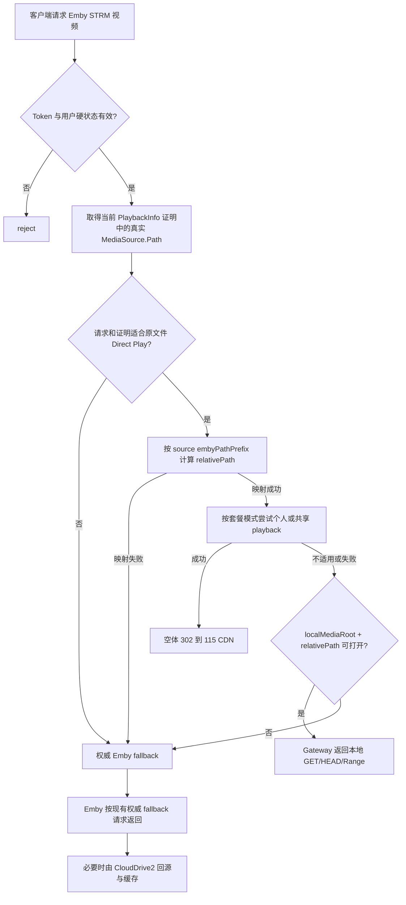

# STRM 本地媒体回退播放实现方案

> 状态：草稿
> 负责人：Ember
> 更新时间：2026-09-02

## 背景

Emby 媒体库只收录由 115 媒体目录生成的 STRM，不扫描本地硬盘上的 MoviePilot 整理硬链接。播放器因此始终从同一套 STRM 条目发起播放，不会因为本地与云端各有一份文件而产生重复媒体条目。

外部同步链路会让 115 正式媒体目录与本地硬链接目录保持相同的相对路径和文件名。当前 Ember 在 115 DirectPlay 不适用或失败时，会把视频请求回退给 Emby；当 STRM 最终由 CloudDrive2 提供视频字节时，本地已经存在的同路径文件仍可能被忽略，导致 CloudDrive2 再从 115 下载并建立缓存。

本计划只在现有 Gateway 播放链路中增加一个透明的本地回退层：成功的 115 `302` 保持不变；原本准备回退 Emby 的请求，先用 STRM 对应的真实媒体路径计算相对路径，本地精确路径存在时由 Gateway 直接提供视频字节，本地不存在或不可用时再保持当前 Emby/CloudDrive2 回退。

当前 115 组件、时序和证据边界见 [115 Cookie 直连播放端到端流程参考](../../reference/p115-playback-end-to-end-flow.md)；管理员全局账号 DirectPlay 主计划见 [Emby 115 直连播放网关实现方案](./emby-115-direct-play-gateway.md)；用户个人账号和 Redis 配额见 [115 用户自有账号路由与 Redis 配额实现方案](./p115-personal-account-routing-and-redis-quotas.md)。

## 目标

1. 保持 Emby 只有一套 115 STRM 媒体库，本地硬链接不进入 Emby，也不生成第二套 Item。
2. 在 115 DirectPlay 失败后的公共 fallback 层，根据 `MediaSources[].Path` 和现有 source 前缀得到唯一 `relativePath`。
3. 当 `localMediaRoot + relativePath` 对应的本地普通文件存在且可打开时，由 Gateway 直接完成原始视频的 `GET`、`HEAD` 和字节 Range 响应。
4. 本地未命中、不可读或不适合直接响应时，无损回退当前权威 Emby 请求，继续允许 CloudDrive2 回源播放。
5. 保持 Token、用户硬状态、PlaybackInfo 证明、115 `302`、字幕、Playing/Progress/Stopped 和现有日志脱敏边界不被绕过。

## 非目标

本计划明确不做：

- 不监听 MoviePilot 事件，不上传本地文件，不管理上传队列、重试、对账或完成状态；本地到 115 的同步完全属于外部功能。
- 不把本地硬链接加入 Emby 媒体库，不创建本地/云端两套媒体条目，也不按 Emby ItemId 维护本地文件关联。
- 不计算或比较文件 SHA1、大小、修改时间、inode 或其他内容身份；精确相对路径和文件名一致且本地文件存在，就按同一媒体处理。
- 不递归扫描目录，不按文件名模糊搜索，也不处理不同目录下的同名文件匹配。
- 不跟随 `PLAYBACK_LOCAL_MEDIA_ROOT`、中间目录或最终文件的符号链接；本地同步目标是普通文件/硬链接，不需要用符号链接扩展可访问范围。
- 不创建媒体映射表、文件索引表或播放缓存表，不在 PostgreSQL 或 Redis 保存本地文件存在状态。
- 不使用本地文件替代 source 115 的 preID/challenge `HashFileRange`；本计划只优化最终返回给播放器的视频字节。
- 不让本地文件覆盖成功的 115 DirectPlay；115 候选完整成立时仍返回当前 `302`。
- 不改写 HLS、DASH、转码 manifest 或转码分片，不在 Gateway 中新增转码能力。
- 不新增可直接传入任意磁盘路径的公开下载接口，不向客户端暴露宿主机或容器文件路径。
- 不改变 MoviePilot、CloudDrive2、STRM 生成器或 115 Provider 的实现与配置。

## 当前事实

以当前代码和现行文档为准：

- `internal/playbackgateway` 已对 Emby `>= 4.9.0.0 && < 4.10.0.0` 的固定视频路由做身份门控，并从透明代理的 PlaybackInfo 响应保存有界 `MediaSource.Path` 证明。
- `playbackgateway.serveVideo` 当前只在完整 DirectPlay 候选成立时返回 `302`；其余合法请求最终调用 `proxyVideoFallback`，由 Emby 返回状态、响应头和视频体。
- 按需 PlaybackInfo 已为普通视频请求准备与 DirectPlay 决策分离的权威 Emby fallback request，不能为了本地回退退化为猜测路径。
- `directplay.Service.ResolveMediaPath` 已能按 source 账号的 `embyPathPrefix + sourceRootId` 将 `MediaSource.Path` 映射为 115 `relativePath`，并拒绝兄弟前缀、空路径、`.`、`..`、反斜杠和非规范路径。
- 当前 `ResolveMediaPath` 在 source/playback 账号加载后才完成映射；如果 playback 账号未绑定、不可用、达到未来并发上限，Gateway 不一定能获得可供本地查询复用的 `relativePath`。
- 当前 Gateway 没有本地媒体读取组件，没有 `PLAYBACK_LOCAL_MEDIA_ROOT`，Compose 的 `ember-gateway` 也没有本地媒体只读挂载。
- 当前每个视频请求只记录一条 `redirect|fallback|reject` 最终决策日志；fallback 的上游状态由 ReverseProxy 响应钩子补齐。
- 当前实机证据中的“本地 fallback `206`”是 Emby 对一个本地媒体条目的权威 fallback，不等于“115 STRM 映射到隐藏的本地硬链接后由 Gateway 直接读取”；本计划能力尚未实现，也尚无真实客户端证据。
- 本计划依赖一个部署前提：外部系统保证 115 正式目录和本地媒体根目录下的相对路径、大小写及文件名完全一致。Ember 不负责建立或验证这个同步合同。

## 已确认决策

| 主题 | 决策 |
| --- | --- |
| Emby 媒体真相 | Emby 只扫描 115 生成的 STRM，本地硬链接不进入媒体库 |
| 本地文件角色 | 只作为 STRM 实际视频的透明本地副本，不成为新的媒体条目 |
| 播放优先级 | 身份门控 → 115 DirectPlay → 本地精确路径 → Emby/CloudDrive2 |
| 本地身份规则 | `relativePath` 和文件名精确一致且文件存在、可打开，即视为同一视频 |
| 明确不比较 | 不比较 SHA1、文件大小、修改时间、inode 或上传状态 |
| 查找方式 | 只拼接并检查一个确定路径，不扫描、不模糊匹配、不尝试候选列表 |
| 链接边界 | 普通文件和硬链接允许；配置根目录、任一中间目录和最终文件均禁止符号链接 |
| source 映射加载 | 只读取唯一启用的管理员全局 source 位置元数据，不检查 Provider 健康状态、不读取 Provider UID、不解密 Cookie |
| 状态存储 | 不使用 PostgreSQL 或 Redis 保存本地文件索引、命中结果或播放字节状态 |
| 失败策略 | 本地未命中或打开失败时继续现有 Emby fallback；不能因为可选本地能力让合法用户失去播放 |
| 115 兼容 | 成功的个人/系统 115 `302` 保持不变；本地播放不占用 115 Redis 播放租约和转存配额 |
| 配置边界 | 本地根目录是 Gateway 部署期配置，默认未配置即关闭，不增加后台页面 |

## 方案设计

### 1. 用户可见行为

- 用户仍从同一套 Emby STRM 媒体库选择影片，不会看到本地硬链接、第二个版本或额外播放源。
- 115 DirectPlay 成功时行为不变，客户端继续收到空体 `302` 并直连 115 CDN。
- 115 DirectPlay 不适用或失败时，如果本地精确路径命中，客户端在原视频请求上收到 Gateway 返回的本地视频响应，不需要知道本地路径。
- 本地文件不存在、不可读或请求不适合原文件直读时，客户端继续获得当前 Emby/CloudDrive2 结果。
- 本地命中不会修改 Emby 播放进度、字幕和会话事件入口；这些请求仍按现有 Gateway 透明代理合同工作。

### 2. 数据与配置

本次不涉及数据库模型变更，不新增 SQL migration，也不新增 Redis Key。

新增一个 Gateway 部署期配置：

| 配置项 | 默认值 | 生效方式 | 语义 |
| --- | --- | --- | --- |
| `PLAYBACK_LOCAL_MEDIA_ROOT` | 空 | 重启 Gateway | Gateway 容器内的本地媒体只读根目录；空表示关闭本地回退 |

配置要求：

- 非空值必须是规范化绝对目录，不能是 `/`，也不能包含 NUL、`.` 或 `..` 等歧义段；配置根目录本身必须是可打开的真实目录，不能是符号链接。
- 本地文件路径只使用现有 source `embyPathPrefix` 映射得到的 `relativePath`；不再新增第二个远端前缀配置。
- 配置非空但目录不存在、不是目录或不可访问时，Gateway 记录固定脱敏原因并关闭本地回退，正常 Emby 代理继续可用；可选本地能力不能阻止 Gateway 启动。
- 官方 Compose 不强制所有部署挂载宿主机目录。实现时在部署 runbook 提供 `ember-gateway` Compose override 示例，把真实宿主机媒体目录只读挂载到配置的容器路径。
- 不通过设置中心或 Web 页面维护宿主机路径，避免数据库值与容器实际 mount 脱节。

### 3. 组件与职责边界

#### 3.1 路径映射

把“根据 source 的 `embyPathPrefix` 将 `MediaSource.Path` 转成 `relativePath`”收口为 DirectPlay 和本地回退共用的单一映射能力：

- 输入只能来自当前 Principal 对应的有效 PlaybackInfo 证明或按需 PlaybackInfo 结果，不能来自客户端提交的任意文件路径。
- 新增独立的 source 映射加载边界，只选择唯一的管理员全局 `role=source + owner_user_id IS NULL + enabled=true + status<>revoked` 记录，并且只返回 `embyPathPrefix/sourceRootId`。它不要求 `status=active`，不读取 Provider UID，不解密 Cookie，也不申请冷却半开探测租约。
- source 处于 `error` 或 `cooling_down` 时，只要仍是唯一启用的全局 source 且位置有效，本地路径映射继续可用；真正访问 115 时仍使用现有严格凭证加载器和健康状态机。管理员手动停用 source、没有唯一启用记录或位置非法时，不从其他历史 source 猜测路径。
- 映射必须在根据 `personal|system` 套餐模式选择“个人 playback 或管理员共享 playback”、申请 Redis 租约和调用 Provider 之前完成；这样个人账号未绑定、账号并发已满、Redis 不可用或 Provider 失败时仍可复用同一个 `relativePath` 做本地回退。
- DirectPlay 与本地回退不得分别实现一套前缀剥离规则；兄弟前缀、路径遍历、反斜杠和空相对路径继续使用同一合同拒绝。
- 映射失败只禁止本地/115 加速，合法请求仍使用权威 Emby fallback。

#### 3.2 本地媒体解析器

在 `internal/playbackgateway` 增加可注入的本地媒体解析边界，职责限定为：

1. 接收已经验证的 `relativePath`。
2. 先打开并固定 `PLAYBACK_LOCAL_MEDIA_ROOT` 的目录文件描述符，拒绝符号链接或非目录根路径。
3. 从根目录文件描述符开始按 `/` 分段相对打开，每一段都禁止跟随符号链接；不能先做字符串检查再用普通绝对路径打开，避免检查与打开之间的替换竞态。
4. 最终通过已打开文件描述符确认目标是普通文件；硬链接仍按普通文件处理，符号链接、目录和其他特殊文件全部拒绝。
5. 只尝试这一条精确路径，不执行目录遍历、glob、大小写折叠或同名搜索。
6. 文件存在、是普通文件且可读时返回已打开的只读文件；不存在返回类型化 miss，符号链接或路径逃逸返回 unsafe，权限不足和其他打开失败返回 unavailable，Gateway 均继续 Emby fallback。

这里的普通文件和根目录检查属于文件服务安全边界，不是媒体内容一致性判断。解析器不得读取文件计算 SHA1，也不得比较大小、修改时间或其他元数据来判断是否为同一媒体。

#### 3.3 本地视频响应器

本地文件命中后，Gateway 在现有已认证视频路由内直接响应，不新增公开路由。响应合同至少覆盖：

- 无 Range 的 `GET`：返回 `200` 和完整文件字节。
- 合法单 Range、开放尾端 Range 和后缀 Range：返回 `206`、准确的 `Content-Range` 与该响应的 `Content-Length`。
- `HEAD`：返回与对应 `GET` 一致的状态和必要响应头，但不写响应体。
- 不可满足 Range：返回标准 `416`，不能把已经选择的本地文件请求改成 Emby 上游请求。
- 返回 `Accept-Ranges: bytes` 和与文件扩展名/容器相符的 `Content-Type`；不回显本地绝对路径。
- 在发送响应头前完成本地文件打开和基本可服务性检查；如果此时失败，仍可进入 Emby fallback。
- 响应头或文件字节已经发送后发生读取错误时，只能终止本次本地响应并记录固定错误，不能把 Emby 响应体拼接到已发送的本地字节后面。客户端重试时重新执行完整决策。

优先复用 Go 标准库经过验证的文件 Range 语义，不手写不完整的 Range 解析器。实现仍需通过 Gateway fixture 测试锁定播放器依赖的具体响应合同。

### 4. 关键流程



顺序约束：

1. 本地文件检查必须位于身份门控和 PlaybackInfo 证明之后，不能把本地磁盘变成绕过 Ember 用户状态的下载入口。
2. `relativePath` 来自 STRM 指向的真实媒体对应的 `MediaSource.Path`，不是 Emby 扫描目录中的 `.strm` 文件路径。
3. 115 候选完整成功时立即返回当前 `302`，不查询本地文件，也不改变个人/管理员共享 playback 的路由语义。
4. 只有准备进入 fallback 的直接视频请求才查询本地；manifest、转码和无法形成可信媒体路径的请求继续交给 Emby。
5. 本地命中后不访问 Emby 视频上游；本地 miss 后使用请求开始时已经准备好的权威 fallback request，不重新猜测扩展名、Container 或 Token。
6. 本地播放不是 115 播放，不申请或保留 115 Redis 活跃租约，不消耗小时/每日转存额度。

### 5. 失败路径与边界条件

- Token 未映射、已撤销、用户停用/过期或身份错配：保持现有安全 `reject`，不得尝试读取本地文件。
- PlaybackInfo 证明缺失、过期或错配：不信任客户端参数里的路径，直接走当前 Emby fallback。
- `MediaSource.Path` 是 `.strm` 文件路径、外部 URL、相对路径或不命中 source 前缀：不猜测真实视频路径，继续 Emby fallback。
- 唯一启用的管理员全局 source 处于 `error/cooling_down`：仍可使用其非敏感位置配置做本地映射；只有后续真实 115 调用继续受健康状态限制。
- 管理员手动停用 source、没有唯一启用 source 或位置配置非法：不读取其他历史账号，也不解密 Cookie，直接使用 Emby fallback。
- source 路径映射成功，但个人账号未绑定、管理员共享 playback 不可用、账号并发已满、Redis 不可用、转存配额已满或 Provider 失败：检查本地精确路径；命中则本地播放，否则 Emby fallback。
- 本地根目录未配置或启动时不可用：关闭本地回退，保持当前 Emby 行为。
- 本地候选不存在、是目录、不可读或打开失败：记录固定原因后使用 Emby fallback。
- 本地路径包含父目录穿越、绝对路径注入、NUL、反斜杠歧义或越过根目录：禁止本地读取，但合法用户仍可使用 Emby fallback。
- 配置根目录、中间目录或最终文件是符号链接，或路径段在检查与打开之间被替换：禁止跟随或读取；记录固定脱敏原因后继续 Emby fallback。硬链接不触发该拒绝。
- 本地文件在检查和打开之间被删除：打开失败则 Emby fallback；成功打开后被外部删除时由当前文件描述符继续读取或按读取错误结束。
- 本地文件在响应期间被外部改写：Ember 不做内容一致性检测，也不切换数据源；外部文件管理者负责路径合同和文件稳定性。
- Range 无效或不可满足：对已经命中的本地文件返回标准 `416`，不把错误 Range 转交 Emby 获得不同语义。
- 本地读取在响应开始后中断：关闭响应并记录 `local_stream_interrupted`，不拼接 Emby 响应。
- Gateway 多副本：每个需要本地回退的副本都必须挂载同一逻辑本地根目录；未挂载的副本只会 miss 并继续 Emby，不共享文件索引状态。

### 6. 日志与观察边界

继续保持每个视频请求只有一条最终决策日志，不新增数据库日志表。建议在现有 `decision=fallback` 合同上增加：

- `fallbackTarget=local|emby`
- `localLookup=hit|miss|disabled|unsafe|unavailable`
- `reasonCode=local_media_ready|local_media_not_found|local_media_disabled|local_media_unsafe|local_media_open_failed|local_stream_interrupted`

本地命中示例语义：

```text
decision=fallback directPlayResult=failure fallbackTarget=local fallbackResult=success statusCode=206
```

本地未命中后由 Emby 成功响应时，最终日志仍以 Emby 上游结果为准，并保留触发 115 fallback 的原始固定原因。本地查询的中间 miss 不得额外产生第二条 Info 决策日志。

日志禁止记录：

- 本地媒体根目录和拼接后的宿主机/容器绝对路径。
- Token、Cookie、Authorization、完整 115 URL、完整 SHA1 或响应字节。
- 文件系统原始错误文本；只记录固定 reasonCode 和错误类型。

现有 `mediaPath/embyPathPrefix/mappedRelativePath` 诊断字段继续按当前脱敏和有界规则处理。

## 与其他计划的关系

- [Emby 115 直连播放网关实现方案](./emby-115-direct-play-gateway.md) 继续负责管理员全局 source/共享 playback、Provider、秒传、302、身份门控和权威 Emby fallback。本计划只在其 fallback 出口前增加本地媒体目标。
- [115 用户自有账号路由与 Redis 配额实现方案](./p115-personal-account-routing-and-redis-quotas.md) 继续按 `personal|system` 套餐模式选择个人 playback 或管理员共享 playback，以及决定何时因账号、并发、Redis 或配额进入 fallback。本计划统一消费这些 fallback，不改变账号选择和计数规则。
- 两个计划都不得分别实现本地文件映射或本地 HTTP 响应；本地回退必须只有一个 Gateway 公共实现。
- 本计划可独立于个人账号计划先落地；个人账号计划后续只需要把类型化失败交给同一个 fallback 选择器。

## 影响范围

- API/Gateway：调整视频编排顺序，抽取可复用路径映射，新增本地媒体解析与 HTTP Range 响应边界。
- P115Account Service：新增只读 source 映射元数据加载器，与现有运行期凭证/冷却加载器保持分离。
- DirectPlay Service：允许在 playback 账号选择和 Provider 调用前得到稳定 `relativePath`，失败结果继续携带可用于本地 fallback 的非敏感映射。
- Web：无改动，不新增页面或配置控件。
- Bot：无改动。
- 数据库：无改动，无 migration。
- Redis：无新增 Key；本地播放不计入 115 活跃播放和转存配额。
- 配置/部署：新增 `PLAYBACK_LOCAL_MEDIA_ROOT`，Gateway 容器需要按部署者选择只读挂载本地媒体目录。
- 文档：实现后同步系统架构、配置参考、播放端到端流程和部署/测试 runbook。

## 验证方式

### 自动化验证

按 TDD 落地，不访问真实 Emby、115、CloudDrive2 或外网：

- source 映射加载测试：唯一启用的管理员全局 source 在 `active/error/cooling_down` 下均只返回位置元数据且不调用 Cookie 解密器；手动停用、无唯一启用记录、个人账号、revoked 和非法位置必须拒绝，不能回退读取历史 source。
- 路径映射测试：精确前缀、目录边界、Unicode/空格、兄弟前缀、空相对路径、`.`/`..`、反斜杠和超长路径。
- 本地解析器测试：精确普通文件/硬链接命中、不存在、目录、不可读、根目录未配置、根目录不可用和路径逃逸；覆盖符号链接根目录、中间目录 symlink、最终文件 symlink，以及检查后路径被替换的竞态，证明解析器不会读取根目录外文件。测试不得加入 SHA1、大小或修改时间匹配条件。
- HTTP 合同测试：完整 `GET 200`、`HEAD` 无响应体、固定 Range/open-ended/suffix Range 的 `206`、准确 `Content-Length/Content-Range/Accept-Ranges`、不可满足 Range `416` 和请求取消。
- Gateway 决策测试：
  - 115 成功 `302` 时不访问本地解析器。
  - DirectPlay 失败且本地命中时不调用 fake Emby 视频上游。
  - DirectPlay 失败且本地 miss/open 失败时继续现有权威 fake Emby fallback。
  - 身份/硬状态失败时既不访问本地，也不访问 Emby/115。
  - proof 缺失、错配、manifest 和转码请求不能借本地文件绕过现有合同。
  - 本地 `206`、本地 miss 后 Emby `206` 和上游失败均只产生一条最终决策日志。
- 运行时配置测试：空配置关闭、绝对路径校验、目录不可用时降级而不阻止 Gateway 基线启动、依赖注入和日志脱敏。
- `services/api` 工作目录下执行 `gofmt`、`go test ./...`、相关包 `go test -race`、`go vet ./...` 和 `go build ./...`。
- 对 Compose override 示例、环境变量文档、只读 mount 和配置名称做静态一致性检查。

### 受控真实验证

真实验证必须由用户另行明确授权，不启动项目服务作为默认测试动作，并按一项一项的方式执行：

1. 记录目标 Emby Server、STRM 生成方式和客户端的精确版本，确认 PlaybackInfo 观察到的是实际视频 `MediaSource.Path`，不是 `.strm` 文件路径。
2. 准备一个与 115 路径具有完全相同 `relativePath` 的本地测试文件，并确认 Gateway 容器只读可见。
3. 在保持本地文件存在的情况下让 115 DirectPlay 进入可控 fallback，验证客户端收到本地 `200/206`，并以 Gateway/Emby/CloudDrive2 的日志或 I/O 证据确认视频请求没有到达 CloudDrive2。
4. 临时让同一精确本地路径不命中，验证同一 STRM 请求恢复为当前 Emby/CloudDrive2 fallback，且播放器仍可播放。
5. 恢复本地文件并让 115 DirectPlay 成功，验证结果仍是 `302`，本地文件不会覆盖成功的 115 路径。
6. 验证拖动、续播、连续 Range、`HEAD`、外挂/内嵌字幕和 Playing/Progress/Stopped；每一项只按实际证据标记通过。

真实验证日志和报告不得包含 Token、Cookie、完整签名 URL、Authorization、响应体或本地宿主机绝对路径。Gateway 日志只能证明响应决策和状态，不能把“返回 `206`”扩大表述为客户端已完整播放；完整播放仍需要客户端观察确认。

## 分阶段落地

### 阶段 0：固定合同与测试入口

- 固定本计划的优先级、非目标、配置名、本地命中规则和响应语义。
- 用特征测试锁住当前 `302`、权威 Emby fallback、单条决策日志和 PlaybackInfo proof 行为。
- 为路径映射与本地媒体解析器先补失败测试，包括允许硬链接、拒绝所有符号链接和路径替换竞态。

完成条件：测试能证明当前行为未被误改，并明确本地路径只来自可信 PlaybackInfo 证明。

### 阶段 1：路径映射与本地文件边界

- 把 source 前缀映射收口为 DirectPlay 与本地 fallback 共用能力。
- 新增与凭证加载器分离的 source 映射元数据加载器，证明 `error/cooling_down` 不阻断本地映射且不会解密 Cookie。
- 保证映射发生在按套餐模式选择个人/管理员共享 playback 和 Provider 调用之前。
- 落地 `PLAYBACK_LOCAL_MEDIA_ROOT` 解析、基于根目录文件描述符的逐段无跟随打开和普通文件检查。

完成条件：唯一启用 source 的 Provider 健康异常时仍能得到已验证 `relativePath`，手动停用或映射歧义时不猜测历史账号；本地 resolver 只有精确 hit/miss，不包含内容校验或目录搜索，并且硬链接可命中、任一符号链接或路径替换竞态不能逃逸根目录。

### 阶段 2：Gateway 本地 Range 播放

- 在 DirectPlay fallback 出口接入本地选择器。
- 完成 `GET/HEAD/Range` 响应、取消和响应开始后的错误边界。
- 扩展单条最终决策日志，明确 local 与 Emby fallback 目标。

完成条件：fake 链路证明 `302` 不查本地、本地 hit 不访问 Emby、本地 miss 无损访问 Emby，所有安全拒绝仍 fail-closed。

### 阶段 3：部署、文档与受控验收

- 补 Gateway 只读 mount 的 Compose override 示例和配置说明。
- 完成 Go 全量测试、race、vet、build 和文档一致性检查。
- 按用户明确授权范围执行真实客户端验证；未授权项保持未验证。

完成条件：现有生产部署默认不配置即保持原行为；启用后本地命中/未命中/115 成功三条链路均有与证据等级相符的结果记录。

## 已完成项、剩余项与归档条件

已完成：

- 已确认 Emby 只维护一套 115 STRM 媒体库，本地硬链接不进入 Emby。
- 已确认本地文件只在 115 DirectPlay fallback 时参与，成功 `302` 不受影响。
- 已确认本地文件身份只按精确相对路径、文件名和存在性判断，不增加哈希、大小或修改时间比较。
- 已确认 MoviePilot 上传和所有外部同步能力不属于 Ember。
- 当前代码、现行参考和相关计划边界已完成盘点。

剩余：

- 阶段 0 至阶段 3 的代码、配置、部署示例、自动化验证、受控真实验证和稳定文档同步均未实施。

归档条件：

- 三条核心链路全部落地并通过自动化验证：115 `302` 不变、本地精确命中直接播放、本地 miss 无损回退 Emby。
- 配置缺失/错误、路径逃逸、Range 和响应中断边界均有测试保护。
- 真实验证按用户授权范围记录；没有执行的外部 E2E 明确标为未验证。
- 当前实现事实同步到 `docs/system-architecture.md`、`docs/reference/` 和部署 runbook。
- `docs/plan/README.md` 与相关计划交叉引用收口后，将本文移入 `docs/archive/plan/architecture/`。

## 落地后文档处理

实现后同步：

- `docs/system-architecture.md`：Gateway 视频决策改为 `115 redirect → local fallback → Emby fallback`，并记录本地字节边界。
- `docs/reference/p115-playback-end-to-end-flow.md`：更新 fallback 时序、状态、日志字段和证据边界。
- `docs/reference/configuration-reference.md`：补 `PLAYBACK_LOCAL_MEDIA_ROOT`、默认关闭、重启生效和容器路径语义。
- `docs/runbooks/deployment.md`、`docs/runbooks/deployment-environment.md`：补本地媒体只读 mount 和多 Gateway 副本要求。
- `docs/runbooks/testing.md`：补本地 Range fake/fixture 测试与受控真实验证入口。
- 本计划全部完成并满足归档条件后移入 `docs/archive/plan/architecture/`。
