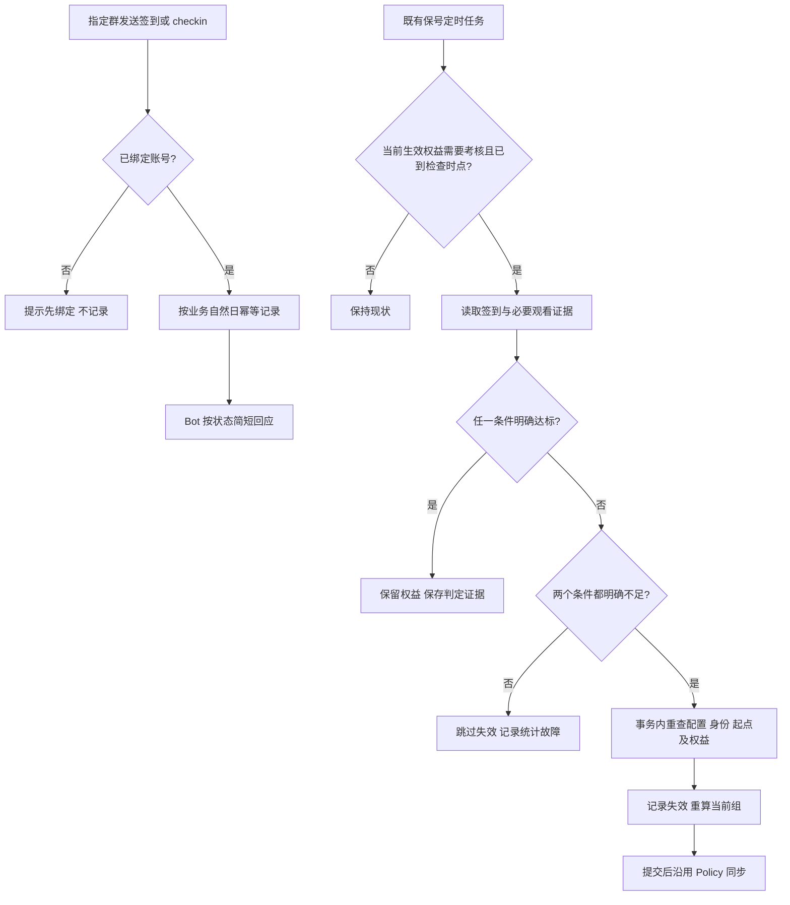

# 群签到与双途径保号计划

> 状态：产品规则已确认，待实施；技术检查与迁移验证尚未执行
> 负责人：Ember
> 更新时间：2026-10-08
> 本轮授权：仅编写计划，不修改业务代码、不执行迁移或外部验证。

## 背景

公益服希望通过 Telegram 群签到带动参与，同时让经常观看但不发言的用户继续正常使用。现有观看保号已有权益失效、接替和同步链路，本计划在该链路上增加签到达标这一替代条件，不引入积分和兑换套餐。

## 目标与非目标

目标：

1. 已绑定用户在指定群签到，提供自然、简短且符合实际状态的回应。
2. 分组只设置一个保号开关、一个共用周期 N、观看门槛 M 分钟、签到门槛 K 天。
3. 最近 N 天观看达到 M 分钟，或签到达到 K 个不同日期，任一达标即可保号。
4. 保留失效不可自动恢复、人工限制独立、当前生效组考核等既有安全边界。
5. 管理员调整门槛不重置正在进行的考核周期，后续检查使用新规则。

非目标：积分、积分兑换、连续签到奖励、断签惩罚、签到排名、发言次数考核、AI 生成回复、Mini App、全站通知平台、额外保号 cron，以及付费续期的特殊考核机制。按用户运营方式，需要付费续期的分组不开启保号；系统仍以分组配置为准，不根据套餐价格猜测。

## 当前事实与证据

基线为当前 `master` 的本地代码及现行文档；不代表本轮完成线上验收。

| 当前事实 | 证据入口 |
| --- | --- |
| 分组已有观看开关、周期、分钟门槛及内部重开时间 | `services/api/internal/models/plan_group.go` |
| 当前修改周期或分钟门槛会重开考核，和本计划的新口径不同 | `services/api/internal/services/payment/watch_retention.go`、对应测试 |
| 权益目前仅保存考核起点和失效时间；接口 `firstCheckAt` 动态计算，未单独持久化首次检查日期 | `services/api/internal/models/entitlement.go`、`services/api/internal/services/user/entitlements.go`、`services/api/internal/services/entitlement/watch_retention.go` |
| 保号 worker 目前只比较观看时长，事务内复核后写审计及失效状态 | `services/api/internal/services/entitlement/watch_retention_worker.go` |
| 只考核当前生效组；其他有效组实际接替时开始完整周期 | `services/api/internal/services/entitlement/store.go`、[运行手册](../../runbooks/watch-retention.md) |
| 有效永久权益覆盖的购买受限；限时权益可续费，续费保留考核起点 | `services/api/internal/services/entitlement/rules.go` |
| 当前代码支持重新购买或管理员明确授予恢复失效权益；本轮确认保留管理员能力与审计 | 同上及 [原观看保号计划](../billing-redemption/watch-activity-renewal.md) |
| Bot 已有绑定、账号查询、群消息及 Internal API 通信，但尚无本计划签到入口 | `services/bot/app/server.py`、`services/bot/app/handlers/telegram_handler.py` |
| 观看协议基线为 Emby 4.9.3.0、Playback Reporting 2.1.0.7 | [版本化 API 合同](../../reference/playback-reporting-api-contract.md) |

本计划是后续增量方案。旧计划和运行手册暂时继续记录现行行为，不提前改成已实现的新规则。

## 已确认的产品规则

### 1. 统一配置与判定

| 分组配置 | 语义 |
| --- | --- |
| 保号开关 | 关闭时不进行保号考核；关闭不能恢复已失效权益 |
| 共用周期 N 天 | 观看、签到及首次积累窗口使用同一个周期 |
| 最低观看 M 分钟 | 最近 N 天内累计观看门槛 |
| 最低签到 K 天 | 最近 N 天内不同签到日期门槛 |

不存在独立的观看开关、签到开关或两套 N。开关开启时两个条件始终按“或”判定，不要求用户选择路径。N、M、K 均可配置，N/M 沿用现有合理校验边界。

**签到门槛 K 默认 5 天（2026-10-08 用户确认）**，用于新建分组和升级时存量分组缺失该字段的初始化；已有显式配置不能被重复迁移覆盖。5 天是可修改的默认值，不是固定门槛，不采用 `min(5, N)` 自动改写。配置校验要求 K 为正整数且不超过 N；实施迁移前盘点存量 N 小于 5 的分组，若实际存在，明确报告默认值与既有周期的冲突并处理，不能静默改写 N/K 或通过迁移批量影响权益。

规则按分组决定，与权益获取方式无关。保号达标只保留资格，不延长限时权益的自然到期日，不解除人工封禁或访问限制。

### 2. 签到资格与计数

- 仅指定群的“签到”和 `/checkin` 是等价签到入口；私聊负责绑定和状态查询。
- 必须先绑定 Ember 账号。未绑定不落签到记录，提示绑定并提供现有绑定路径。
- 已绑定但没有有效权益的人可以签到；签到不授予、激活或恢复权益。
- 同一用户同一个业务自然日只计一次，重复命令、两个入口及 Telegram 重复投递不能多计。
- 自然日使用 `CRON_TIMEZONE`；服务端决定时间、身份和计数，客户端不能提交任意日期补签。
- 新权益实际生效前的签到和观看不计入新一轮；不要求连续签到。
- **签到窗口已确认：包含检查当天的最近 N 个业务自然日，截止到本次检查时刻。** 起始日期为检查日期向前 N−1 天，起始时刻取该日 00:00 与本轮权益实际生效时刻中较晚者，截止采用检查时刻的半开边界；仅统计此范围内已记录的不同业务日期，不按过去 N×24 小时覆盖的日期数计数。
- 例如 N=30，在 10 月 8 日检查时统计 9 月 9 日至 10 月 8 日检查时刻之前的签到；本轮生效前的记录排除。当天检查时刻及之后的签到进入后续检查，不回溯改变本次判定，也不自动恢复已经失效的权益。
- 共用 N 表示共用天数配置；签到按自然日期计数，观看继续沿用已确认的播放统计时间窗口，不能因签到窗口调整而擅自修改 Emby 统计合同。

### 3. 失效与重新激活

- 到检查时点且两个条件都明确未达标，才使对应权益失效。
- 后续签到、观看达标、配置放宽或普通重算，均不自动恢复失效权益。
- 用户侧只能通过重新购买获得权益；新权益实际生效时开始新一轮完整考核，不使用之前的记录抵扣。
- 管理员保留明确授予／恢复失效权益的能力，必须保留操作审计，记录操作者、目标用户与分组、操作时间和权益变更前后状态。恢复后的权益实际生效时按既有机制开始新一轮考核；这属于明确人工操作，不是签到、观看、配置放宽或普通重算触发的自动恢复，也不解除独立的人工封禁或访问限制。
- 购买其他分组不恢复原失效组。多组接替、自然到期、人工限制沿用既有权益机制；不新增持有所有组同时考核。
- 普通付费续期场景不扩展设计，沿用现有实现。

### 4. 管理员修改规则

管理员修改保号门槛时保持原考核起点，不增加宽限期；下一次检查按新配置判定。重复保存不重开。已失效权益不因规则变更恢复。

**首次检查日期的已确认口径（2026-10-08）：每条权益保存本轮首次检查日期；计算依据变化导致日期改变时，更新权益上的日期记录。** “不重置周期”指不把考核起点改成管理员修改配置的时刻，不代表冻结原首次检查日期。

- 新权益实际生效或有效权益重新接替时，依据本轮起点、N 和实际生效的 cron 计算并保存首次检查日期：满 N 个业务日后第一个可执行的调度时点。
- 修改 N 时，使用原考核起点和新的 N 重新计算；日期有变化则更新记录。不能固定旧日期，也不能改成“修改当天再等 N 天”。
- 仅修改 M 或 K 时，首次检查日期不变，后续检查使用新门槛。重复保存相同规则不重写起点或日期。
- 实际生效的调度规则变化时，同步核对并更新日期；仅保存尚未生效的 cron 配置不能提前改变用户可见日期。全部使用 `CRON_TIMEZONE`。
- 更新后的日期已经到达时，由下一次正常调度按新规则检查；配置保存本身不触发补跑或直接使权益失效。
- 定时任务、Web 与 Bot 都以同一份已维护的首次检查日期为依据，不能一端读持久化值、另一端按旧配置算出不同日期。

例如，起点为 10 月 1 日 00:00，实际调度为每天 02:00：N=30 时首次检查为 10 月 31 日 02:00；10 月 10 日将 N 改为 7 后，首次检查记录更新为 10 月 8 日 02:00，起点仍为 10 月 1 日。由于新日期已到，下一次正常调度即可检查，不回溯执行遗漏批次，也不延后至 10 月 17 日。日期均为业务时区，数字仅用于解释规则。

实施必须替换当前“修改门槛更新重开时间”的行为，新增首次检查日期持久化并迁移相应特征测试。现行实现尚未具备这套完整行为，不能将接口已有 `firstCheckAt` 表述为权益表已保存该字段。

### 5. 群内回应与私聊状态

- 基础结构为简短签到结果加场景化短文案，同一场景可轮换，减少连续重复。
- 区分首次有效签到、重复签到、当前签到达标、观看已达标、无有效权益；所有状态来自 API，文案不得自行推断。
- 观看状态未知时使用中性文案，不为每次群签到实时请求 Emby。
- 无有效权益用户不反复催购；完整权益状态、失效原因、购买入口和保号进度放在私聊。
- 群内不公开观看时长、失效原因或购买情况。不承诺“本月永久达标”等超出滚动窗口的保障。
- 影视话题采用人工维护的简短内容，全群低频触发；重复签到不触发话题。第一版不引入外部推荐调用或 AI。
- Bot 发送失败不撤销已经成功写入的签到；重试后可得到当天已记录的事实。

## 方案设计

### 1. 服务与接口边界

- Go API 负责绑定校验、指定群校验、时区、签到幂等、窗口统计、保号判定与权益事务。
- Bot 负责识别两个入口、转交 Telegram 身份及聊天上下文、格式化结果、绑定和私聊导航。不直接写库或计算权益。
- 新增签到 Internal API 和私聊保号状态查询能力，沿用 `X-Internal-Secret` 与现有 Telegram 身份映射；具体路由在实施时并入现有路由组织。
- 签到请求携带 `telegramId`、`chatId` 及必要去重上下文；用户身份由 API 查绑定关系，不信任传入的 Ember 用户 ID。
- 响应使用 camelCase，区分“本次新记录/当天已记录”、业务日期、是否持有有效权益、可公开的签到进度；错误区分未绑定、非指定群和临时不可用。
- 私聊查询提供当前组规则、考核阶段、首次或下一检查时间、签到进度及带时间标记的观看统计状态。未知不显示为零，未开启保号不伪造进度。
- 群消息处理须避免与现有审批拒绝原因文本处理冲突；不能把普通聊天或含“签到”的长句误认作签到。

### 2. 数据与 SQL migration

**已确认的存储选择（2026-10-08）：签到明细使用现有 PostgreSQL，由 Go API 校验并写入，保号任务直接查询统计。** Bot 不直接访问数据库；签到不新增 Redis 依赖，也不增加 Redis 缓存或双写。已有 Gateway 对 Redis 的使用保持原样。

每个用户每个业务日期最多一条签到事实，使用数据库唯一约束处理两个入口、重复投递及并发请求；同时保存准确签到时间，以区分同一天内签到与新权益生效的先后顺序。

**已确认的保留策略（2026-10-08）：签到明细保留 3 个日历月，并自动清理超期记录，不按固定 90 天计算。** 清理时以 `CRON_TIMEZONE` 的当前业务日期向前减 3 个日历月，目标月份没有对应日期时取该月最后一天，以所得日期 00:00 为截止点，仅删除此前记录。例如 10 月 8 日清理时，删除 7 月 8 日 00:00 之前的记录；5 月 31 日清理时，截止日期为当年 2 月最后一天。截止日及之后的签到保留。

实现应复用 API 定时任务基础设施，分批、可重入地清理，记录截止点、删除数量及失败情况；不清理权益状态、权益操作审计或保号判定审计。具体执行频率与批量大小在实施时确定，不新增独立部署组件。日期运算必须按目标月末截断，不可让无效日期自动溢出到下个月；转换为存储时间时显式应用业务时区。

**用户已确认不因保留期限新增 N 上限或跨字段限制。** 沿用现有 N 输入范围，由管理员保证配置合理；不静默修改存量长周期配置，不随 N 自动延长签到保留期，也不为不合理的超长周期增加专门兼容流程。超出保留期的签到历史将不可查询，不能承诺支持完整回溯；这属于已知的运营配置边界，不再作为实施前审批或待确认项。数据库读取失败仍须按既有统计故障规则处理，不得当作零签到。

实施涉及模型和索引变更，必须新增 `infrastructure/database/YYYYMMDD_NN_<description>.sql`，不得修改已应用 migration 或依赖 AUTO_MIGRATE。

- 分组增加签到天数门槛，复用唯一保号开关和 N/M；内部历史命名是否保留应优先兼容现有调用，不为改名引入独立配置。
- 权益增加可空的首次检查时间字段（建议 `watch_retention_first_check_at`），与本轮起点分别保存；现有对外 `firstCheckAt` 可继续复用。尚未实际起算的权益不伪造日期，失效记录不能因日期回填而恢复。SQL migration 与回填须按升级时真实有效起点和实际调度计算，不把迁移执行时间当作新起点；配置更新与日期维护须保证任务不会使用新规则配旧日期执行失效判定。
- 新增签到事实记录：用户、签到时 Telegram 身份、指定群、服务端记录时间、业务日期及必要业务时区证据。数据库约束保障用户每日唯一；解绑重绑不得搬运历史签到到其他账号。
- 保号审计扩展签到门槛、计数、两个条件的判定及未知原因；不能用“未查询观看”的默认零伪造不足证据。
- 迁移说明涵盖存量启用组的 K 回填、唯一索引、可重复执行、历史审计兼容和回滚限制。升级不得批量重置权益起点或恢复失效标记。
- GORM 字段显式指定 column，数据库命名 snake_case，对外 DTO camelCase。

### 3. 核心流程

签到写入不能直接授予或恢复权益。任务沿用现有调度；优先读取本地签到，已达标可避免不必要的 Emby 查询。任一可靠条件达标足以保留；只有两个可靠结果都不足才能失效。

写入前重新核对配置、当前组、起点、绑定归属、资格及统计证据。并发签到发生在统计截止点前后时按一致的快照边界处理，不能旧读数覆盖已应计入的记录。重复任务不得重复失效；Policy 同步失败保留本地审计与既有恢复入口，不宣称远端成功。

### 4. Web 展示与兼容

- 管理端沿用分组表单，将“观看保号”表达调整为统一“保号”，仅一个开关、一个周期、两个门槛。
- 概览当前组与账号中心对应权益沿用既有展示位置，改为一条“最近 N 天观看 M 分钟或签到 K 天”的要求，不新增菜单或页面。
- 规则变更立即影响后续检查这一后果，应在管理员保存前通过必要的短提示表达；不堆解释文案。
- 前端实现必须遵守 Ember 风格，设计与交互基线以 [Web 设计规范](../../reference/web-design-guide.md) 为准；本计划无偏离规范的特例。
- 分组 API、控制台 DTO、Bot 查询与旧客户端字段必须一起核对。不得在代码尚未升级时把双条件语义写进现行文档。

## 实施阶段技术检查

本轮产品规则与时间口径已确认，暂无待用户确认的产品问题。以下属于实施与验收检查，不表示已经执行，也不要求重复确认已定规则；仅在实际证据发现冲突时再说明具体问题。

1. **Telegram 接收条件（技术核对）**：核对目标 Bot 的群隐私模式及权限能否接收普通“签到”文本；命令和普通文本均需验收，不以 handler 存在代替可接收性证明。真实验收另行授权，不作为需用户再次决定的产品口径。
2. **迁移与时间一致性**：验证 K=5 初始化、存量配置、首次检查日期回填、自然日签到窗口、日历月清理及并发边界。执行前检查实际数据，不静默修改配置、重开起点或恢复失效权益。

## 影响范围

| 子系统 | 影响 |
| --- | --- |
| API | 分组配置、签到事实与查询、Internal API、保号 worker、权益审计、并发保护 |
| Web | 分组保号表单、概览及账号中心要求展示、API 类型与测试 |
| Bot | 群签到入口、绑定引导、私聊状态、场景化回复、话题频率 |
| 数据库与部署 | 幂等迁移、K 回填与灰度升级兼容、签到明细保留 3 个月的自动清理、Telegram 群消息接收条件；不新增业务时区或部署组件 |
| 外部合同 | 复用已核对版本的观看统计合同，不新增 Emby 原生协议；Telegram 交互需 mock 锁定 |

## 验证方式

实施采用 TDD，先补现状特征测试，再修改门槛重开和双条件判定。外部依赖必须 mock。

| 场景 | 预期 |
| --- | --- |
| 未绑定、私聊签到、非指定群 | 不落有效签到，返回对应引导 |
| 已绑定无有效权益 | 可以签到，但不发放或恢复权益 |
| 两入口、重复 update、并发请求、发送响应失败后重试 | 每日仅一条有效事实，不重复计数 |
| 跨午夜、非默认时区、DST、考核起点当天、解绑重绑 | 日期和归属稳定，生效前记录不计入，无历史转移 |
| N=30 且 10 月 8 日检查、N=1、检查时刻前后签到 | 分别包含 9 月 9 日起的 30 个自然日期、仅当天；截止检查时刻，不计第 N+1 个日期，不回溯恢复失效权益 |
| 3 个日历月清理边界、平年/闰年 2 月、月末、重复执行、中断重试、与考核并发 | 目标月无对应日则取月末，截止日 00:00 及之后保留；不按 90 天或溢出日期计算，不影响权益或判定审计，失败可重试 |
| 存量或新增 N 超过签到可保留范围 | 不增加与保留期关联的配置拦截，不修改 N、不延长保留期；不承诺已清理历史可回溯 |
| 只观看达标、只签到达标、两项达标、两项不足 | 前三者保留，最后才失效 |
| 一项达标另一项故障；一项不足另一项故障 | 前者保留，后者不失效，审计区分未知 |
| 修改 M/K、重复保存、配置变更与扫描并发 | 不重置起点，按最新有效规则处理，丢弃陈旧结果 |
| N 缩短或延长、更新后日期在过去或未来 | 保留起点，重算并保存首次检查日期，下一次正常调度依据更新后的日期处理，不补跑或从修改时重开 |
| 只改 M/K、重复保存 | 日期不变，采用新门槛；配置保存不直接触发失效 |
| cron 保存但未生效、实际调度变更、Web/Bot 查询 | 日期跟随实际生效调度维护，执行与展示一致 |
| 首次日期字段回填、进程重启、配置更新与任务并发 | 不丢失既有起点、不复活失效权益、不以新规则配旧日期错误判定 |
| 首次开启、关闭后重开、存量升级 | 保留适用的既有生命周期边界，迁移不暗中增加宽限期 |
| 失效后签到达标、放宽规则、普通重算 | 不恢复 |
| 管理员明确授予／恢复失效权益 | 允许，保留操作者及变更前后审计；实际生效时重新起算，不解除独立人工限制 |
| 同组重新购买、购买其他组、多组接替 | 只影响对应权益，按实际生效重新起算 |
| 人工限制、自然到期、Policy 同步失败 | 保留既有边界，不虚报访问恢复或远端成功 |
| Bot 场景文案、HTML 转义、长度、话题限频 | 文案准确、群内无隐私、重复签到不刷话题 |
| 群签到与审批拒绝原因处理并存 | 不互相误消费，不泄露审批上下文 |
| Web 单开关及共用 N、校验、错误态 | 与 API 合同一致，无双周期或独立开关残留 |
| 新建分组、存量 K 初始化、重复迁移 | K 默认 5 天且可修改，不覆盖已配置值，不自动取 N；存量 N 小于 5 的冲突不得静默改写 |

实施阶段命令分别在对应目录执行：

- `services/api`：相关单测、`go test ./... -skip Integration -count=1`、`go vet ./...`、`go build ./...`；数据库唯一性、并发与迁移另用专用测试库验证并如实记录。
- `services/web`：相关 Vitest/组件测试、`npm run test`、`npm run build`。
- `services/bot`：`python -m py_compile main.py`、`python -m pytest tests`，fake Telegram、Internal API 及外网 HTTP。
- 本轮纯文档只检查链接、目录落点、规则一致性和 diff；不将上述待执行命令标记为通过。
- 不启动服务、不后台运行、不访问真实 Emby/Telegram/支付；需要真实验证时另按明确授权执行。

## 进度与落地后文档处理

- [x] 对话确认核心产品规则，纠正为单开关与共用 N。
- [x] 确认签到门槛 K 默认 5 天，可由管理员修改，不采用随 N 自动缩小的默认值。
- [x] 确认签到统计包含检查当天的最近 N 个自然日，截止检查时刻，并排除本轮权益生效前记录。
- [x] 确认签到明细使用 PostgreSQL，由 API 写入并保证每日唯一，不新增 Redis 依赖。
- [x] 确认签到明细自动清理、保留 3 个日历月，按业务时区取截止日 00:00，缺失日期取月末；不因保留期新增 N 限制或超长周期兼容流程。
- [x] 确认权益持久化首次检查日期，计算依据变化时更新；修改规则不重置本轮起点，不冻结旧日期。
- [x] 确认保留管理员明确授予／恢复失效权益的能力与操作审计，用户侧仍须购买，不允许自动恢复。
- [x] 核对现有保号、购买与 Bot 入口，识别规则变更重开周期的差异。
- [x] 新建计划及索引；本轮仅文档交付。
- [x] 产品规则与时间口径澄清结束，暂无待用户确认项。
- [ ] 完成迁移盘点、时间边界及 Telegram 接收条件的技术核对。
- [ ] 完成数据迁移、API/Web/Bot 和关键链路测试。
- [ ] 完成系统性 review，核对鉴权、异步、状态与配置部署链路。
- [ ] 同步稳定文档与实际验证结果。

实施后同步 [系统架构](../../system-architecture.md)、[Bot 架构参考](../../reference/bot-architecture-reference.md)、[Web 信息架构](../../reference/web-information-architecture.md)、[数据模型](../../reference/data-model-reference.md)、[API 目录](../../reference/api-endpoint-catalog.md)、[观看保号运行手册](../../runbooks/watch-retention.md)及数据库 migration 入口。原观看保号计划补充增量方案落地后的实际状态，不抹去历史验证边界。

归档条件：实现、测试、迁移与技术检查完成，稳定规则已进入现行参考文档，未做的外部验收明确标记并决定后续安排。之后按 [归档规范](../../reference/archive-governance.md) 移入 `docs/archive/plan/bot-telegram/` 并同步索引与引用。当前保留为待实施计划。
