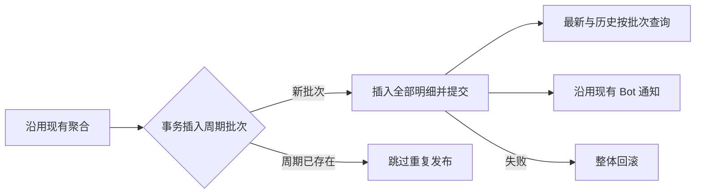

# 每日播放总结分步修复方案

> 状态：第一至四步完成；第五步可选，待决定；投递管理 / 补发已取消
> 负责人：Ember
> 更新时间：2026-09-29

## 背景

播放总结已经具备 cron、Playback Reporting 聚合、快照查询和 Telegram 推送链路，但原明细表上的周期唯一索引使一期最多保留一条记录，原最新榜查询又要求周期结束，导致晚间生成后暂时不可见。第一至四步已完成存储与读取、发送反馈、统计完整性、日期边界及配置说明修复；查询成本优化保留为可选项。

## 已确认口径与授权

- 来源：2026-09-29 用户确认并授权“先做第一步，记录后开始执行”。
- 日榜默认每天 20:00 执行，查询当天日期范围内、执行时已经存在的数据。20:00 是调度时间，不要求精确冻结该时刻的播放累计值。
- 周榜保留当前默认周日 20:30 与本周日期范围；全局业务时区继续使用 `CRON_TIMEZONE`。
- 第一步已按用户另行授权提交为 `ca1f2d0`。推送、部署、真实 Emby / Telegram 验证尚未授权。
- 2026-09-29 用户明确取消投递结果列表和二次发送需求，并授权实施收缩后的第二步：正常发送、明确跳过与失败反馈、关键测试；不新增投递表、状态管理页面、补发或自动重试。偶发推送失败时仍通过页面查看历史快照。

## 目标与步骤

| 步骤 | 问题 | 完成条件 | 当前状态 |
| --- | --- | --- | --- |
| 1. 批次存储与最新榜读取 | P1-1、P1-2 | 整期明细原子保存、周期幂等、空榜可查询、生成后立即可见、日期与生成时间展示正确 | 已完成；本地检查与 PostgreSQL 集成验证通过 |
| 2. 发送链路基础修正与测试 | P1-3（范围调整） | 正常发送有明确反馈，配置缺失明确跳过，失败 / 超时有可排查日志，且不影响已保存快照、不自动重试 | 已完成，fake 测试与编译检查通过；原投递管理与补发方案取消 |
| 3. 统计范围与数字 | P2-1、P2-2、P2-3、P2-5 | 总量统一电影 / 剧集且不受上榜门槛或候选截断影响；明确缺失条目跳过并记日志，选库全失效仍发空榜但不扩大范围，请求失败不冒充成功，名称不分裂同一条目 | 已完成；Go / fake、SQLite 内存验证与现有 Web 组件回归通过 |
| 4. 日期边界与配置说明 | P2-4、P3-1 | 手动日期半开边界、设置中心说明和固定提示一致 | 已完成；Go / Web 测试、构建及 SQLite 边界验证通过 |
| 5. 查询成本优化 | 可选 | 基于正确结果比较单次聚合和去重回查的收益，再决定是否实施 | 可选，未授权 |

P2-6（分次读取产生采集时间差）已降为可选优化；不为它增加历史时点冻结设计。

## 实施前基线

- 代码基线：`ad7cf2b`；开发分支 `fix/playback-ranking-batches`。
- `playback_rankings` 每行是一个上榜条目，但 `uq_playback_rankings_period` 唯一键只有 `period / period_start / period_end`。
- 当前写入对任意冲突 `DO NOTHING`，只检查是否至少插入一行，然后用内存榜单通知 Bot。
- 最新查询以 `period_end <= now` 限制可见性；日榜晚上生成却保存次日零点的周期结束，消息也从结束时间生成“截至 00:00”。
- 现有历史接口支持完整周期和周期内截点；旧记录既可能有批次 ID，也可能为空。
- 协议依据：[Emby / Playback Reporting 合同](../../reference/playback-reporting-api-contract.md)。实际安装插件版本仍未实机确认。

## 当前落地

- 第一步代码已实现：`ranking_store.go` 事务保存批次与全部明细，最新 / 历史统一读取批次；新增 `20260929_01_playback_ranking_batches.sql` 与 schema fingerprint。
- Web / Bot 已使用 API 的业务时区生成时间，日期展示不再包含零点排他上界的下一天。
- 第二步已完成：Bot 明确返回发送 / 跳过结果，异常返回固定错误；Go 核对结果并按批次关联日志。未新增表、页面或重试 / 补发功能。
- 第三步已按确认口径完成：完整按 ID 聚合电影 / 单集，总量独立于上榜门槛；失效范围保留且全失效仍发空榜，缺失条目跳过并记日志，请求或响应损坏返回错误。该步没有模型、migration、Web / Bot 业务代码变更。
- 第四步已完成：手动含首尾日期转换为半开区间，设置中心说明明确开关依赖和执行口径，移除页面固定生成时间提示，并纠正调度配置的 env 回退旧说明。第五步仍未授权。
- 本地 SQL mock、fake、编译与静态检查已通过；用户提供专用测试库后，PostgreSQL 15.15 上的迁移、真实约束、并发事务和查询集成验证也已通过。
- 测试连接仅解析各自临时 schema，不回退到 `public`；测试结束后临时 schema 已清理，既有 `public` 结构指纹保持一致。第一步验收完成，真实 Emby / Telegram 链路与部署未执行。

## 第一步方案

### 数据与迁移

- 新增 `playback_ranking_batches`：保存批次 ID、周期、周期起止、生成时间、总播放时长和创建时间；周期起止的唯一性放在批次表。
- `playback_rankings` 继续保存明细，关联批次，按“批次 + 类别 + 排名”防止位置重复。同 ID 不同名称的聚合修复属于第三步，本步不提前增加与现状冲突的条目唯一约束。
- 生成完成后，在短事务中插入批次，再插入全部明细；重复周期只复用已存在的批次，不追加或混合明细、不重复通知。任意明细失败整体回滚。
- 空榜也创建批次，可以查询日期、生成时间和空数组，并具备周期幂等依据。
- 增量 SQL 回填历史批次并关联原明细，不推测丢失数据。历史总播放时长无法由残存 Top 条目反推，保留未知值；本步不回填投递状态或补发历史通知。
- 保留原始周期与生成时间供回溯，旧空批次 ID 在迁移时确定性补齐，避免长期双轨读取。
- 使用新增前向 migration，不改已记账 baseline；同步 GORM 显式列名和启动 schema fingerprint。

### 查询与展示

- 最新 / 历史读取先选批次，再读取该批次全部明细。最新榜允许当前尚未结束的自然日 / 周期；不展示未来生成时间的记录。
- 历史查询保留 `period_end <= 查询范围结束` 的完整周期兼容语义，不能回退到丢失完整周期快照的旧条件。
- 现有路由、电影 / 剧集数组与 camelCase 字段结构保持兼容。展示日期把零点排他上界换算成实际覆盖的最后一天；生成时间从 `snapshotAt` 取得并在 API 边界按 `CRON_TIMEZONE` 转换。
- Web 与 Telegram 显示所属日期和实际生成时间，不再把周期结束时间描述成采集截止。
- 第一步仅调整 Bot 时间展示载荷与格式；第二步保留异步发送并修正反馈，可靠补发已从计划范围移除。
- 前端实现必须遵守 Ember 风格；设计与交互基线以 [前端设计规范](../../reference/web-design-guide.md) 为准。本步没有偏离规范的特例。

## 第一步非目标

- 不修改播放聚合 SQL、媒体库筛选策略、上榜门槛、播放次数或时长定义。
- 不实现通知状态机、人工补发、自动重试或错过调度的补偿。
- 不修改 cron 默认计划，不做精确 20:00 截止，不调用真实 Emby / Telegram 等外部业务系统。
- 不修手动生成的最后一秒边界，也不调整其他配置入口。

## 第一步影响范围

- API：排行模型、事务持久化、最新 / 历史读取、响应与通知时间格式、schema 校验。
- 数据库：新增批次表、回填关系、更换唯一约束；提供新装与升级测试。
- Web / Bot：复用当前页面与消息样式，修正日期和生成时间展示。
- 文档：系统架构、数据模型、协议参考、数据库 README、计划索引和盘点记录。

## 第一步验证方式

按 TDD 先补失败用例，再做最小实现：

- [x] SQL mock 锁定一期 20 条明细的完整插入与批次元数据；实际 PostgreSQL 保存验证也已通过。
- [x] SQL mock / fake 覆盖周期重复不追加明细、不再次通知；PostgreSQL 实测 4 路并发只保存一个完整批次。
- [x] SQL mock 覆盖批次错误、明细错误、异常短写均整体回滚。
- [x] SQL mock / fake 覆盖空榜有可查询批次且重复执行不重复发布。
- [x] SQL mock 锁定未结束周期的最新查询条件、完整 / 部分历史范围和迁移后批次 ID；无批次与数据库读取失败明确区分。
- [x] PostgreSQL 实测历史有 / 无批次 ID 迁移后可查、新装、重复执行、20 条明细、并发、回滚重试、空榜覆盖与未来批次排除。
- [x] 全局时区、零点排他结束、夏令时日期边界和实际生成时间展示测试通过。
- [x] Go 定向测试、关键 race、全量测试、`go vet ./...`、`go build ./...` 通过；首次全量测试跳过的排行榜数据库用例已在后续专项中补跑通过。
- [x] Web mock 组件测试与 `npm run build`；Bot fake 格式化测试、全量测试与编译通过。
- [x] SQL migration 资产检查和启动指纹回归通过；完整迁移与 `VerifySchema` 已在 PostgreSQL 临时 schema 中实际通过。

Go 命令在 `services/api` 工作目录执行；Web 在 `services/web`，Bot 在 `services/bot`。集成测试只使用专用 `EMBER_INTEGRATION_DATABASE_URL`。本轮连接信息通过隐藏输入临时注入测试进程，未写入仓库或持久配置；后续执行若未配置该变量，仍须明确记录跳过，不能将 mock 或 SQL 静态检查当作 PostgreSQL 验证。

2026-09-29 验证记录：

- 已先执行失败回归：当前周期 / 空榜查询、API 时区及日期转换、Web / Bot 生成时间均在修复前失败；新存储入口和 migration 缺失也已确认失败。
- `go test ./...`、五个关键包的 `go test -race`、`go vet ./...`、`go build ./...` 通过。
- Web：266 项通过、3 项既有用例跳过；生产构建通过。
- Bot：72 项通过，10 个子用例通过；`py_compile` 通过。
- PostgreSQL：在用户提供的专用测试库执行 `go test ./internal/services/playback ./internal/app -run '^TestIntegrationRanking' -count=1 -v -timeout=180s`，4 个新增批次测试、2 个已有排行榜集成测试及历史接口的 4 个日 / 周榜子用例全部通过，无跳过。
- 数据库验收覆盖真实旧 baseline 升级、历史批次回填、迁移重复执行、新装完整迁移与指纹校验、4 路并发竞争、明细冲突整体回滚后重试、空榜覆盖、未来批次排除、历史完整 / 部分周期选择与外键级联清理。
- 执行前后比对 `public` 表 / 列 / 索引 / 约束结构指纹一致，临时 schema 全部清理。未启动数据库或项目服务，Emby 使用 fake，未调用真实 Emby / Telegram。
- 通知旧载荷过渡只涉及缺失 / 无效 `snapshotAt` 的展示；第二步已复查并继续保留，在最低支持 API 均提供 `snapshotAt` 且旧 API 回滚窗口结束后移除原 `cutoffAt` 文案分支。

## 第二步方案（范围已收缩）

### 实施前事实与边界

- `GenerateRanking` 已在整期提交后通过 `SafeGo` 通知 Bot，同周期重复不通知；此行为继续保留。
- Bot 未配置群组或管理员时直接返回，但 `/notify/ranking` 仍只返回 `ok: true`；Go 当前也不读取发送反馈。
- API / Bot 只做内存中的结果反馈和日志，不持久化投递状态；本步没有模型、数据库 migration、Web 页面或配置项变更。
- 发送失败不回滚批次、不自动重试、不新增补发接口；用户继续在现有页面查询历史快照。

### 通知合同与处理

- 内部载荷附带 `batchId` 关联生成日志，保留既有日 / 周榜内容、业务时区和群组优先 / 管理员回退规则。
- Bot 成功完成发送后返回 `ok: true, sent: true`；没有目的地时返回 `ok: true, sent: false, reason: chat_not_configured`。
- Bot 发送调用报错时返回明确非成功 HTTP 响应，日志只包含批次、周期和错误类型，不记录异常原文、Token、URL 或完整响应体。
- Go 显式记录未配置 Bot、已发送、明确跳过、HTTP 错误、网络错误和超时；旧 Bot 仅返回 `ok: true` 或响应无效时，只记为结果未确认，不推断送达，也不追加请求。
- 保留既有通知超时与异步方式，不改动其他通知类型；旧时间展示载荷兼容条件继续保留，不能因本步收缩就提前删除。

### 验证与收尾

- [x] Bot fake 覆盖日 / 周榜、群组优先、管理员回退、空榜、无目的地、发送报错和超时。
- [x] Go fake HTTP 覆盖请求合同、发送 / 跳过响应、旧响应、无效响应、HTTP / 网络错误、请求与响应体读取超时、无重试；日志不泄露敏感错误内容。
- [x] 保留并复验整期保存后才调度通知、生成不等待异步通知、重复 / 写入失败不通知；Notifier 失败只记日志，与快照事务解耦。
- [x] Go 测试 / 关键 race / vet / build、Bot 测试 / 编译通过；文档同步到上述收缩范围。
- 同步系统架构、Bot 通知合同、Playback Reporting 参考边界和计划索引；第三至五步仍按原授权边界保留。

2026-09-29 第二步验证记录：

- 先执行失败回归：原 Bot 缺少显式 `sent` 反馈、异常未转固定错误响应；原 Go 不读取发送结果且网络异常日志含 URL，新增测试均确认失败。响应体读取超时也先复现误记为无效响应，再修正分类。
- `go test ./... -skip Integration -count=1`、`go test -race ./internal/integrations/notifier ./internal/services/playback -skip Integration -count=1`、`go vet ./...`、`go build ./...` 全部通过。
- Bot `.venv/bin/python -m pytest tests -q`：77 项测试、24 个子用例通过；`main.py`、`app/server.py`、`app/handlers/telegram_handler.py` 的 `py_compile` 通过。
- 使用 fake HTTP / Telegram 和进程内入口测试，未启动项目服务、未调用真实 Emby / Telegram。本步没有数据库或 Web 变更，不重跑 PostgreSQL / Web 验收；第一步的实测记录仍只覆盖第一步。

## 第三步方案（已完成）

2026-09-29 已完成 4 个业务口径问题的确认，用户随后明确授权“开始实现”，并在实现与验证完成后另行授权本地提交。以下结论指导第三步实现与验收；推送、部署或真实外部验证仍需单独授权。

### 已确认

- **总播放时长的媒体类型范围**：统一只统计电影和剧集，适用于日榜 / 周榜，以及全部媒体库 / 指定媒体库两种范围；音乐等其他媒体类型不计入总时长。来源：2026-09-29 第 1/4 问，用户选择选项 1。此项明确调整原全库总量包含其他类型的行为，已实现。
- **总播放时长与上榜门槛**：所选范围内的电影 / 剧集，即使本期累计播放不足 60 秒，也计入总播放时长；60 秒门槛只决定作品是否具备上榜资格，总量不因未达门槛或未进入 Top 10 而剔除。例：电影 A 累计 40 秒、电影 B 累计 100 秒，总时长为 140 秒。来源：2026-09-29 第 2/4 问，用户选择选项 1；已实现。
- **成功回查后的信息缺失**：请求成功后，明确缺少条目详情或无法确认剧集 / 媒体库归属的记录直接跳过，其余内容继续生成与推送，不因这些记录停止整期。仅通过日志记录缺失原因、数量及必要条目标识，不增加“统计不完整”标签或管理功能。来源：2026-09-29 第 3/4 问，用户明确要求“不能停止，跳过这些明确有问题的，打印日志记录就行了”。本项仅适用于成功响应后的信息缺失，不把网络请求失败直接判定为条目缺失；已实现。
- **已选媒体库失效**：保留原始选择，不自动清空配置或回退到全库；部分失效时跳过失效库、继续统计有效库。非空选择中的媒体库全部失效时，仍生成、保存并推送空榜，沿用“暂无播放数据”文案，失效原因只记录日志。来源：2026-09-29 第 4/4 问，用户明确要求“仍然推送，说明无播放数据，并打印日志”。此规则不改变用户主动选择“全部媒体库”的语义，也不把媒体库列表请求失败当作全部失效；已实现。

### 剩余验证边界

- 本轮业务口径已确认，无剩余业务问题。
- 实际安装插件版本与 `ParentId + Ids` 组合筛选行为仍未实机核实；继续以版本化合同和 fake 测试约束本地实现，不将其写成真实 Emby 兼容验证通过。真实只读验证保留独立授权边界。

### 实施与验收

- 聚合按媒体类型和稳定 ID 分组，名称仅选取确定的展示值；电影 / 单集完整聚合后再做归属筛选，按 Series 汇总剧集，最后应用 60 秒门槛与 Top 10。
- 总时长取已确认范围内的完整电影 / 剧集汇总，在上榜筛选前计算；不再另用包含所有媒体类型的全库总量查询。
- 读取失效媒体库配置不产生写操作；全失效范围显式表示为空，继续沿用已有空榜持久化与通知链路，不回退到全库。
- 成功响应中缺少必要信息的条目跳过并汇总记录；请求失败或返回损坏数据明确报错，不误当作媒体已删除。Emby 批量协议和既有接收目标保持不变。
- [x] 回归覆盖改名聚合、同名不同 ID、短时长总量、候选尾部与所选库范围。
- [x] 回归覆盖部分 / 全部失效配置只读保留、全失效空榜保存与通知、主动选择全库及配置写入校验。
- [x] 回归覆盖成功缺失条目可跳过与日志、部分 / 全部请求失败不能保存或推送、无效响应不能伪装空榜。
- [x] Go 测试、关键 race、vet、build 与现有 Web 组件回归通过，稳定事实同步到架构与协议参考。

2026-09-29 第三步验证记录：

- 先用失败测试复现候选尾部漏算、上榜门槛影响总量、改名参与分组、失效配置自动清空、请求失败降级成功；再复现聚合短行被忽略、缺列被接受和 NULL 名称误转成 `<nil>`，完成修正。
- `go test ./... -skip Integration -count=1`、`go test -race ./internal/services/playback ./internal/integrations/emby ./internal/integrations/notifier -skip Integration -count=1`、`go vet ./...`、`go build ./...` 全部通过。
- `npm run test -- src/views/console/RankingsView.spec.ts`：现有 8 项测试通过，包括全失效配置的提示与恢复全库入口；未修改前端页面或样式。
- 从当前生产 SQL 模板提取查询，在 SQLite `3.54.0` 内存库执行合成数据，验证改名合并、同名不同 ID、暂停扣减、短时长保留、Audio 排除与次日零点排除；Go fake 验证 3022 个电影候选的完整总量与批量归属查询。
- 本轮无数据库模型 / migration 变更，不重复第一步 PostgreSQL 验收；Bot 格式化与发送方式不变，沿用第二步验证。未启动项目服务、未调用真实 Emby / Telegram，真实筛选兼容性与生产容量仍未验证。历史快照不追溯重算。

## 第四步方案（已完成）

2026-09-29 用户确认第四步，并接受手动日期上界转换为结束日次日零点。范围限定为日期边界、配置说明与页面提示；实现与验证完成后，用户另行授权本地提交，推送、部署或真实外部验证仍需单独授权。

- 手动生成的 `start/end` 仍接收包含首尾日期的 `YYYY-MM-DD`，按 `CRON_TIMEZONE` 转换为 `[开始日零点,结束日次日零点)`；复用现有 `< end` 聚合与批次保存链路，覆盖最后一秒和小数秒，不重算历史快照。
- 设置中心说明明确总调度开关与排行榜开关的依赖、默认日 / 周执行时间和全局业务时区；调度修改后仍需重启 API。配置由数据库托管，不增加环境变量回退。
- 排行榜空状态保留简短的无播放数据提示，删除固定自动生成时间的承诺。前端实现遵守 Ember 风格，基线见 [前端设计规范](../../reference/web-design-guide.md)，没有偏离规范的特例。
- 不改 cron 默认值、调度实现、媒体聚合口径、外部 API、Bot 发送方式或数据库结构；第五步查询成本优化仍为可选项。
- [x] 手动生成回归覆盖含结束日、跨月 / 年、夏令时、全局时区及既有参数 / 错误响应。
- [x] 复验 SQL 半开区间、快照展示、配置与排行榜组件测试，执行 Go vet / build 和 Web build。
- [x] 同步架构、配置与接口参考、计划索引及验证边界。

2026-09-29 第四步验证记录：

- 先运行新增 handler 回归，6 个含结束日 / 时区用例均复现旧上界错误，8 个默认参数、无效请求与服务失败用例保持原行为；修改上界后全部通过。
- `go test ./... -skip Integration -count=1`、`go vet ./...`、`go build ./...` 全部通过；包含既有聚合 SQL 半开区间、快照日期展示和配置定义测试。
- `npm run test`：34 个测试文件通过、1 个跳过，266 项测试通过、3 项跳过；`npm run build` 通过。页面和配置描述只做文案调整，复用现有组件 / 配置测试与编译验证；Browserslist 数据过期提示不影响本次构建。
- 提取生产聚合 SQL 模板，在 SQLite `3.54.0` 内存库执行 8 条合成记录：开始日零点、结束日最后一秒及小数秒均包含，开始日前、次日零点及其后记录均排除；旧上界可复现最后一秒遗漏。
- 未启动服务、未执行真实 Emby / Telegram 或浏览器验收；本步无模型 / migration 变更，不重复 PostgreSQL 验收，Bot 业务代码未改动。

## 落地后文档处理

- 每一步完成后记录实际改动、测试结果和仍待验证项，稳定事实同步到系统架构、数据模型与接口参考。
- 第一至三步已按用户授权提交，第三步提交为 `9fe4830`；第四步实现与验证完成，用户已授权本地提交。第五步不自动扩大授权。
- 四步修复完成、可选优化已决定实施或明确不做，且验证边界收口后，整份计划才进入 `docs/archive/plan/media-subscription/` 并同步全部索引。
