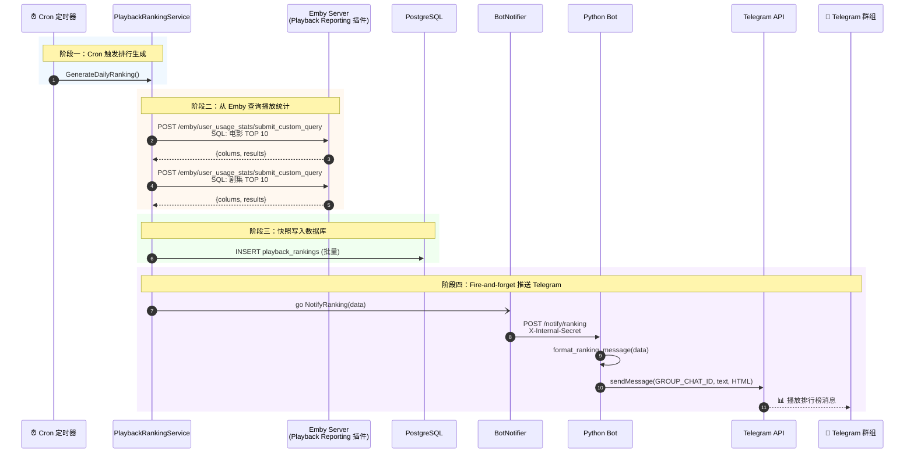
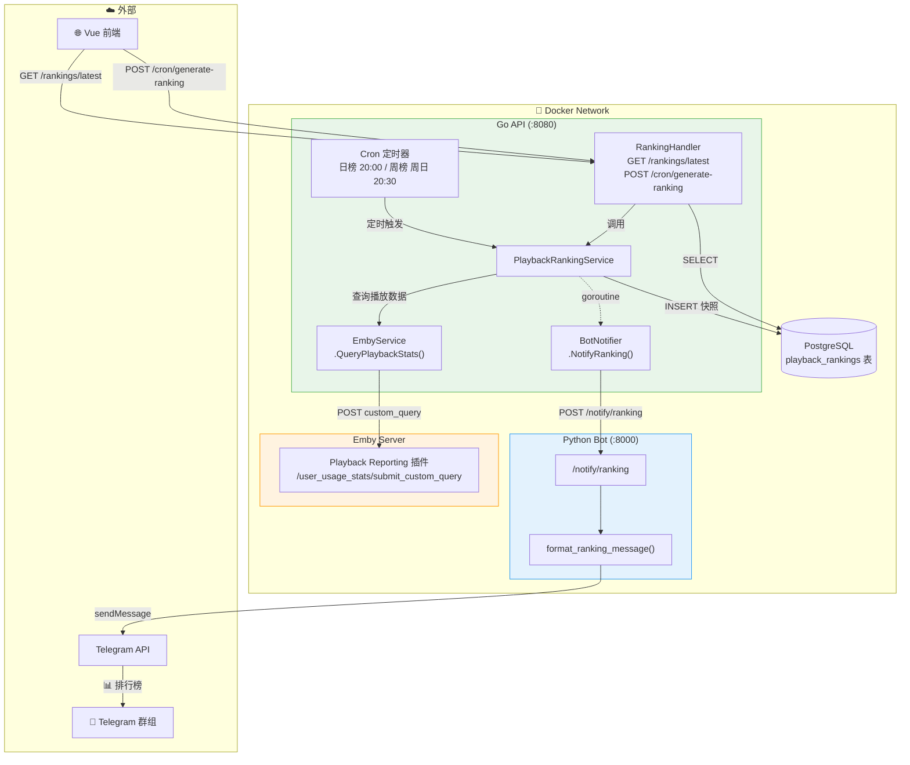

# 播放排行榜功能实现方案

## 背景与目标

Ember 正在替代 embyboss 项目。embyboss 有一个影片播放排行榜功能：每天/每周统计 Emby 服务器上电影和剧集的播放次数与时长，生成 TOP 10 排行，推送到 Telegram 群组。

**本方案实现**：
1. 通过 Emby Playback Reporting 插件 API 查询播放活动数据
2. 每天 20:00 生成日榜，每周日 20:30 生成周榜（阶段榜：截止到触发时刻）
3. 排行快照存入 PostgreSQL，前端可查看当前和历史排行
4. 排行结果自动推送到 Telegram 群组
5. 管理员可通过 API 手动触发排行生成

**不做的事**：
- 不做用户观影时长排行（仅做影片播放排行）
- 不做海报图片生成（纯文本排行，不引入 PIL/图像处理）
- 不做积分系统

**前提条件**：Emby 服务器已安装 Playback Reporting 插件（提供 `user_usage_stats` API）

---

## 一、架构设计

### 1.1 整体数据流（时序图）



### 1.2 服务架构图



### 1.3 关键设计决策

**为什么存快照而不是存原始数据**：
- PlaybackActivity 原始数据归 Emby 所有，Ember 不应重复存储
- 排行榜是聚合结果，直接存快照避免每次重新计算
- 历史排行查询只需读取快照，不需要回溯原始数据
- 一张表搞定，数据结构简单无特殊情况

**为什么日榜和周榜 cron 表达式硬编码**：
- 这是固定的业务逻辑（每天 20:00 出日榜、每周日 20:30 出周榜），不是运维配置
- 过度参数化是假想的需求

**为什么推送到群组而不是管理员**：
- 排行榜是所有用户可见的公开信息，适合推送到群组
- 管理员通知和群组推送用不同的 chat_id，互不干扰

---

## 二、数据模型设计

### 2.1 PlaybackRanking 模型

**新建** `services/api/internal/models/playback_ranking.go`

```go
package models

import (
    "time"

    "gorm.io/gorm"
)

// RankingPeriod 排行周期
type RankingPeriod string

const (
    RankingDaily  RankingPeriod = "daily"
    RankingWeekly RankingPeriod = "weekly"
)

// RankingCategory 排行类别
type RankingCategory string

const (
    RankingMediaMovie   RankingCategory = "media_movie"   // 电影播放榜
    RankingMediaEpisode RankingCategory = "media_episode"  // 剧集播放榜
)

// PlaybackRanking 播放排行快照
type PlaybackRanking struct {
    ID          string          `json:"id" gorm:"column:id;type:varchar(25);primaryKey"`
    Period      RankingPeriod   `json:"period" gorm:"column:period;type:varchar(10);not null;index:idx_ranking_lookup"`
    Category    RankingCategory `json:"category" gorm:"column:category;type:varchar(20);not null;index:idx_ranking_lookup"`
    Rank        int             `json:"rank" gorm:"column:rank;not null"`
    ItemName    string          `json:"itemName" gorm:"column:item_name;size:500;not null"`
    PlayCount   int             `json:"playCount" gorm:"column:play_count;not null"`
    Duration    int64           `json:"duration" gorm:"column:duration;not null"`              // 总时长（秒）
    SnapshotAt  time.Time       `json:"snapshotAt" gorm:"column:snapshot_at;not null;index:idx_ranking_lookup"`
    PeriodStart time.Time       `json:"periodStart" gorm:"column:period_start;not null"`
    PeriodEnd   time.Time       `json:"periodEnd" gorm:"column:period_end;not null"`
    CreatedAt   time.Time       `json:"createdAt" gorm:"column:created_at;autoCreateTime"`
}

func (PlaybackRanking) TableName() string {
    return "playback_rankings"
}

func (r *PlaybackRanking) BeforeCreate(tx *gorm.DB) error {
    if r.ID == "" {
        r.ID = generateCUID()
    }
    return nil
}
```

**设计要点**：

| 字段 | 类型 | 说明 |
|------|------|------|
| `Period` | varchar(10) | `daily` 或 `weekly`，区分日榜/周榜 |
| `Category` | varchar(20) | `media_movie` 或 `media_episode`，区分电影/剧集 |
| `Rank` | int | 排名（从 1 开始） |
| `ItemName` | varchar(500) | 影片名称（从 Emby PlaybackActivity 获取） |
| `PlayCount` | int | 播放次数（`COUNT(1)`） |
| `Duration` | bigint | 总播放时长（秒，`SUM(PlayDuration - PauseDuration)`） |
| `SnapshotAt` | timestamp | 快照生成时间（用于查询"最新排行"） |
| `PeriodStart` | timestamp | 统计周期起始 |
| `PeriodEnd` | timestamp | 统计周期结束 |

**复合索引**：`idx_ranking_lookup(period, category, snapshot_at)` 覆盖所有查询场景。

**复用**：`generateCUID()` 来自 `services/api/internal/models/utils.go:11`。

### 2.2 注册 AutoMigrate

**修改** `services/api/internal/db/db.go` 第 166 行

在 `AutoMigrate()` 函数中追加 `&models.PlaybackRanking{}`：

```go
func AutoMigrate() error {
    if err := DB.AutoMigrate(
        &models.RedemptionCode{},
        &models.Redemption{},
        &models.Setting{},
        &models.User{},
        &models.Subscription{},
        &models.PlaybackRanking{}, // 新增
    ); err != nil {
        return err
    }
    // ... 其余不变
}
```

---

## 三、Go API 变更

### 3.1 变更文件清单

| 文件 | 操作 | 说明 |
|------|------|------|
| `services/api/internal/models/playback_ranking.go` | **新建** | GORM 模型 |
| `services/api/internal/services/playback_ranking.go` | **新建** | 排行榜核心业务逻辑 |
| `services/api/internal/handlers/ranking.go` | **新建** | HTTP 处理器 |
| `services/api/internal/services/emby.go` | **修改** | 新增 `QueryPlaybackStats` 方法 |
| `services/api/internal/services/notifier.go` | **修改** | 新增 `NotifyRanking` 方法 |
| `services/api/internal/db/db.go` | **修改** | AutoMigrate 追加模型 |
| `services/api/cmd/server/main.go` | **修改** | 注册路由 + cron 任务 |

### 3.2 修改：EmbyService 新增 QueryPlaybackStats

**文件**：`services/api/internal/services/emby.go`（追加到文件末尾）

**新增类型**：

```go
// CustomQueryResponse Emby user_usage_stats 插件自定义查询响应
// 注意：插件返回的字段名是 "colums"（非 "columns"），这是插件本身的拼写
type CustomQueryResponse struct {
    Colums  []string        `json:"colums"`
    Results [][]interface{} `json:"results"`
    Message string          `json:"message"`
}
```

**新增方法**：

```go
// QueryPlaybackStats 通过 Playback Reporting 插件执行自定义 SQL 查询
// 插件 API：POST /emby/user_usage_stats/submit_custom_query
// 请求体：{"CustomQueryString": "SQL"}
func (s *EmbyService) QueryPlaybackStats(sql string) (*CustomQueryResponse, error)
```

**方法实现逻辑**：
1. 检查 `s.baseURL` 和 `s.apiKey` 是否为空（同现有方法模式）
2. 构建请求体：`{"CustomQueryString": sql}`
3. POST 到 `{baseURL}/emby/user_usage_stats/submit_custom_query`
4. 请求头：`Content-Type: application/json`，`X-Emby-Token: {apiKey}`
5. 使用 `s.client`（已有 10 秒超时）
6. 解析响应为 `CustomQueryResponse`
7. 非 200 状态码返回 error

**参考模式**：完全复用 `TestConnection()`（emby.go 第 194-217 行）的请求-响应模式。

### 3.3 新建：PlaybackRankingService

**文件**：`services/api/internal/services/playback_ranking.go`

#### struct 定义

```go
type PlaybackRankingService struct {
    embyService *EmbyService
    notifier    *BotNotifier
}

func NewPlaybackRankingService() *PlaybackRankingService {
    return &PlaybackRankingService{
        embyService: NewEmbyService(),
        notifier:    NewBotNotifier(),
    }
}
```

#### 方法清单

| 方法 | 调用方 | 说明 |
|------|--------|------|
| `fetchMediaRanking(category, start, end, limit)` | 内部 | 从 Emby 查询指定类别的播放排行 |
| `GenerateRanking(period, start*, end*)` | Cron / Handler | 生成排行快照 + 推送（start/end 可选） |
| `GetLatestRanking(period, category)` | Handler | 查询最新排行 |

**`GenerateRanking` 是统一入口**：Cron 和 Handler 都调用它，区别仅在于时间范围的来源：
- **Cron 调用**：不传 start/end，自动计算当天/本周
- **Handler 手动调用**：可选传入 start/end，用于调试指定日期范围

#### fetchMediaRanking 详细设计

**签名**：
```go
func (s *PlaybackRankingService) fetchMediaRanking(
    category models.RankingCategory,
    start, end time.Time,
    limit int,
) ([]models.PlaybackRanking, error)
```

**内部构造的 SQL**：

```sql
-- category = media_movie 时，ItemType = 'Movie'
-- category = media_episode 时，ItemType = 'Episode'

SELECT ItemName, COUNT(1) AS play_count,
       SUM(PlayDuration - PauseDuration) AS total_duration
FROM PlaybackActivity
WHERE ItemType = '{itemType}'
  AND DateCreated >= '{start}'
  AND DateCreated <= '{end}'
GROUP BY ItemName
ORDER BY total_duration DESC
LIMIT {limit}
```

**时间格式**：`2006-01-02 15:04:05`（Go 标准 time.Format 参数，Emby SQLite 日期格式）

**category → itemType 映射**：
- `media_movie` → `"Movie"`
- `media_episode` → `"Episode"`

**解析 `CustomQueryResponse.Results`**：

插件返回的 `Results` 是 `[][]interface{}`，每行按 SELECT 列顺序排列：
- `[0]` = ItemName (string)
- `[1]` = play_count (number)
- `[2]` = total_duration (number，秒)

解析为 `[]models.PlaybackRanking`，设置 `Rank` 从 1 递增。

**类型断言注意**：JSON 数字反序列化为 `float64`，需要 `int64(val.(float64))` 转换。

#### GenerateRanking 详细设计

**签名**：
```go
// GenerateRanking 生成排行快照并推送
// period: "daily" 或 "weekly"
// start/end: 可选，传 nil 时自动计算当天/本周范围
func (s *PlaybackRankingService) GenerateRanking(period models.RankingPeriod, start, end *time.Time) error
```

**流程**：
```
1. 获取时区：
   tzName := os.Getenv("CRON_TIMEZONE")  // 默认 "Asia/Shanghai"
   tz := time.LoadLocation(tzName)
   now := time.Now().In(tz)

2. 确定时间范围（start/end 为 nil 时自动计算）：
   if start == nil || end == nil {
       if period == RankingDaily {
           start = 当日 00:00:00
           end = 当日 23:59:59
       } else { // weekly
           start = 本周一 00:00:00
           end = 本周日 23:59:59
       }
   }

3. 查询电影排行：
   movies, err := s.fetchMediaRanking(models.RankingMediaMovie, start, end, 10)

4. 查询剧集排行：
   episodes, err := s.fetchMediaRanking(models.RankingMediaEpisode, start, end, 10)

5. 设置快照元数据（对 movies + episodes 统一设置）：
   for _, r := range rankings {
       r.Period = period
       r.SnapshotAt = now
       r.PeriodStart = start
       r.PeriodEnd = end
   }

6. 批量写入数据库：
   if len(rankings) > 0 {
       db.DB.Create(&rankings)
   }

7. 异步推送 Telegram：
   go s.notifier.NotifyRanking(RankingNotification{
       Period:      string(period),
       PeriodStart: start.Format("2006-01-02"),
       PeriodEnd:   end.Format("2006-01-02"),
       Movies:      toNotifyItems(movies),
       Episodes:    toNotifyItems(episodes),
   })

8. return nil
```

**Cron 调用方式**（不传 start/end，自动计算）：
```go
// 日榜
rankingService.GenerateRanking(models.RankingDaily, nil, nil)
// 周榜
rankingService.GenerateRanking(models.RankingWeekly, nil, nil)
```

**Handler 手动调用方式**（可选传入自定义日期范围）：
```go
// 无 start/end → 自动计算
rankingService.GenerateRanking(period, nil, nil)
// 有 start/end → 使用自定义范围，方便调试
rankingService.GenerateRanking(period, &start, &end)
```

#### GetLatestRanking 详细设计

**签名**：
```go
func (s *PlaybackRankingService) GetLatestRanking(
    period models.RankingPeriod,
    category models.RankingCategory,
) ([]models.PlaybackRanking, error)
```

**GORM 查询**：
```go
var rankings []models.PlaybackRanking
subQuery := db.DB.Model(&models.PlaybackRanking{}).
    Select("MAX(snapshot_at)").
    Where("period = ? AND category = ?", period, category)

err := db.DB.Where("period = ? AND category = ? AND snapshot_at = (?)",
    period, category, subQuery).
    Order("rank ASC").
    Find(&rankings).Error
```

### 3.4 修改：BotNotifier 新增 NotifyRanking

**文件**：`services/api/internal/services/notifier.go`（追加到文件末尾）

**新增类型**：

```go
// RankingNotification 排行榜推送数据
type RankingNotification struct {
    Period      string              `json:"period"`       // "daily" 或 "weekly"
    PeriodStart string              `json:"periodStart"`  // "2026-02-14"
    PeriodEnd   string              `json:"periodEnd"`    // "2026-02-14"
    Movies      []RankingItemNotify `json:"movies"`
    Episodes    []RankingItemNotify `json:"episodes"`
}

// RankingItemNotify 排行条目
type RankingItemNotify struct {
    Rank     int    `json:"rank"`
    Name     string `json:"name"`
    Duration int64  `json:"duration"` // 秒
    Count    int    `json:"count"`
}
```

**新增方法**：

```go
// NotifyRanking 通知 Bot 发送排行榜到 Telegram 群组（fire-and-forget）
func (n *BotNotifier) NotifyRanking(data RankingNotification)
```

**实现**：完全复用 `NotifyNewSubscription`（notifier.go 第 58-88 行）的模式，仅替换：
- URL 路径：`n.botURL + "/notify/ranking"`
- 请求体：`json.Marshal(data)`

### 3.5 新建：RankingHandler

**文件**：`services/api/internal/handlers/ranking.go`

**参考模式**：`handlers/system.go`（第 1-78 行）的 handler 结构。

```go
package handlers

import (
    "net/http"

    "github.com/gin-gonic/gin"
    "github.com/konghang/ember/backend/internal/models"
    "github.com/konghang/ember/backend/internal/services"
)

type RankingHandler struct {
    service *services.PlaybackRankingService
}

func NewRankingHandler() *RankingHandler {
    return &RankingHandler{
        service: services.NewPlaybackRankingService(),
    }
}
```

**端点 1：GetLatestRanking**

```go
// GetLatestRanking 获取最新排行
// GET /api/v1/rankings/latest?period=daily&category=media_movie
func (h *RankingHandler) GetLatestRanking(c *gin.Context) {
    period := models.RankingPeriod(c.DefaultQuery("period", "daily"))
    category := models.RankingCategory(c.DefaultQuery("category", "media_movie"))

    // 校验参数
    if period != models.RankingDaily && period != models.RankingWeekly {
        c.JSON(http.StatusBadRequest, gin.H{"error": "无效的 period 参数"})
        return
    }
    if category != models.RankingMediaMovie && category != models.RankingMediaEpisode {
        c.JSON(http.StatusBadRequest, gin.H{"error": "无效的 category 参数"})
        return
    }

    rankings, err := h.service.GetLatestRanking(period, category)
    if err != nil {
        c.JSON(http.StatusInternalServerError, gin.H{"error": err.Error()})
        return
    }

    c.JSON(http.StatusOK, gin.H{"data": rankings})
}
```

**端点 2：GenerateRanking**

```go
// GenerateRanking 手动触发排行榜生成
// POST /api/v1/admin/cron/generate-ranking?type=daily
// POST /api/v1/admin/cron/generate-ranking?type=daily&start=2026-02-10&end=2026-02-13
//
// start/end 可选：不传时自动计算当天/本周，传了则用自定义范围（方便调试）
func (h *RankingHandler) GenerateRanking(c *gin.Context) {
    rankType := c.DefaultQuery("type", "daily")
    period := models.RankingDaily
    if rankType == "weekly" {
        period = models.RankingWeekly
    }

    // 解析可选的 start/end 参数
    var startPtr, endPtr *time.Time
    if startStr := c.Query("start"); startStr != "" {
        if t, err := time.Parse("2006-01-02", startStr); err == nil {
            startPtr = &t
        } else {
            c.JSON(http.StatusBadRequest, gin.H{"error": "start 格式无效，请用 YYYY-MM-DD"})
            return
        }
    }
    if endStr := c.Query("end"); endStr != "" {
        // end 设为当日 23:59:59
        if t, err := time.Parse("2006-01-02", endStr); err == nil {
            endTime := t.Add(23*time.Hour + 59*time.Minute + 59*time.Second)
            endPtr = &endTime
        } else {
            c.JSON(http.StatusBadRequest, gin.H{"error": "end 格式无效，请用 YYYY-MM-DD"})
            return
        }
    }

    if err := h.service.GenerateRanking(period, startPtr, endPtr); err != nil {
        c.JSON(http.StatusInternalServerError, gin.H{
            "success": false,
            "error":   err.Error(),
        })
        return
    }

    c.JSON(http.StatusOK, gin.H{
        "success": true,
        "message": fmt.Sprintf("%s排行榜生成完成", rankType),
    })
}
```

**调试用法示例**：
```bash
# 默认：生成今天的日榜
curl -X POST "http://localhost:8080/api/v1/admin/cron/generate-ranking?type=daily"

# 指定日期范围：生成 2 月 10 日的日榜
curl -X POST "http://localhost:8080/api/v1/admin/cron/generate-ranking?type=daily&start=2026-02-10&end=2026-02-10"

# 指定范围的周榜：2 月 10 日 ~ 2 月 16 日
curl -X POST "http://localhost:8080/api/v1/admin/cron/generate-ranking?type=weekly&start=2026-02-10&end=2026-02-16"
```

**API 响应格式**（遵循现有 `docs/reference/API-RESPONSE-STANDARD.md` 规范）：

```json
// GET /api/v1/rankings/latest?period=daily&category=media_movie
{
  "data": [
    {
      "id": "cl...",
      "period": "daily",
      "category": "media_movie",
      "rank": 1,
      "itemName": "肖申克的救赎",
      "playCount": 15,
      "duration": 8640,
      "snapshotAt": "2026-02-14T23:00:00Z",
      "periodStart": "2026-02-14T00:00:00Z",
      "periodEnd": "2026-02-14T23:59:59Z",
      "createdAt": "2026-02-14T23:00:01Z"
    },
    {
      "id": "cl...",
      "rank": 2,
      "itemName": "盗梦空间",
      "playCount": 10,
      "duration": 5400,
      ...
    }
  ]
}
```

### 3.6 修改：main.go — 路由注册 + Cron 扩展

**文件**：`services/api/cmd/server/main.go`

#### 变更 1：路由注册（第 38-151 行区域）

在第 44-46 行 handler 创建区域追加：
```go
rankingHandler := handlers.NewRankingHandler()
```

在第 98-100 行 admin 路由组内（`admin.POST("/cron/check-expired", ...)` 之后）追加：
```go
admin.POST("/cron/generate-ranking", rankingHandler.GenerateRanking)
```

在第 110-128 行 authenticated 路由组内（`authenticated.GET("/media/stats", ...)` 之后）追加：
```go
// 播放排行
authenticated.GET("/rankings/latest", rankingHandler.GetLatestRanking)
```

#### 变更 2：Cron 扩展（第 159-193 行区域）

当前代码结构：
```go
if cronEnabled == "true" {
    // ... 时区解析 ...
    systemService := services.NewSystemService()
    c := cron.New(cron.WithLocation(tz))
    if _, err := c.AddFunc(schedule, func() { ... }); err != nil {
        // ...
    } else {
        c.Start()
        defer c.Stop()
    }
}
```

改为：
```go
if cronEnabled == "true" {
    // ... 时区解析（不变） ...

    systemService := services.NewSystemService()
    rankingService := services.NewPlaybackRankingService()
    c := cron.New(cron.WithLocation(tz))

    // 原有任务：过期用户检查
    c.AddFunc(expiredSchedule, func() {
        log.Println("[Cron] 开始检查过期用户...")
        result, err := systemService.CheckExpiredUsers()
        if err != nil {
            log.Printf("[Cron] 检查失败：%v", err)
            return
        }
        log.Printf("[Cron] 完成，封禁 %d/%d 个用户", result.DisabledCount, result.TotalExpired)
    })

    // 日榜：每天 20:00（阶段榜：不传 start/end，自动计算当天 00:00 ~ 触发时刻）
    c.AddFunc("0 20 * * *", func() {
        log.Println("[Cron] 开始生成播放日榜...")
        if err := rankingService.GenerateRanking(models.RankingDaily, nil, nil); err != nil {
            log.Printf("[Cron] 日榜生成失败：%v", err)
            return
        }
        log.Println("[Cron] 日榜生成完成")
    })

    // 周榜：每周日 20:30（阶段榜：不传 start/end，自动计算本周一 00:00 ~ 触发时刻）
    c.AddFunc("30 20 * * 0", func() {
        log.Println("[Cron] 开始生成播放周榜...")
        if err := rankingService.GenerateRanking(models.RankingWeekly, nil, nil); err != nil {
            log.Printf("[Cron] 周榜生成失败：%v", err)
            return
        }
        log.Println("[Cron] 周榜生成完成")
    })

    c.Start()
    defer c.Stop()
    log.Printf("定时任务已启用：过期检查(%s), 日榜(23:00), 周榜(周日23:30) (%s)", expiredSchedule, tzName)
}
```

**注意**：需要把 `c.Start()` 移出原来的 `if _, err := c.AddFunc(...)` 块，改为所有 `AddFunc` 注册完成后统一调用。

---

## 四、Python Bot 变更

### 4.1 变更文件清单

| 文件 | 操作 | 说明 |
|------|------|------|
| `services/bot/app/config.py` | **修改** | 新增 `TELEGRAM_GROUP_CHAT_ID`（可选） |
| `services/bot/app/server.py` | **修改** | 新增 `/notify/ranking` 路由 |
| `services/bot/app/handlers/telegram_handler.py` | **修改** | 新增 `send_ranking_notification` |
| `services/bot/app/formatters/message_formatter.py` | **修改** | 新增 `format_ranking_message` |

### 4.2 修改：config.py

**文件**：`services/bot/app/config.py`（第 11 行之后追加）

```python
_group_chat_id = os.getenv("TELEGRAM_GROUP_CHAT_ID", "").strip()
TELEGRAM_GROUP_CHAT_ID = int(_group_chat_id) if _group_chat_id else None
```

使用 `os.environ`（必填），缺失时启动崩溃——配置错误应该在启动时暴露。

### 4.3 修改：server.py

**文件**：`services/bot/app/server.py`

在第 19-23 行 import 区域追加：
```python
from app.handlers.telegram_handler import (
    handle_callback,
    send_registration_notification,
    send_subscription_notification,
    send_ranking_notification,        # 新增
)
```

在第 119 行（`notify_registration` 函数之后）追加新路由：

```python
@app.post("/notify/ranking")
async def notify_ranking(request: Request):
    secret = request.headers.get("X-Internal-Secret")
    if secret != INTERNAL_API_SECRET:
        return JSONResponse(status_code=401, content={"error": "unauthorized"})

    data = await request.json()
    await send_ranking_notification(tg_app.bot, data)
    return {"ok": True}
```

完全复用 `notify_subscription`（第 100-108 行）和 `notify_registration`（第 111-119 行）的模式。

### 4.4 修改：telegram_handler.py

**文件**：`services/bot/app/handlers/telegram_handler.py`

在第 7 行 import 区域追加：
```python
from app.config import TELEGRAM_ADMIN_CHAT_ID, TELEGRAM_GROUP_CHAT_ID, TMDB_IMAGE_BASE
from app.formatters.message_formatter import (
    format_ranking_message,           # 新增
    format_registration_message,
    format_result_message,
    format_subscription_message,
)
```

在文件末尾追加：

```python
async def send_ranking_notification(bot, data: dict) -> None:
    """发送排行榜到 Telegram 群组

    未配置 TELEGRAM_GROUP_CHAT_ID 时，回退推送到管理员 chat，避免既有部署升级后崩溃。
    """
    text = format_ranking_message(data)
    chat_id = TELEGRAM_GROUP_CHAT_ID or TELEGRAM_ADMIN_CHAT_ID
    await bot.send_message(
        chat_id=chat_id,
        text=text,
        parse_mode="HTML",
    )
```

**关键区别**：优先推送到 `TELEGRAM_GROUP_CHAT_ID`（群组）；未配置时回退推送到 `TELEGRAM_ADMIN_CHAT_ID`（管理员），保证不破坏既有部署。

### 4.5 修改：message_formatter.py

**文件**：`services/bot/app/formatters/message_formatter.py`

在文件末尾追加：

```python
def _format_duration(seconds: int) -> str:
    """将秒数格式化为可读时长"""
    hours = seconds // 3600
    minutes = (seconds % 3600) // 60
    if hours > 24:
        days = hours // 24
        hours = hours % 24
        return f"{days}天{hours}h{minutes}m"
    if hours > 0:
        return f"{hours}h{minutes}m"
    return f"{minutes}m"


def format_ranking_message(data: dict) -> str:
    """格式化排行榜消息"""
    period = data.get("period", "daily")
    title = "日榜" if period == "daily" else "周榜"
    period_start = data.get("periodStart", "")
    period_end = data.get("periodEnd", "")

    # 标题
    lines = [
        f"🏆 <b>Ember 播放{title}</b>",
        f"📅 {period_start}" if period_start == period_end else f"📅 {period_start} ~ {period_end}",
        "",
    ]

    # 奖牌映射
    medals = {1: "🥇", 2: "🥈", 3: "🥉"}

    # 电影排行
    movies = data.get("movies", [])
    if movies:
        lines.append("🎬 <b>电影 TOP 10</b>")
        for item in movies:
            rank = item["rank"]
            medal = medals.get(rank, f"  {rank}.")
            name = escape(item["name"])
            duration = _format_duration(item["duration"])
            count = item["count"]
            lines.append(f"  {medal} {name}  ⏱{duration}  ▶{count}次")
        lines.append("")

    # 剧集排行
    episodes = data.get("episodes", [])
    if episodes:
        lines.append("📺 <b>剧集 TOP 10</b>")
        for item in episodes:
            rank = item["rank"]
            medal = medals.get(rank, f"  {rank}.")
            name = escape(item["name"])
            duration = _format_duration(item["duration"])
            count = item["count"]
            lines.append(f"  {medal} {name}  ⏱{duration}  ▶{count}次")

    # 如果没有任何数据
    if not movies and not episodes:
        lines.append("📭 暂无播放数据")

    return "\n".join(lines)
```

### 4.6 Telegram 消息示例

#### 日榜消息

```
┌─────────────────────────────────────────────┐
│ 🏆 Ember 播放日榜                            │
│ 📅 2026-02-14                                │
│                                              │
│ 🎬 电影 TOP 10                               │
│   🥇 肖申克的救赎  ⏱1h30m  ▶5次              │
│   🥈 盗梦空间  ⏱2h15m  ▶3次                  │
│   🥉 星际穿越  ⏱1h45m  ▶2次                  │
│     4. 教父  ⏱55m  ▶2次                      │
│     5. 千与千寻  ⏱40m  ▶1次                   │
│                                              │
│ 📺 剧集 TOP 10                               │
│   🥇 绝命毒师 S05E16  ⏱3h20m  ▶12次          │
│   🥈 权力的游戏 S08E01  ⏱2h10m  ▶8次         │
│   🥉 Breaking Bad S05E15  ⏱1h45m  ▶5次       │
│     ...                                      │
└─────────────────────────────────────────────┘
```

#### 周榜消息

```
┌─────────────────────────────────────────────┐
│ 🏆 Ember 播放周榜                            │
│ 📅 2026-02-10 ~ 2026-02-16                  │
│                                              │
│ 🎬 电影 TOP 10                               │
│   🥇 ...                                     │
│   ...                                        │
└─────────────────────────────────────────────┘
```

---

## 五、前端变更

### 5.1 变更文件清单

| 文件 | 操作 | 说明 |
|------|------|------|
| `services/web/src/types/api.ts` | **修改** | 新增 TypeScript 类型 |
| `services/web/src/api/console.ts` | **修改** | 新增 API 调用函数 |
| `services/web/src/views/console/RankingsView.vue` | **新建** | 排行榜页面 |
| `services/web/src/router/index.ts` | **修改** | 新增路由 |
| `services/web/src/components/console/Sidebar.vue` | **修改** | 新增菜单项 |

### 5.2 修改：types/api.ts

**文件**：`services/web/src/types/api.ts`（在文件末尾追加）

```typescript
// ==================== 播放排行 ====================
export type RankingPeriod = 'daily' | 'weekly'
export type RankingCategory = 'media_movie' | 'media_episode'

export interface PlaybackRanking {
  id: string
  period: RankingPeriod
  category: RankingCategory
  rank: number
  itemName: string
  playCount: number
  duration: number              // 秒
  snapshotAt: string
  periodStart: string
  periodEnd: string
  createdAt: string
}
```

### 5.3 修改：console.ts

**文件**：`services/web/src/api/console.ts`（在文件末尾追加）

```typescript
// ==================== 播放排行 ====================
export function getLatestRanking(
  period: string,
  category: string
): Promise<{ data: PlaybackRanking[] }> {
  return request({
    url: '/rankings/latest',
    method: 'get',
    params: { period, category }
  })
}
```

同时在文件顶部 import 中追加 `PlaybackRanking` 类型：
```typescript
import type {
  // ... 现有类型 ...
  PlaybackRanking
} from '@/types/api'
```

### 5.4 新建：RankingsView.vue

**文件**：`services/web/src/views/console/RankingsView.vue`

**页面结构**：

```
┌──────────────────────────────────────────────────────────┐
│ 播放排行榜                          [日榜] [周榜]        │
├──────────────────────────────────────────────────────────┤
│                                                          │
│ ┌─ 🎬 电影 TOP 10 ───────────────────────────────────┐  │
│ │ 📅 2026-02-14                                       │  │
│ │                                                     │  │
│ │  🥇  肖申克的救赎          5次    1小时30分          │  │
│ │  🥈  盗梦空间              3次    2小时15分          │  │
│ │  🥉  星际穿越              2次    1小时45分          │  │
│ │  4.  教父                  2次    55分              │  │
│ │  5.  千与千寻              1次    40分              │  │
│ │  ...                                               │  │
│ └─────────────────────────────────────────────────────┘  │
│                                                          │
│ ┌─ 📺 剧集 TOP 10 ───────────────────────────────────┐  │
│ │ 📅 2026-02-14                                       │  │
│ │                                                     │  │
│ │  🥇  绝命毒师 S05E16      12次   3小时20分          │  │
│ │  🥈  权力的游戏 S08E01     8次    2小时10分          │  │
│ │  ...                                               │  │
│ └─────────────────────────────────────────────────────┘  │
│                                                          │
│ ┌─ 暂无数据提示（当排行为空时显示） ──────────────────┐  │
│ │  📭 暂无播放数据，排行榜将在每天 20:00 自动生成     │  │
│ └─────────────────────────────────────────────────────┘  │
└──────────────────────────────────────────────────────────┘
```

**Vue 组件结构**：

```vue
<template>
  <div class="space-y-8 animate-fade-in">
    <!-- 标题 + 周期切换 -->
    <div class="flex items-center justify-between">
      <h1 class="text-2xl font-bold text-gray-900">播放排行榜</h1>
      <el-radio-group v-model="period" @change="fetchAll">
        <el-radio-button value="daily">日榜</el-radio-button>
        <el-radio-button value="weekly">周榜</el-radio-button>
      </el-radio-group>
    </div>

    <!-- 电影榜卡片 -->
    <div class="bg-white rounded-2xl border border-gray-100 shadow-sm p-6">
      <div class="flex items-center gap-2 mb-4">
        <span class="text-lg">🎬</span>
        <h2 class="text-lg font-semibold text-gray-900">电影 TOP 10</h2>
        <span v-if="movieMeta" class="text-sm text-gray-400 ml-auto">
          📅 {{ movieMeta }}
        </span>
      </div>
      <!-- 排行列表或空状态 -->
      <RankingList :items="movies" />
    </div>

    <!-- 剧集榜卡片 -->
    <div class="bg-white rounded-2xl border border-gray-100 shadow-sm p-6">
      <div class="flex items-center gap-2 mb-4">
        <span class="text-lg">📺</span>
        <h2 class="text-lg font-semibold text-gray-900">剧集 TOP 10</h2>
        <span v-if="episodeMeta" class="text-sm text-gray-400 ml-auto">
          📅 {{ episodeMeta }}
        </span>
      </div>
      <RankingList :items="episodes" />
    </div>
  </div>
</template>
```

**RankingList 子组件**（内联定义或独立文件均可）：

每一行的结构：`排名标识 + 名称 + 播放次数 + 时长`

前三名使用金银铜色高亮（`text-amber-500`、`text-gray-400`、`text-orange-600`）。

**时长格式化函数**：

```typescript
function formatDuration(seconds: number): string {
  const hours = Math.floor(seconds / 3600)
  const minutes = Math.floor((seconds % 3600) / 60)
  if (hours > 24) {
    const days = Math.floor(hours / 24)
    const h = hours % 24
    return `${days}天${h}小时${minutes}分`
  }
  if (hours > 0) {
    return `${hours}小时${minutes}分`
  }
  return `${minutes}分`
}
```

**数据加载**：

```typescript
const period = ref<'daily' | 'weekly'>('daily')
const movies = ref<PlaybackRanking[]>([])
const episodes = ref<PlaybackRanking[]>([])
const loading = ref(false)

async function fetchAll() {
  loading.value = true
  try {
    const [movieRes, episodeRes] = await Promise.all([
      getLatestRanking(period.value, 'media_movie'),
      getLatestRanking(period.value, 'media_episode'),
    ])
    movies.value = movieRes.data || []
    episodes.value = episodeRes.data || []
  } finally {
    loading.value = false
  }
}

onMounted(fetchAll)
```

**UI 风格**：复用 Dashboard 的设计语言——`bg-white rounded-2xl border border-gray-100 shadow-sm` 卡片样式、Tailwind 响应式布局、`animate-fade-in` 入场动画。

### 5.5 修改：router/index.ts

**文件**：`services/web/src/router/index.ts`

在第 47 行（`subscriptions/new` 路由之后）追加：

```typescript
{
  path: 'rankings',
  name: 'console-rankings',
  component: () => import('../views/console/RankingsView.vue'),
},
```

无需 `meta: { role: 'admin' }`——排行榜对所有已认证用户可见。

### 5.6 修改：Sidebar.vue

**文件**：`services/web/src/components/console/Sidebar.vue`

在第 5 行 import 区域追加：
```typescript
import { TrophyBase } from '@element-plus/icons-vue'
```

**注意**：需要确认 `TrophyBase` 是否在 Element Plus Icons 中可用。如果不可用，使用 `DataAnalysis` 或 `Histogram` 作为替代图标。

在第 18-56 行 `menuItems` computed 中，"订阅管理"（第 26-30 行）之后追加：

```typescript
{
  title: '播放排行',
  path: '/console/rankings',
  icon: TrophyBase,     // 或 DataAnalysis
  role: 'user'          // admin + user 共享
},
```

---

## 六、环境变量变更

### 新增环境变量

| 变量 | 使用服务 | 必需 | 说明 | 示例值 |
|------|---------|------|------|--------|
| `TELEGRAM_GROUP_CHAT_ID` | Bot | 否 | Telegram 群组 ID，排行榜推送目标（未配置时回退推送到管理员） | `-1001234567890` |

### 已有变量（无需修改）

| 变量 | 说明 |
|------|------|
| `EMBY_URL` | Emby 服务器地址，EmbyService 已使用 |
| `EMBY_API_KEY` | Emby API Key，EmbyService 已使用 |
| `BOT_NOTIFY_URL` | Bot 通知地址，BotNotifier 已使用 |
| `INTERNAL_API_SECRET` | 内部认证密钥，BotNotifier 已使用 |
| `CRON_ENABLED` | Cron 开关，main.go 已使用 |
| `CRON_TIMEZONE` | Cron 时区，main.go 已使用 |

---

## 七、Emby 插件 API 参考

### 端点

`POST /emby/user_usage_stats/submit_custom_query`

### 认证

```
X-Emby-Token: {EMBY_API_KEY}
```

### 请求体

```json
{
  "CustomQueryString": "SELECT ... FROM PlaybackActivity ..."
}
```

### 响应体

```json
{
  "colums": ["ItemName", "play_count", "total_duration"],
  "results": [
    ["肖申克的救赎", 15, 8640],
    ["盗梦空间", 10, 5400],
    ["星际穿越", 8, 4200]
  ],
  "message": ""
}
```

**注意**：
- 字段名 `colums` 是插件本身的拼写（非 typo），不要在代码中"修正"
- `results` 中的数值类型是 JSON number，Go 反序列化为 `float64`，需要 `int64(val.(float64))` 转换
- `PlayDuration` 和 `PauseDuration` 单位是秒
- `DateCreated` 格式为 `YYYY-MM-DD HH:MM:SS`

### 电影排行 SQL

```sql
SELECT ItemName, COUNT(1) AS play_count,
       SUM(PlayDuration - PauseDuration) AS total_duration
FROM PlaybackActivity
WHERE ItemType = 'Movie'
  AND DateCreated >= '2026-02-14 00:00:00'
  AND DateCreated <= '2026-02-14 23:59:59'
GROUP BY ItemName
ORDER BY total_duration DESC
LIMIT 10
```

### 剧集排行 SQL

```sql
SELECT ItemName, COUNT(1) AS play_count,
       SUM(PlayDuration - PauseDuration) AS total_duration
FROM PlaybackActivity
WHERE ItemType = 'Episode'
  AND DateCreated >= '2026-02-14 00:00:00'
  AND DateCreated <= '2026-02-14 23:59:59'
GROUP BY ItemName
ORDER BY total_duration DESC
LIMIT 10
```

**来源**：embyboss `bot/func_helper/emby.py` 第 940-1002 行 `get_emby_report()` 方法。

---

## 八、实施顺序

### Phase 1：后端模型 + 数据库

1. 新建 `services/api/internal/models/playback_ranking.go` — GORM 模型
2. 修改 `services/api/internal/db/db.go` — AutoMigrate 追加模型
3. 编译验证：`cd services/api && go build ./...`

### Phase 2：后端服务层

4. 修改 `services/api/internal/services/emby.go` — 新增 `QueryPlaybackStats`
5. 修改 `services/api/internal/services/notifier.go` — 新增 `NotifyRanking`
6. 新建 `services/api/internal/services/playback_ranking.go` — 核心业务逻辑
7. 编译验证：`cd services/api && go build ./...`

### Phase 3：后端 Handler + 路由 + Cron

8. 新建 `services/api/internal/handlers/ranking.go` — HTTP 处理器
9. 修改 `services/api/cmd/server/main.go` — 路由注册 + Cron 扩展
10. 编译验证：`cd services/api && go build ./...`

### Phase 4：Bot 端

11. 修改 `services/bot/app/config.py` — 新增 `TELEGRAM_GROUP_CHAT_ID`（可选）
12. 修改 `services/bot/app/formatters/message_formatter.py` — 新增格式化函数
13. 修改 `services/bot/app/handlers/telegram_handler.py` — 新增发送函数
14. 修改 `services/bot/app/server.py` — 新增 `/notify/ranking` 路由

### Phase 5：前端

15. 修改 `services/web/src/types/api.ts` — 新增 TypeScript 类型
16. 修改 `services/web/src/api/console.ts` — 新增 API 调用
17. 新建 `services/web/src/views/console/RankingsView.vue` — 排行榜页面
18. 修改 `services/web/src/router/index.ts` — 新增路由
19. 修改 `services/web/src/components/console/Sidebar.vue` — 新增菜单项
20. 编译验证：`cd services/web && npm run build`

---

## 九、文件变更汇总

| 操作 | 文件路径 | 改动量 |
|------|----------|--------|
| **新建** | `services/api/internal/models/playback_ranking.go` | ~60 行 |
| **新建** | `services/api/internal/services/playback_ranking.go` | ~180 行 |
| **新建** | `services/api/internal/handlers/ranking.go` | ~70 行 |
| **新建** | `services/web/src/views/console/RankingsView.vue` | ~150 行 |
| **修改** | `services/api/internal/db/db.go` | +1 行 |
| **修改** | `services/api/internal/services/emby.go` | +50 行 |
| **修改** | `services/api/internal/services/notifier.go` | +40 行 |
| **修改** | `services/api/cmd/server/main.go` | +25 行（路由 + cron） |
| **修改** | `services/bot/app/config.py` | +1 行 |
| **修改** | `services/bot/app/server.py` | +10 行 |
| **修改** | `services/bot/app/handlers/telegram_handler.py` | +10 行 |
| **修改** | `services/bot/app/formatters/message_formatter.py` | +55 行 |
| **修改** | `services/web/src/types/api.ts` | +15 行 |
| **修改** | `services/web/src/api/console.ts` | +12 行 |
| **修改** | `services/web/src/router/index.ts` | +5 行 |
| **修改** | `services/web/src/components/console/Sidebar.vue` | +6 行 |

**总计**：4 个新文件，12 个修改文件

---

## 十、验证方式

### 10.1 编译验证

```bash
# Go API
cd services/api && go build ./...

# 前端
cd services/web && npm run build
```

### 10.2 端到端测试

1. 可选配置 `TELEGRAM_GROUP_CHAT_ID` 环境变量（未配置时回退推送到管理员）
2. 启动 Go API、Python Bot、前端
3. 手动触发日榜（使用默认当天范围）：
   ```bash
   curl -X POST -H "Authorization: Bearer {admin_token}" \
     "http://localhost:8080/api/v1/admin/cron/generate-ranking?type=daily"
   ```
4. 检查：
   - PostgreSQL `playback_rankings` 表有新记录
   - Telegram 群组收到排行榜消息
   - 前端 `/console/rankings` 页面显示日榜数据
5. 切换到"周榜" tab，确认显示"暂无数据"（因为还没生成过周榜）
6. 手动触发周榜：
   ```bash
   curl -X POST -H "Authorization: Bearer {admin_token}" \
     "http://localhost:8080/api/v1/admin/cron/generate-ranking?type=weekly"
   ```
7. 刷新前端，确认周榜数据正确
8. 调试：指定历史日期范围，验证数据回溯能力：
   ```bash
   curl -X POST -H "Authorization: Bearer {admin_token}" \
     "http://localhost:8080/api/v1/admin/cron/generate-ranking?type=daily&start=2026-02-10&end=2026-02-10"
   ```

### 10.3 异常场景验证

| 场景 | 预期行为 |
|------|---------|
| Emby Playback Reporting 插件未安装 | `QueryPlaybackStats` 返回 404，`GenerateDailyRanking` 返回 error，Cron 日志输出错误 |
| Emby 无播放数据（新装服务器） | SQL 查询返回空 `results`，数据库不写入，Telegram 消息显示 "📭 暂无播放数据" |
| Bot 未启动 | 排行快照正常写入数据库，Telegram 推送失败（日志记录），前端正常显示 |
| `TELEGRAM_GROUP_CHAT_ID` 未配置 | Bot 不崩溃，排行榜推送回退到管理员；排行数据正常写入数据库 |
| 重复触发同一天日榜 | 数据库新增一批快照（不会覆盖旧的），前端查询 `MAX(snapshot_at)` 取最新 |
| 前端请求排行但无任何快照 | `GetLatestRanking` 返回空数组，前端显示空状态 |

---

## 十一、不做的事情

| 不做 | 原因 |
|------|------|
| 用户观影时长排行 | 用户明确只需要影片排行 |
| 海报图片生成（PIL） | 过度工程化，文本排行够用 |
| 积分系统 | 不做用户排行，无需积分 |
| 排行消息置顶 | 群组消息置顶需要 Bot 为管理员，增加配置复杂度 |
| 历史排行分页查询 | 前端只展示最新一期，历史功能留给后续迭代 |
| Cron schedule 环境变量化 | 日榜/周榜时间是固定业务逻辑，不是运维配置 |
| 数据清理（定期删旧快照） | 每天 ~20 行数据，一年 ~7300 行，PostgreSQL 轻松承受 |

---

## 十二、关键文件路径索引

### 需要阅读理解的现有文件

| 文件 | 用途 |
|------|------|
| `services/api/internal/services/emby.go` | Emby API 客户端（扩展点） |
| `services/api/internal/services/notifier.go` | Bot 通知客户端（扩展点） |
| `services/api/internal/models/utils.go` | `generateCUID()` 工具函数 |
| `services/api/internal/handlers/system.go` | Handler 参考模式 |
| `services/api/cmd/server/main.go` | 路由注册 + Cron 注册 |
| `services/bot/app/server.py` | Bot 路由模式 |
| `services/bot/app/handlers/telegram_handler.py` | 消息发送模式 |
| `services/bot/app/formatters/message_formatter.py` | 格式化模式 |
| `services/web/src/views/console/DashboardView.vue` | 前端卡片样式参考 |
| `services/web/src/components/console/Sidebar.vue` | 导航菜单结构 |

### embyboss 参考文件

| 文件 | 参考内容 |
|------|---------|
| `Sakura_embyboss/bot/func_helper/emby.py:940-1002` | `get_emby_report()` — SQL 查询模式 |
| `Sakura_embyboss/bot/scheduler/ranks_task.py:62-169` | 日榜/周榜生成逻辑 |
| `Sakura_embyboss/bot/modules/panel/sched_panel.py:45-65` | Cron 调度配置 |
