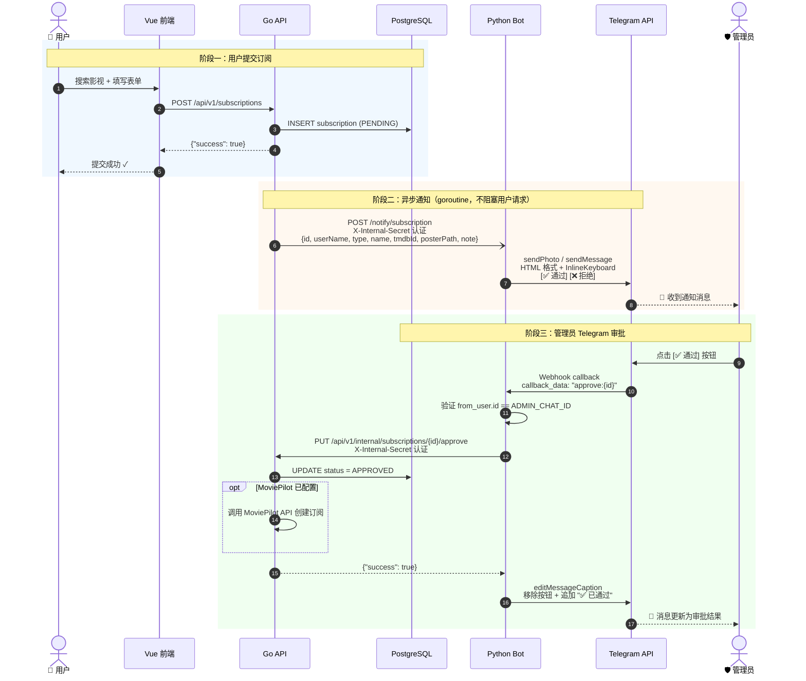
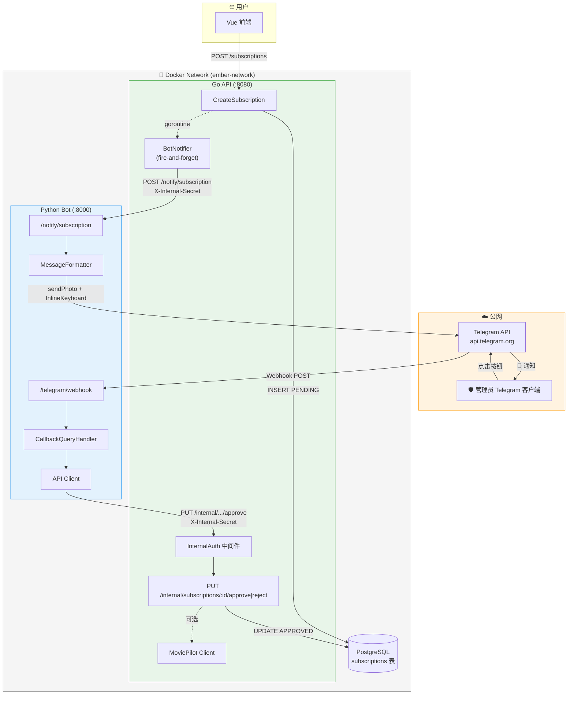

# Telegram 订阅通知功能实现方案

## 背景与目标

当前订阅管理系统没有任何通知机制。用户提交订阅请求后，管理员只能通过 Web 控制台手动刷新查看新的 PENDING 订阅。这导致审批延迟，用户体验差。

**本方案实现**：
1. 用户提交订阅请求 → 自动通过 Telegram Bot 发送通知给管理员
2. 管理员在 Telegram 中点击内联按钮，直接完成审批（通过/拒绝）
3. 审批后 Telegram 消息自动更新为审批结果

**交互方式**：内联键盘按钮（非文本回复），一键操作
**实现位置**：独立 Python Bot 服务（`services/bot/`）
**更新接收**：Webhook 模式

---

## 一、架构设计

### 1.1 整体数据流（时序图）



### 1.2 服务架构部署图



### 1.3 服务通信设计

**两条通信路径**：

| 方向 | 触发场景 | 传输方式 | 认证方式 |
|------|---------|---------|---------|
| Go API → Python Bot | 新订阅创建成功后 | HTTP POST `{BOT_URL}/notify/subscription` | `X-Internal-Secret` header |
| Python Bot → Go API | 管理员点击审批按钮 | HTTP PUT `{API_URL}/api/v1/internal/subscriptions/:id/approve\|reject` | `X-Internal-Secret` header |

**为什么不让 Go API 直接调 Telegram API**：
- 如果 API 直接发 Telegram 消息，那 Telegram webhook 回调仍然要交给 Bot 处理
- 这意味着两个服务都要写 Telegram 逻辑（API 发消息、Bot 处理回调）
- 让 Bot 统一负责所有 Telegram 交互（发送 + 接收），Go API 只需"通知 Bot 有新订阅"

**为什么用共享密钥而不是 JWT**：
- Bot 不是用户，没有 userID/role
- 服务间认证只需简单的 shared secret
- 一个 header 比较，零密码学开销
- 与项目中 `CRON_SECRET` 的设计思路一致

### 1.4 关键设计原则

1. **fire-and-forget**：通知失败绝不阻塞订阅创建。用 goroutine 异步发送，5 秒超时
2. **callback_data 自带 ID**：`approve:{subscription_id}` 格式，无需数据库存储消息映射。CUID 25 字符 + `approve:` 8 字符 = 33 字符，远在 Telegram 64 字节限制内
3. **复用现有 handler**：内部路由直接复用 `ApproveSubscription`/`RejectSubscription` handler（已验证不依赖 JWT context）

---

## 二、Go API 变更

### 2.1 变更文件清单

| 文件 | 操作 | 说明 |
|------|------|------|
| `services/api/internal/services/notifier.go` | **新增** | Bot 通知客户端 |
| `services/api/internal/services/subscription.go` | **修改** | 注入 notifier，CreateSubscription 末尾加异步通知 |
| `services/api/internal/middleware/internal_auth.go` | **新增** | 内部服务认证中间件 |
| `services/api/cmd/server/main.go` | **修改** | 注册 `/api/v1/internal/*` 内部路由组 |
| `services/api/.env.example` | **修改** | 新增 `INTERNAL_API_SECRET`、`BOT_NOTIFY_URL` |

### 2.2 新增：`services/api/internal/services/notifier.go`

**职责**：向 Python Bot 发送 HTTP 通知，遵循 `moviepilot.go` 的设计模式。

**struct 设计**：
```go
type BotNotifier struct {
    botURL string       // 来自 BOT_NOTIFY_URL 环境变量
    secret string       // 来自 INTERNAL_API_SECRET 环境变量
    client *http.Client // 5 秒超时
}
```

**公开方法**：

| 方法 | 签名 | 说明 |
|------|------|------|
| `NewBotNotifier()` | `func NewBotNotifier() *BotNotifier` | 从环境变量初始化，去除 URL 尾部斜杠 |
| `IsConfigured()` | `func (n *BotNotifier) IsConfigured() bool` | 检查 `botURL` 非空 |
| `NotifyNewSubscription()` | `func (n *BotNotifier) NotifyNewSubscription(data SubscriptionNotification)` | POST 通知到 Bot，**返回 void**（调用方无需处理错误） |

**通知数据结构**：
```go
type SubscriptionNotification struct {
    ID         string  `json:"id"`
    UserName   string  `json:"userName"`
    Type       string  `json:"type"`       // "MOVIE" 或 "TV"
    Name       string  `json:"name"`       // 影视名称
    TmdbID     string  `json:"tmdbId"`
    PosterPath *string `json:"posterPath"` // 海报路径（可选）
    Note       *string `json:"note"`       // 用户备注（可选）
}
```

**HTTP 请求细节**：
- 目标 URL：`{botURL}/notify/subscription`
- Method：POST
- Content-Type：`application/json`
- Header：`X-Internal-Secret: {secret}`
- 超时：5 秒
- 错误处理：`fmt.Printf` 输出日志（与 MoviePilot 客户端一致），不返回 error

### 2.3 修改：`services/api/internal/services/subscription.go`

**变更点 1**：`SubscriptionService` struct 增加 `notifier` 字段

```go
// 当前
type SubscriptionService struct {
    moviepilot *MoviePilotClient
}

// 改为
type SubscriptionService struct {
    moviepilot *MoviePilotClient
    notifier   *BotNotifier
}
```

**变更点 2**：`NewSubscriptionService()` 增加初始化

```go
// 当前
func NewSubscriptionService() *SubscriptionService {
    return &SubscriptionService{
        moviepilot: NewMoviePilotClient(),
    }
}

// 改为
func NewSubscriptionService() *SubscriptionService {
    return &SubscriptionService{
        moviepilot: NewMoviePilotClient(),
        notifier:   NewBotNotifier(),
    }
}
```

**变更点 3**：`CreateSubscription()` 方法末尾注入异步通知

在第 67 行 `return nil` 之前插入：

```go
// 第 62-67 行之后，return nil 之前
// 通知 Bot（异步 fire-and-forget，失败不影响订阅创建）
go func() {
    var username string
    var user models.User
    if err := db.DB.Select("username").Where("id = ?", userID).First(&user).Error; err == nil {
        username = user.Username
    }
    s.notifier.NotifyNewSubscription(SubscriptionNotification{
        ID:         subscription.ID,
        UserName:   username,
        Type:       string(req.Type),
        Name:       req.Name,
        TmdbID:     req.TmdbID,
        PosterPath: req.PosterPath,
        Note:       req.Note,
    })
}()

return nil
```

**为什么在 goroutine 里查用户名**：
- `CreateSubscription` 的参数只有 `userID`（string），没有 `username`
- 查一次 DB 获取用户名只是 `SELECT username FROM users WHERE id = ?`，极轻量
- 在 goroutine 里做，不会增加主请求的延迟
- 即使查询失败，`username` 为空字符串，通知仍可发出（只是消息里没有用户名）

### 2.4 新增：`services/api/internal/middleware/internal_auth.go`

**职责**：验证内部服务间的 `X-Internal-Secret` header。

**逻辑**：
1. 启动时从 `INTERNAL_API_SECRET` 环境变量读取密钥
2. 每次请求比对 header 值
3. 未配置 → 503 Service Unavailable（`{"error": "内部认证未配置"}`）
4. 不匹配 → 401 Unauthorized（`{"error": "无效的内部认证"}`）
5. 匹配 → `c.Next()`

**参考**：遵循 `middleware/jwt.go` 的中间件风格（返回 `gin.HandlerFunc`，错误时 `c.Abort()`）。

### 2.5 修改：`services/api/cmd/server/main.go`

在第 97 行（admin 路由组 `}` 之后）和第 99 行（authenticated 路由组之前）之间，插入内部路由组：

```go
// ==================== 内部服务路由（Bot 调用） ====================
internal := api.Group("/internal")
internal.Use(middleware.InternalAuth())
{
    internal.PUT("/subscriptions/:id/approve", subscriptionHandler.ApproveSubscription)
    internal.PUT("/subscriptions/:id/reject", subscriptionHandler.RejectSubscription)
}
```

**为什么可以直接复用现有 handler**：

已验证 `handlers/subscription.go` 第 189-223 行：
- `ApproveSubscription` 只用 `c.Param("id")` 获取订阅 ID，不依赖 JWT context（无 `c.Get("userID")`）
- `RejectSubscription` 同理
- 它们调用的 `service.ApproveSubscription(subscriptionID)` 和 `service.RejectSubscription(subscriptionID)` 也只接收 ID 参数

因此可以零修改地挂到内部路由上。**零重复代码**。

### 2.6 修改：`services/api/.env.example`

在文件末尾（第 87 行之后）追加：

```env
# ==================== 内部服务通信 ====================
# 内部 API 密钥（Bot ↔ API 双向认证密钥）
# 生成方法：openssl rand -hex 32
INTERNAL_API_SECRET="your-internal-api-secret"

# Bot 通知地址（可选，不配置则不发通知）
# Docker 环境下通常为 http://bot:8000
BOT_NOTIFY_URL="http://localhost:8000"
```

---

## 三、Python Bot 服务（新建 `services/bot/`）

### 3.1 目录结构

```
services/bot/
├── main.py                # 入口：FastAPI 应用 + Telegram webhook 注册
├── config.py              # 环境变量配置（必填用 os.environ[]，缺失即崩）
├── api_client.py          # 调用 Go API 的 HTTP 客户端（approve/reject）
├── telegram_handler.py    # 发送通知 + 处理按钮回调
├── message_formatter.py   # 消息文本格式化 + InlineKeyboard 构建
├── requirements.txt       # Python 依赖
├── Dockerfile             # 容器构建文件
└── README.md              # 更新现有文档
```

### 3.2 依赖清单（`requirements.txt`）

```
python-telegram-bot==21.6
fastapi==0.115.0
uvicorn==0.32.0
httpx==0.27.0
python-dotenv==1.0.1
```

**选型理由**：
- `python-telegram-bot` v21：全异步 API，与 FastAPI 异步模型天然配合
- `FastAPI`：异步 HTTP 框架，Bot 需要同时处理 Telegram webhook 和 Go API 通知两种 HTTP 请求
- `uvicorn`：ASGI 服务器，FastAPI 标准配套
- `httpx`：异步 HTTP 客户端，用于调用 Go API
- `python-dotenv`：环境变量加载

**为什么用 FastAPI 而不是 Flask**：`python-telegram-bot` v21 是全异步的，FastAPI 天然异步，`httpx` 异步客户端，整条链路零阻塞。Flask 需要额外的异步适配。

### 3.3 配置模块（`config.py`）

**环境变量**：

| 变量 | 必需 | 类型 | 说明 | 默认值 |
|------|------|------|------|--------|
| `TELEGRAM_BOT_TOKEN` | 是 | string | BotFather 获取的 Bot Token | — |
| `TELEGRAM_ADMIN_CHAT_ID` | 是 | int | 管理员的 Telegram Chat ID | — |
| `INTERNAL_API_SECRET` | 是 | string | 与 Go API 共享的认证密钥 | — |
| `API_URL` | 否 | string | Go API 地址 | `http://localhost:8080` |
| `WEBHOOK_URL` | 是 | string | Bot 的公网 HTTPS 地址 | — |
| `BOT_PORT` | 否 | int | Bot HTTP 监听端口 | `8000` |

**设计原则**：
- 必填变量用 `os.environ["KEY"]`（缺失时直接 KeyError 崩溃退出）
- 可选变量用 `os.getenv("KEY", "default")`
- 没有 fallback 逻辑，配置错误应该在启动时暴露

**常量**：
```python
TMDB_IMAGE_BASE = "https://image.tmdb.org/t/p/w300"
```

### 3.4 Go API 客户端（`api_client.py`）

**职责**：调用 Go API 的内部端点完成订阅审批。

**函数**：

| 函数 | 签名 | 说明 |
|------|------|------|
| `approve_subscription` | `async def approve_subscription(subscription_id: str) -> bool` | PUT 调用 approve 端点 |
| `reject_subscription` | `async def reject_subscription(subscription_id: str) -> bool` | PUT 调用 reject 端点 |

**请求细节**：
- URL：`{API_URL}/api/v1/internal/subscriptions/{subscription_id}/approve` 或 `reject`
- Method：PUT
- Header：`X-Internal-Secret: {INTERNAL_API_SECRET}`
- 超时：10 秒
- 返回：`resp.status_code == 200` → `True`，否则 `False`

**不做重试**：如果 Go API 不可用，管理员点按钮会看到"操作失败，请重试"，再点一次即可。

### 3.5 消息格式化（`message_formatter.py`）

**函数 1**：`format_subscription_message(data: dict) -> tuple[str, InlineKeyboardMarkup]`

生成通知消息文本和内联键盘。

**消息模板**（HTML 格式）：
```
🎬 <b>新的求片请求</b>

📌 <b>流浪地球 2</b>
🎭 类型：电影
👤 用户：zhang_san
🔗 TMDB：<a href='https://www.themoviedb.org/movie/906126'>#906126</a>
💬 备注：希望能尽快添加     ← 仅当 note 非空时显示

[✅ 通过]  [❌ 拒绝]        ← InlineKeyboardMarkup
```

**Inline Keyboard 按钮**：
```python
InlineKeyboardMarkup([
    [
        InlineKeyboardButton("✅ 通过", callback_data=f"approve:{data['id']}"),
        InlineKeyboardButton("❌ 拒绝", callback_data=f"reject:{data['id']}"),
    ]
])
```

**callback_data 格式说明**：
- `approve:clxxxxxxxxxxxxxxxxxx` 或 `reject:clxxxxxxxxxxxxxxxxxx`
- CUID ID 25 字符 + `approve:` 8 字符 = 33 字符（Telegram 限制 64 字节，充裕）

**函数 2**：`format_result_message(original_text: str, action: str) -> str`

审批完成后更新消息文本：
```
[原始消息内容]

────────────────────
✅ 已通过              ← 或 ❌ 已拒绝
```

### 3.6 Telegram 处理器（`telegram_handler.py`）

**函数 1**：`send_subscription_notification(bot, data: dict)`

被 FastAPI 通知端点调用，向管理员发送通知。

**逻辑**：
1. 调用 `format_subscription_message(data)` 获取文本和键盘
2. 检查 `data.get("posterPath")`：
   - **有海报**：`bot.send_photo(chat_id, photo=TMDB_IMAGE_BASE+posterPath, caption=text, parse_mode="HTML", reply_markup=keyboard)`
   - **无海报**：`bot.send_message(chat_id, text=text, parse_mode="HTML", reply_markup=keyboard)`

**函数 2**：`handle_callback(update: Update, context: ContextTypes.DEFAULT_TYPE)`

处理管理员点击内联按钮的回调。

**完整逻辑流程**：
```
1. query = update.callback_query
2. await query.answer()                     # 立即响应 Telegram，消除按钮加载状态
3. 验证权限：
   - if query.from_user.id != TELEGRAM_ADMIN_CHAT_ID:
       await query.answer("你没有权限操作", show_alert=True)
       return
4. 解析 callback_data：
   - parts = query.data.split(":", 1)
   - if len(parts) != 2: return
   - action, subscription_id = parts
   - if action not in ("approve", "reject"): return
5. 调用 Go API：
   - if action == "approve":
       success = await api_client.approve_subscription(subscription_id)
   - else:
       success = await api_client.reject_subscription(subscription_id)
6. 处理结果：
   - if not success:
       await query.answer("操作失败，请重试", show_alert=True)
       return
   - 获取原始消息文本：
     original_text = query.message.text or query.message.caption or ""
   - 生成结果文本：
     result_text = format_result_message(original_text, action)
   - 更新消息（移除按钮 + 标记结果）：
     if query.message.photo:   # 带海报图片的消息
         await query.edit_message_caption(caption=result_text, parse_mode="HTML")
     else:                     # 纯文本消息
         await query.edit_message_text(text=result_text, parse_mode="HTML")
```

**边界情况处理**：
- 管理员重复点击已处理的订阅 → Go API 返回 "订阅已被处理" 400 错误 → Bot 显示 "操作失败，请重试"（实际订阅状态不会被覆盖，因为 ApproveSubscription 和 RejectSubscription 都检查了 PENDING 状态）
- Bot 服务重启后旧消息的按钮仍可用 → callback_data 自带 subscription_id，无需内存状态
- 非管理员点击 → `from_user.id` 校验拒绝

### 3.7 入口模块（`main.py`）

**职责**：FastAPI 应用 + Telegram Application 单例 + 生命周期管理。

**全局单例**：
```python
tg_app = Application.builder().token(TELEGRAM_BOT_TOKEN).build()
tg_app.add_handler(CallbackQueryHandler(handle_callback))
```

**FastAPI Lifespan**（启动/关闭钩子）：
```
启动时：
  1. await tg_app.initialize()
  2. await tg_app.bot.set_webhook(url=f"{WEBHOOK_URL}/telegram/webhook")
  3. await tg_app.start()

关闭时：
  1. await tg_app.stop()
  2. await tg_app.shutdown()
```

**HTTP 端点**：

| 路径 | 方法 | 说明 | 认证 |
|------|------|------|------|
| `/telegram/webhook` | POST | 接收 Telegram 更新 | Telegram 自身机制（基于 webhook secret） |
| `/notify/subscription` | POST | 接收 Go API 订阅通知 | 验证 `X-Internal-Secret` header |
| `/health` | GET | 健康检查 | 无 |

**`/telegram/webhook` 端点逻辑**：
```python
@app.post("/telegram/webhook")
async def telegram_webhook(request: Request):
    data = await request.json()
    update = Update.de_json(data, tg_app.bot)
    await tg_app.process_update(update)
    return Response(status_code=200)
```

**`/notify/subscription` 端点逻辑**：
```python
@app.post("/notify/subscription")
async def notify_subscription(request: Request):
    # 验证内部密钥
    secret = request.headers.get("X-Internal-Secret")
    if secret != INTERNAL_API_SECRET:
        return JSONResponse(status_code=401, content={"error": "unauthorized"})

    data = await request.json()
    await send_subscription_notification(tg_app.bot, data)
    return {"ok": True}
```

**启动**：
```python
if __name__ == "__main__":
    uvicorn.run(app, host="0.0.0.0", port=BOT_PORT)
```

### 3.8 Dockerfile

```dockerfile
FROM python:3.11-slim

WORKDIR /app

COPY requirements.txt .
RUN pip install --no-cache-dir -r requirements.txt

COPY . .

EXPOSE 8000

HEALTHCHECK --interval=30s --timeout=3s --start-period=5s --retries=3 \
    CMD python -c "import httpx; httpx.get('http://localhost:8000/health').raise_for_status()" || exit 1

CMD ["python", "main.py"]
```

---

## 四、Docker Compose 变更

### 4.1 修改 `infrastructure/docker/docker-compose.yml`

**变更 1**：api 服务增加环境变量（第 32-37 行 environment 区域）

新增两行：
```yaml
- INTERNAL_API_SECRET=${INTERNAL_API_SECRET}
- BOT_NOTIFY_URL=http://bot:8000
```

**变更 2**：取消 bot 注释并更新配置（第 60-73 行）

```yaml
  # Python Telegram Bot
  bot:
    build:
      context: ../../services/bot
      dockerfile: Dockerfile
    container_name: ember-bot
    environment:
      - TELEGRAM_BOT_TOKEN=${TELEGRAM_BOT_TOKEN}
      - TELEGRAM_ADMIN_CHAT_ID=${TELEGRAM_ADMIN_CHAT_ID}
      - API_URL=http://api:8080
      - INTERNAL_API_SECRET=${INTERNAL_API_SECRET}
      - WEBHOOK_URL=${WEBHOOK_URL}
      - BOT_PORT=8000
    ports:
      - "8000:8000"
    depends_on:
      - api
    networks:
      - ember-network
    restart: unless-stopped
```

**网络说明**：
- Docker 网络内：API 通过 `http://bot:8000` 访问 Bot，Bot 通过 `http://api:8080` 访问 API
- 外网：需要反向代理将 `WEBHOOK_URL`（如 `https://bot.example.com`）路由到 Bot 的 8000 端口
- Telegram 要求 Webhook URL 必须是 HTTPS

---

## 五、环境变量汇总

### 5.1 全部新增环境变量

| 变量 | 使用服务 | 必需 | 说明 | 示例值 |
|------|---------|------|------|--------|
| `INTERNAL_API_SECRET` | API + Bot | 是 | 服务间认证密钥 | `openssl rand -hex 32` 生成 |
| `BOT_NOTIFY_URL` | API | 否 | API 通知 Bot 地址，不配置则不发通知 | `http://bot:8000`（Docker）或 `http://localhost:8000` |
| `API_URL` | Bot | 否 | Bot 调用 API 地址 | `http://api:8080`（Docker）或 `http://localhost:8080` |
| `WEBHOOK_URL` | Bot | 是 | Bot 公网 HTTPS 地址 | `https://bot.example.com` |
| `BOT_PORT` | Bot | 否 | Bot 监听端口 | `8000` |

### 5.2 已存在但需配置的变量

| 变量 | 说明 | 位置 |
|------|------|------|
| `TELEGRAM_BOT_TOKEN` | 已在 `.env.example` 第 80 行定义 | Bot 使用 |
| `TELEGRAM_ADMIN_CHAT_ID` | 已在 `.env.example` 第 87 行定义 | Bot 使用 |

---

## 六、实现顺序

### Phase 1：Go API 内部路由

1. 创建 `services/api/internal/middleware/internal_auth.go` — InternalAuth 中间件
2. 修改 `services/api/cmd/server/main.go` — 注册 `/api/v1/internal/*` 路由组
3. 编译验证：`cd services/api && go build ./...`

### Phase 2：Go API 通知客户端

1. 创建 `services/api/internal/services/notifier.go` — BotNotifier
2. 修改 `services/api/internal/services/subscription.go` — 注入 notifier + CreateSubscription 末尾加 goroutine
3. 编译验证：`cd services/api && go build ./...`

### Phase 3：Python Bot 基础框架

1. 创建 `services/bot/requirements.txt`
2. 创建 `services/bot/config.py`
3. 创建 `services/bot/api_client.py`
4. 创建 `services/bot/message_formatter.py`

### Phase 4：Python Bot 入口与处理器

1. 创建 `services/bot/telegram_handler.py`
2. 创建 `services/bot/main.py`

### Phase 5：Docker 与配置

1. 创建 `services/bot/Dockerfile`
2. 修改 `infrastructure/docker/docker-compose.yml` — 取消 bot 注释 + api 加环境变量
3. 修改 `services/api/.env.example` — 新增内部服务通信配置
4. 更新 `services/bot/README.md`

---

## 七、Telegram 消息示例

### 7.1 通知消息（有海报）

```
┌─────────────────────────────────────┐
│          [海报图片 300px]             │
│                                     │
│ 🎬 新的求片请求                      │
│                                     │
│ 📌 流浪地球 2                        │
│ 🎭 类型：电影                        │
│ 👤 用户：zhang_san                   │
│ 🔗 TMDB：#906126                    │
│ 💬 备注：希望能尽快添加               │
│                                     │
│    [✅ 通过]    [❌ 拒绝]             │
└─────────────────────────────────────┘
```

### 7.2 审批完成后

```
┌─────────────────────────────────────┐
│          [海报图片 300px]             │
│                                     │
│ 🎬 新的求片请求                      │
│                                     │
│ 📌 流浪地球 2                        │
│ 🎭 类型：电影                        │
│ 👤 用户：zhang_san                   │
│ 🔗 TMDB：#906126                    │
│ 💬 备注：希望能尽快添加               │
│                                     │
│ ────────────────────                │
│ ✅ 已通过                            │
└─────────────────────────────────────┘
```

按钮消失，底部显示审批结果。消息不可再次操作。

---

## 八、验证方式

### 8.1 编译验证

```bash
# Go API
cd services/api && go build ./...

# Python Bot 语法检查
cd services/bot && python -c "import main; import config; import api_client; import telegram_handler; import message_formatter"
```

### 8.2 端到端测试

1. 配置环境变量（`TELEGRAM_BOT_TOKEN`、`TELEGRAM_ADMIN_CHAT_ID`、`INTERNAL_API_SECRET` 等）
2. 启动 Go API 和 Python Bot
3. 通过 Web 界面提交一个订阅请求
4. 检查 Telegram 是否收到通知消息（含海报和按钮）
5. 点击 ✅ 通过 按钮
6. 检查：Telegram 消息更新为 "已通过"、按钮消失、Web 界面订阅状态变为 APPROVED
7. 再次提交订阅，点击 ❌ 拒绝，验证拒绝流程

### 8.3 异常场景验证

| 场景 | 预期行为 |
|------|---------|
| Bot 未启动时提交订阅 | 订阅创建成功，API 日志输出通知失败，不影响用户 |
| `BOT_NOTIFY_URL` 未配置 | `IsConfigured()` 返回 false，不发送通知 |
| API 未启动时点击按钮 | Bot 显示 "操作失败，请重试" 弹窗 |
| 重复点击已处理订阅的按钮 | Go API 返回 "订阅已被处理"，Bot 显示 "操作失败" |
| 非管理员点击按钮 | Bot 显示 "你没有权限操作" 弹窗 |

---

## 九、不做的事情

| 不做 | 原因 |
|------|------|
| 消息队列（RabbitMQ/Redis） | 两个服务、一个通知场景，HTTP 足够 |
| 重试/指数退避 | 管理员可以手动再点一次 |
| Bot 命令系统（/start 等） | 本次只做订阅通知，其他命令留给后续迭代 |
| 数据库存储 message_id 映射 | callback_data 自带 subscription_id，无需持久化 |
| 审批结果反向通知用户 | 用户可在 Web 端查看状态变化，后续迭代可加 |
| Rate Limiting | 内部通知端点在 Docker 网络内不暴露公网，Telegram webhook 有自身限流 |

---

## 十、关键文件路径索引

### 需要阅读理解的现有文件

| 文件 | 用途 |
|------|------|
| `services/api/internal/services/subscription.go` | 订阅服务（核心修改点） |
| `services/api/internal/handlers/subscription.go` | 订阅 handler（复用 approve/reject） |
| `services/api/internal/services/moviepilot.go` | HTTP 客户端参考模式 |
| `services/api/internal/middleware/jwt.go` | 中间件参考模式 |
| `services/api/cmd/server/main.go` | 路由注册点 |

### 需要创建的新文件

| 文件 | 用途 |
|------|------|
| `services/api/internal/services/notifier.go` | Bot 通知客户端 |
| `services/api/internal/middleware/internal_auth.go` | 内部认证中间件 |
| `services/bot/main.py` | Bot 入口 |
| `services/bot/config.py` | Bot 配置 |
| `services/bot/api_client.py` | Go API 客户端 |
| `services/bot/telegram_handler.py` | Telegram 处理器 |
| `services/bot/message_formatter.py` | 消息格式化 |
| `services/bot/requirements.txt` | Python 依赖 |
| `services/bot/Dockerfile` | 容器构建 |

### 需要修改的现有文件

| 文件 | 改动量 |
|------|--------|
| `services/api/internal/services/subscription.go` | 小（加 2 行 struct 字段 + 15 行 goroutine） |
| `services/api/cmd/server/main.go` | 小（加 7 行内部路由组） |
| `services/api/.env.example` | 小（追加 6 行环境变量） |
| `infrastructure/docker/docker-compose.yml` | 中（取消注释 + 补充环境变量） |
