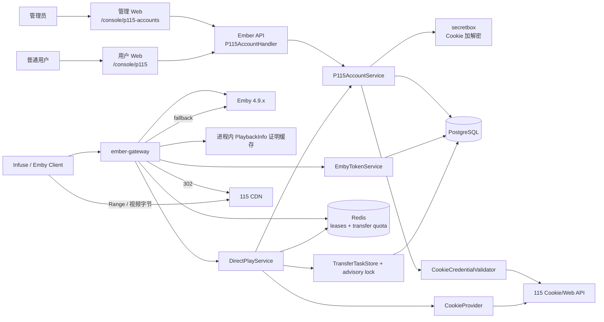
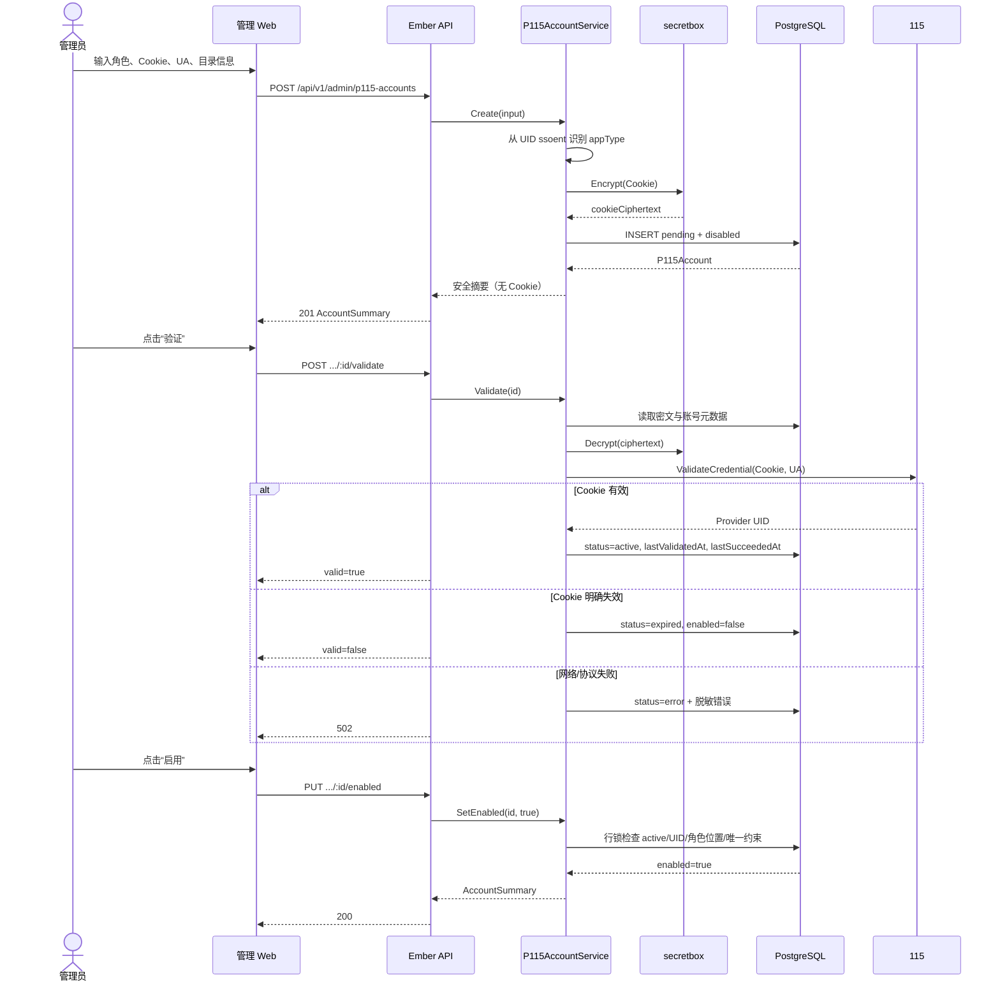
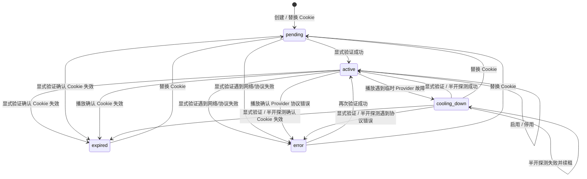
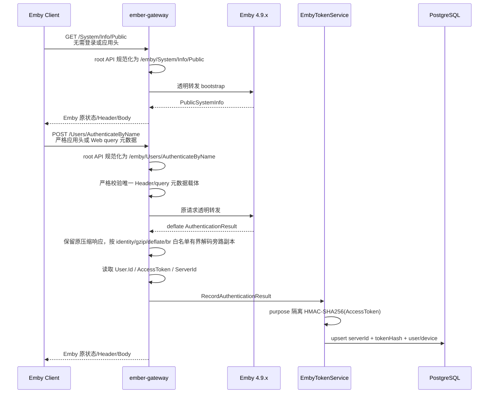
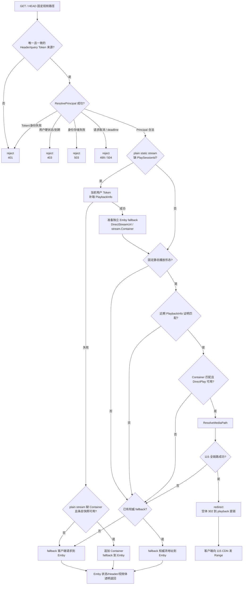
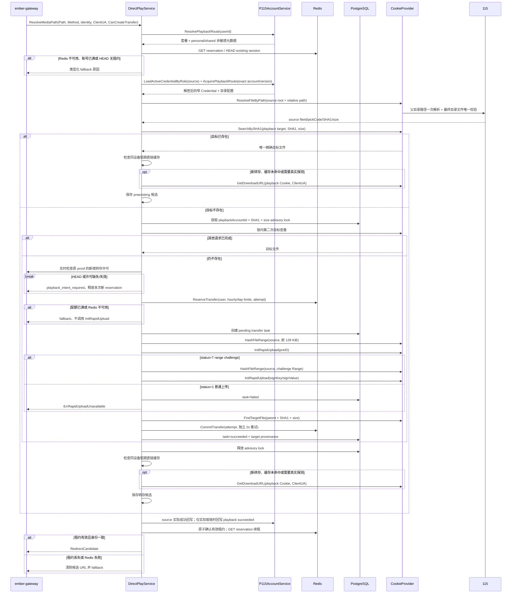
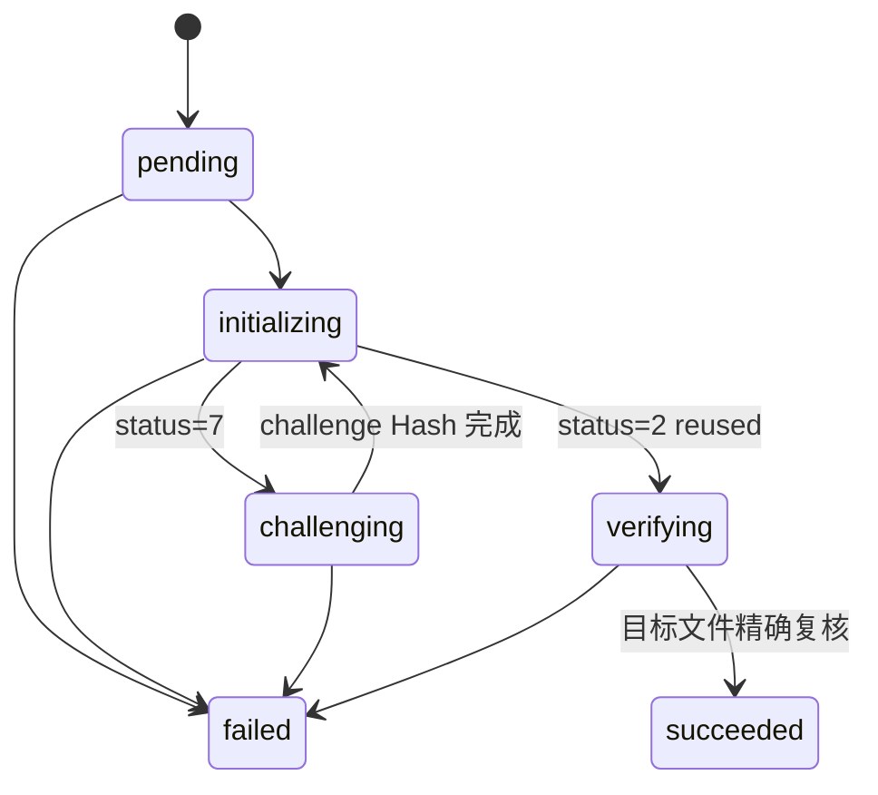

# 115 Cookie 直连播放端到端流程参考

本文档从当前代码出发，说明 Ember 的 115 Cookie 账号控制面、Emby 身份桥接、PlaybackInfo 短期证明、保留式秒传、302 直连、Emby fallback、安全 reject、持久化与日志边界。

它回答“现在实际怎么运行”，不替代协议合同和实施计划：

- Emby method/path/Header/DTO：看 [Emby 4.9 系列播放代理 API 合同](./emby-playback-proxy-contract.md)。
- 115 Cookie/Web API、上传加密和直链安全：看 [115 Cookie 播放兼容合同](./p115-cookie-playback-contract.md)。
- 当前系统内置链路的尚未完成项和阶段安排：看 [Emby 115 直连播放网关实施计划](../plan/architecture/emby-115-direct-play-gateway.md)。
- 用户自有账号、套餐来源、Redis 当前活跃数与转存配额的实现约束及未执行受控验证：看 [115 用户自有账号路由与 Redis 配额实现方案](../plan/architecture/p115-personal-account-routing-and-redis-quotas.md)。

## 1. 核心原则

当前实现只有三种视频请求决策：

| 决策 | 条件 | 客户端结果 |
| --- | --- | --- |
| `reject` | Token/身份/用户硬状态失败，或 DirectPlay 期间请求已取消/超时 | Gateway 固定终止，不访问后续 Emby/115 |
| `redirect` | Principal、PlaybackInfo 证明、请求资格和 115 全链路均成功 | Gateway 返回空体 `302`，客户端直连 115 CDN |
| `fallback` | Principal 合法，但请求不适合加速或任一 115 步骤失败 | 透明代理权威 Emby 请求 |

最重要的边界是：

> Emby 正常代理播放是基线，115 是可选加速。只有安全失败可以拒绝；合法用户不能因为没有 115 条件而失去正常播放能力。

### 1.1 用户账号路由与 Redis 配额（已实现，真实链路未验证）

当前运行时保留唯一管理员 source，并按用户有效套餐在个人 playback 与管理员共享 playback 之间路由。实现不建立数据库播放会话或套餐播放并发：

播放路由支持 `admin` 与 `user`，两者均读取本人显式分组（未指定时读取默认分组）的播放模式、转存额度和策略模板。管理员的 `system` 套餐选择共享 playback；`personal` 套餐仍要求本人个人账号，不隐式借用共享账号。个人账号控制面仍限制为普通用户；共享账号的合计并发、健康检查和 Redis 准入不因管理员身份而放宽。

- 套餐组增加 `personal|system` 账号来源，migration 将历史套餐组统一回填为 `personal`，新建套餐组也默认 `personal`；既有用户没有个人账号时按已接受的产品语义进入公共 fallback，不为历史共享直连保留隐式 `system` 或 feature flag。只有管理员主动设置的套餐组使用当前管理员共享 playback；`system` 只是套餐路由值，不是账号类型或 scope。
- `personal` 用户可在控制台绑定本人唯一 playback 账号，固定按“只提交 write-only Cookie 创建 `pending + disabled` → 显式验证为 `active + disabled` → 配置已有目录路径与最大播放路数 → 完整性和当前套餐复验后启用”流转。创建不请求 115 或套餐模板，页面和 API 不接受 `appType/UserAgent`；未绑定或账号不可用时回退 Emby。
- 后端从 Cookie 唯一合法 `UID` 的 `ssoent` 自动派生个人账号 `app_type`，未知编码保存 `unknown`，缺失、重复或非法 `UID` 直接拒绝；普通 Cookie/Web 请求固定使用 `Mozilla/5.0`，该默认值尚未经过目标个人 Cookie 的真实 115 验证。
- 最终下载直链继续使用 Gateway 收到的真实播放器 User-Agent，不能用固定 Provider User-Agent 替代；秒传初始化继续使用协议代码内的版本绑定上传 User-Agent。
- 最大播放路数属于具体 playback 账号。个人账号配置时读取当前有效套餐模板：`SimultaneousStreamLimit > 0` 要求 `1 <= maxConcurrentStreams <= SimultaneousStreamLimit`，值为 `0` 时按 Ember 内部合同视为没有有限套餐上限，但账号配置仍限制为 `1..100`。运行时使用 `effectiveMaxConcurrentStreams = min(configuredMaxConcurrentStreams, positive SimultaneousStreamLimit)`；套餐降低不自动改写数据库配置。管理员共享 playback 按所有 `system` 使用者合计，不与单个套餐上限比较。
- 管理员共享 playback 在显式验证为 `active` 后，通过 `PUT /api/v1/admin/p115-accounts/:id/playback-config` 原子提交已有目录路径和正整数 `maxConcurrentStreams`；两个字段都必填，目录解析失败时 path、ID 和并发配置全部不写，解析期间 Cookie、状态或账号版本变化则返回 `409`，禁止旧凭证解析结果覆盖新状态。已启用账号允许降低上限但不终止已有播放，新 reservation 等待合计占用降到新上限以下。现有管理员列表/详情直接返回该共享账号下由 `system` 路由建立的全部现存租约合计，不按用户当前套餐重新归类；Redis 查询成功且 Key 缺失时 `usageAvailable=true` 并返回零，Redis 不可用时 `usageAvailable=false` 且计数为 `null`，不新增独立用量端点。
- 个人与共享 playback 复用同一运行期健康状态机：先按套餐路由选择不解密 Cookie 的精确账号元数据，Redis 准入成功后再按 account ID/owner 加载凭证。冷却未到期时 fallback；到期后 PostgreSQL 行锁只发放一个 1 分钟半开探测，成功恢复 `active`，失败按类型重新冷却、进入 `expired` 或 `error`。Redis 失败不消耗半开机会，两次读取间的停用、解绑、Cookie 替换或控制面配置更新均失败关闭并只释放本次新 reservation。
- 个人账号 Cookie 替换回到 `pending + disabled`，清空旧 Provider UID 和目标目录 path/ID，保留待下次启用重新按套餐复验的并发配置；旧目录 ID 禁止跨 Provider 账号沿用。只有 `enabled` playback 必须同时具备 `active`、Cookie、Provider UID、成对目录 path/ID 和正整数并发配置；未配置完成的 pending/disabled 记录允许目录和并发为空。
- 个人账号解绑使用不可复活的 `revoked` tombstone：在同一事务清空 owner、Cookie、Provider、`appType/UserAgent`、source/playback 目录、并发和健康等运行期数据，但保留账号 ID、role、后端固定 alias、auth mode、revoked/disabled 状态和时间供 transfer provenance 引用；owner 外键使用 `ON DELETE RESTRICT`，确保未完成 tombstone 的活动个人账号会阻止直接删除用户，revoked 状态则保证已清空 owner 的 tombstone 不会被共享账号加载器选中。
- Redis 同时维护账号/用户的占用与真实活跃索引：合格 GET 在 302 前只建立 `30s reservation` 并参与账号并发准入，HEAD 无既有租约时直接 fallback；成功 Playing/Progress 才晋级为 `active` 并刷新 `2m` TTL，暂停继续占用并刷新 `15m` TTL，Stopped 成功转发后释放。Sorted Set 的过期 member 每次脚本按 Gateway 可注入时钟清理并不再计数，account/user `leases + active` 另使用 `16m` Key TTL 回收无后续请求的空闲索引。三类业务 TTL 首期使用代码常量，不增加环境变量或后台配置；用户索引只用于展示、归因和后续治理，不参与第二套并发门控。
- Redis 账号索引键使用规范化 Provider UID 的服务端用途隔离 HMAC，不使用数据库账号 ID、owner 或 Ember 用户 ID，也不暴露原始 Provider UID；解绑只擦除持久凭证并停止新 `302`，不删除仍可能对应已签发 CDN URL 的 Redis 占用。同一真实 115 账号以新数据库 ID 重新绑定时仍命中旧租约，不同 Provider UID 不继承；现有会话由成功 `Stopped` 或 TTL 收口。
- Redis 可用且命令成功时，当前 Key 是占用和转存用量的唯一真相源；Key 不存在按零处理。不锁定或探测 Redis 版本，只使用 Lua/Sorted Set/TTL 通用能力；首期只支持单 Gateway，所有 score 和套餐窗口使用 Gateway 可注入时钟与全局 `CRON_TIMEZONE`，不承诺多 Gateway、Redis Cluster 或跨主机时钟兼容。Redis 重启或数据丢失后的计数重置是已接受行为，不增加 epoch、恢复等待、数据库重建或历史补偿。
- 套餐组提供用户小时/每日转存限额，默认每小时 `5`、每天 `10`；小时范围固定 `1..100`，每日范围固定 `1..1000`，`0` 非法，越界直接拒绝且不截断，两者不要求大小关系。只有目标缺失且秒传、目标复核均成功的新文件消耗一次额度，预存命中、重复请求和失败不消耗。并发防穿透使用固定 `5m` 且不续租的 pending reservation，pending/succeeded 复用同一 opaque `transferAttemptId` 并幂等完成。失败或预存命中立即删除 pending，进程崩溃后最多保留 5 分钟；pending 已过期但外部转存晚到成功时仍补记一次 succeeded，记录固定诊断码且不删除文件、不污染账号健康。succeeded 提交使用独立 `2s` 总预算有限重试，只有记账成功才继续 `302`；最终失败时保留文件和 pending、本次公共 fallback，不建立数据库补偿或从 transfer 历史重建 Redis。
- Redis、账号并发或转存配额不可用时只停止新的 115 加速并 fallback Emby，不改变用户安全门控，不污染 115 账号健康状态。
- 不新增 Gateway 用户级总并发门控。115 `302` 使视频字节绕开 Emby 视频上游，当前没有证据证明 Emby `SimultaneousStreamLimit` 能限制这类分流播放；该效果保持“未证实”，不能写成当前保证。

### 1.2 Emby fallback 边界

- source 路径映射使用独立非敏感加载边界：只读取唯一启用的管理员全局 source 的 `embyPathPrefix/sourceRootId`，不检查 Provider 的 `active/error/cooling_down`、不读取 Provider UID、不解密 Cookie 或申请半开探测；管理员手工停用 source、没有唯一启用记录或位置非法时直接回退 Emby，真正访问 115 仍走严格凭证加载器并复核 source 位置。
- DirectPlay 返回取消/deadline 或 request context 已终止时返回 `499/504`，不发起 Emby fallback。
- 其他 DirectPlay 不适用或失败场景直接代理权威 Emby 请求；Gateway 不读取媒体文件，也不自行实现 Range、缓存或传输编码语义。

### 1.3 新增转存起播许可

详情浏览的视频 GET 不等于点击播放。Gateway 在现有 proof 缓存中单独保存 30 秒新增转存许可：只有客户端 POST PlaybackInfo 的唯一布尔 `IsPlayback=true` 与成功响应匹配，才授予选定媒体源；未指定媒体源时要求响应唯一。Gateway GET 补查和缓存命中不签发或延长许可，意图解析歧义不改变普通 proof 和透明代理。严格字段与多源合同见 [Emby 播放合同](./emby-playback-proxy-contract.md#新增转存起播许可ember-内部策略)。

DirectPlay 先保留现有缓存/目标查重行为；内容锁内再次确认目标缺失后，在转存配额、任务和 preID 之前调用 Gateway 提供的实时许可检查。缺失、过期、已停止或 proof 代次被替换时以 `playback_intent_required` fallback，不创建任务、不占转存配额、不污染账号健康，并释放本次新建 reservation。HEAD 只能复用已有目标。该策略仍允许详情探测复用已有文件及短暂预留播放并发，不表示详情页完全不请求 115。

成功 Stopped 清对应身份/条目/session 的许可，缺少 MediaSourceId 时覆盖该 session 的全部 source；清理不依赖 Redis 租约是否存在。普通 proof、十分钟跨 session 媒体缓存和下载地址缓存保留。许可有效期不续期，TTL 内失败可重试；准入后已经开始的转存不因随后停止或过期回滚。未携明确起播字段的客户端首次目标缺失时回退 Emby，其他播放器兼容与优化后的真实 Infuse 行为仍需受控验证。

用户账号、套餐来源和 Redis 租约/配额均已有代码与自动化 fake/fixture 证据；本轮没有启动项目服务，也没有执行真实 Redis、个人 115 Cookie、Emby/CloudDrive2 或客户端验收。

## 2. 组件与职责



| 组件 | 当前职责 | 明确不负责 |
| --- | --- | --- |
| 管理/用户 Web | 管理员维护全局 source/shared playback；普通用户按四步流转维护本人 playback，并查看 Redis 用量 | 不保存或回填 Cookie，不直接请求 115，不显示内部 Redis Key/目录 ID |
| P115AccountService | 加密凭证、owner/状态/唯一性、personal/system 路由元数据、准入后凭证加载、控制面用量与 revoked tombstone | 不做 Provider 秒传编排，不清理 Redis 旧租约 |
| CookieProvider | 固定 Cookie/Web 协议、路径解析、查重、秒传、目标复核、下载 URL、Range Hash | 不做用户资格和 Gateway 决策 |
| EmbyTokenService | Token HMAC 映射、实时用户资格、软撤销 | 不保存 Token 明文，不替代 Emby Token |
| Playback Gateway | Emby 透明代理、身份门控、证明观察、视频决策、成功事件后的 Redis 租约更新和单条最终日志 | 不持久化播放决策，不读取媒体文件，不把 Cookie/Provider UID/Redis Key 给客户端或日志 |
| DirectPlayService | 路由元数据、Redis reservation、source 解析、目标查重、转存配额、保留式秒传、任务/锁、直链候选 | 不注册 HTTP 路由，不删除保留文件，不把 Redis 故障写成账号健康错误 |
| Redis | account/user `leases + active`、反向 session、用户 transfer pending/succeeded；Lua 原子更新，缺失 Key 按零 | 不保存 Cookie、下载 URL、原始 Provider UID 或原始 PlaySessionId，不从 PostgreSQL 重建 |
| PostgreSQL | 账号密文、Token 摘要、transfer provenance、唯一约束与 advisory lock | 不保存完整 115 URL、Token 或播放证明 Path |

### 2.1 Gateway 启动边界

`ember gateway` 按 `InitDB → Migrate → VerifySchema → load ConfigService/CRON_TIMEZONE → GET /emby/System/Info → build Redis/EmbyToken/DirectPlay/Gateway → listen` 启动。只有目标 Emby 的 ServerId 非空，且四段数字 Version 满足 `>= 4.9.0.0 && < 4.10.0.0` 时才打开 Listener；`4.9.3.0` 是协议证据基线，不是唯一运行版本；`/health` 只在完整构造后可用。Redis 构造不做 Ping 或版本探测，实际命令失败只关闭本次 115 加速。

Compose 的 `gateway` profile 复用 `ember-api` 镜像，只把 command 改为 `gateway`，同时启动浮动 `redis:alpine`、AOF 和持久卷并等待 Redis healthy；API/Gateway 共用 `REDIS_URL`。Gateway 固定监听容器内 `8081`。当前 Redis 合同只支持单 Gateway，不支持 Cluster 或跨主机时钟协调；公网 HTTPS 和原始 Emby 网络隔离仍不由 Compose 自动完成。

## 3. 管理员账号控制面

### 3.1 两种账号角色

| 角色 | 用途 | 必填运行位置 |
| --- | --- | --- |
| `source` | 定位 Emby 原始文件并读取秒传所需的有界 Range | `embyPathPrefix + sourceRootId` |
| `playback` | 保存保留式秒传文件并签发最终客户端直链 | `targetParentPath + targetParentId + maxConcurrentStreams` |

运行期稳定态要求一个 `enabled + active` 管理员 source；playback 则由套餐路由选择用户本人的 enabled personal 账号或唯一 enabled shared 账号。数据库 partial unique 保证管理员每个角色最多启用一条、每个 owner 最多一个当前个人账号，并禁止 Provider UID 在任一非 revoked 账号间重复；已到期 `cooling_down` 仅允许 PostgreSQL 半开租约持有者临时加载并探测。

管理员 source/shared playback 是全局基础设施；普通用户可在 `/console/p115` 绑定自己的 playback。`system` 只是套餐路由值，不是账号 role/scope，管理员控制面始终只查询 `owner_user_id IS NULL AND status <> revoked`。

### 3.2 创建、验证、启用时序



创建和 Cookie 替换都会优先从 `UID` 的 `ssoent` 自动识别客户端类型并写入现有 `app_type`；只有未知编码才接受请求中的 `appType` 人工兜底。Cookie 替换会在同一次更新中刷新 `app_type`，把账号重置为 `pending + disabled`，并清空 Provider UID、验证时间、成功时间、冷却和错误字段；必须重新验证后才能启用。识别全程在本地完成，不请求 115 设备接口。

个人账号创建和 Cookie 替换只提交 Cookie：未知 `ssoent` 保存 `unknown`，缺失、重复或非法 `UID` 拒绝，Provider User-Agent 由后端固定为 `Mozilla/5.0`；管理员现有 `appType` 人工兜底和显式 User-Agent 输入保持兼容。

### 3.3 账号状态



`enabled` 是独立布尔轴：`active` 不等于已启用。显式验证或播放调用确认 Cookie 失效时会进入 `expired + disabled`；显式验证的网络/协议错误进入 `error` 并保留 enabled。播放期间临时 Provider 故障进入固定 1 分钟 `cooling_down`，未到期时不读取 Cookie；到期后 PostgreSQL 行锁只发放一个 1 分钟半开探测租约，成功恢复 `active`，失败重新冷却。播放协议错误进入 `error`。路由和目录保存使用独立 `config_version`，健康成功不再使其他请求的配置快照失效；Cookie、显式验证、启停、目录/并发和解绑会推进配置版本。运行期回写同时匹配加载凭证时的 Cookie 密文、`config_version` 和 `updated_at`，旧请求不能覆盖 Cookie 替换、显式验证、手工启停或更新后的结果。

持续健康账号复用凭证读取快照，对 1 分钟内的干净成功跳过健康 SQL；错误、恢复和配置修改后的首次成功仍立即尝试条件写入。采样观察不会推进健康版本或清除新错误。保留文件复用的访问时间使用单条条件 UPDATE，先确定最近 succeeded 任务，再按 1 分钟窗口更新；旧请求不回退时间，窗口内及外部预存文件均允许零行更新。这两个时间是观察采样，不是逐次播放审计或活跃会话真相。

源路径解析按请求范围处理：`/files/get_path_id` 或最终目录列表的业务拒绝、协议异常，以及返回的无效源文件身份，均不能单独证明源账号故障，因此不触发上述 `error` 状态。DirectPlay 停在源解析阶段，释放本次新建的播放 reservation；Gateway 保留 `providerOperation=resolve_source_path` 并回退 Emby。明确的凭证失效/临时不可用仍遵循原健康状态机；失败请求不会清除已有冷却状态或冒充成功探测。

### 3.4 个人账号控制面与解绑

个人账号固定按以下顺序推进：

1. `POST /api/v1/user/p115-account` 只提交 Cookie，创建 `pending + disabled`；不调用 115 或套餐模板。
2. `POST /api/v1/user/p115-account/validate` 使用本人密文凭证显式验证，成功进入 `active + disabled`。
3. 目录接口解析已有路径并成对保存 path/ID；并发接口在同一事务内锁定账号、用户、套餐组和模板，要求 `1..100` 且不超过正数 `SimultaneousStreamLimit`。
4. 启用接口在行锁内复验 active、凭证、Provider UID、目录、并发和当前套餐；套餐降低不改写已保存配置，运行时计算较小有效值。
5. `DELETE` 不物理删除账号，而是写入不可复活的 revoked tombstone，清空 owner/凭证/Provider/目录/并发/健康字段并保留账号 ID 供 transfer 外键引用。用户删除顺序为 Token 撤销 → tombstone → Emby 删除 → Ember 用户删除。

解绑不删除 Redis 租约：已签发 CDN URL 仍可能播放，现有 reservation/active/paused 由成功 Stopped 或 TTL 收口。同一 Provider UID 重新绑定时会生成相同 HMAC account key 并继续受旧占用限制。

## 4. Emby 登录与 Token 映射



关键语义：

- Emby 登录响应始终是客户端真相；旁路映射失败不能改写 Emby 成功响应。
- 固定 OpenAPI API family 的 root path 与已有 `/emby/...` 共用同一门控和处理器；family/前缀大小写不敏感，重复 `/emby/emby/...`、尾斜杠、额外层级和 alternate escaping 失败关闭，根 `/web/...` 留给后续 Web Surface 合同。
- `System/Info/Public` 仍是原生客户端唯一不要求已映射 AccessToken 和应用头的登录前公开 API；Emby Web 仅额外允许精确 `/emby/Branding/Css.css`、单层语言 JSON、携严格 query 元数据的 Branding Configuration，并让 Public users 与 AuthenticateByName 使用同一严格 query 形态，其他 bootstrap 不随之放宽。
- 登录后的目标 Web Item Image 可按 Web Surface 合同使用无 Token 的精确 `/emby/Items/{Id}/Images/{Type}` 与可选规范非负 int32 Index；它不参与 Principal、PlaybackInfo 证明或 115 决策，携 Token 图片仍走普通身份门控。
- 数据库只保存 32 字节 Token HMAC，不保存 AccessToken 明文。
- 后续受保护请求按 [客户端兼容矩阵](./emby-client-compatibility-matrix.md) 收集 `X-Emby/X-MediaBrowser` 直接 Token Header、严格应用头和固定 query aliases；所有非空来源同值才接受，空值、重复、冲突和非法格式失败关闭。任意 Bearer、Quick Connect/PIN 不进入 Gateway 身份来源。
- Store 请求取消/deadline 分别返回 `499/504`，只有 driver 保证未发送到 PostgreSQL 的幂等读错误才重试一次；真正存储失败继续 `503` 并记录脱敏连接池统计。
- 用户停用、Emby 禁用、访问禁用、解绑/删除和设备强制退出会写本地软撤销；普通到期使用实时资格拒绝，不永久撤销映射。

### 4.1 用户条目 Container 快照

Infuse 可能不先调用 PlaybackInfo，而是在成功获取 `/Users/{UserId}/Items/{ItemId}` 后直接请求 `/Videos/{Id}/stream?MediaSourceId=...&Static=true`。Gateway 对用户和响应 Id 均匹配的条目 `200` 响应只缓存有界 Container：

```text
mappingId + itemId + mediaSourceId -> container
```

该缓存不包含 Token、Path、Size 或响应体，不是 115 授权证明。按需 PlaybackInfo 失败后，plain stream 仍完全缺少必填 Container 时，它才用于克隆正常 Emby fallback 并追加 Container；该降级分支不会进入 DirectPlay。

分类时显式排除 `/Users/{UserId}/Items/Latest`、`Resume`、`Root` 三种静态端点：它们继续按普通受保护请求透明代理，不使用尾段字面值建立 ItemId 快照。固定版本响应合同见 [用户与条目路由合同补充](./emby-user-policy-and-item-route-contract.md)。[GitHub Issue #8](https://github.com/konghanghang/ember/issues/8) 的误分类已由代码与 fake 回归覆盖，测试包含 root/`/emby`、大小写、HEAD、gzip 原始响应保持和快照日志缺席，不代表新增实机验收。

### 4.2 缺 PlaySessionId 的按需 PlaybackInfo

plain stream 带唯一 MediaSourceId 和 `Static=true`、但没有 PlaySessionId 时：

1. 先复用同一 mapping/item/source 最新、未过期的 PlaybackInfo 证明，并再次核对当前 server/user/Emby user/device 身份；身份变化时不得复用旧 PlaySessionId。
2. 未命中时使用当前用户 Token 请求内部 Emby `GET /Items/{Id}/PlaybackInfo?UserId=...`；不使用管理员 API Key，Token 不进入 URL。
3. 相同 key 的并发请求 singleflight 合并；调用固定 10 秒超时，等待方可独立取消。
4. 成功响应必须匹配 item/source 并提供 PlaySessionId/Container；合格 DirectPlay source 写入原证明缓存。
5. 分别准备两份请求：追加缺失参数的 115 决策请求，以及严格验证 `DirectStreamUrl` 后形成的正常 Emby fallback 请求。
6. DirectStreamUrl 缺失或无效时，正常 fallback 使用 Emby 官方 Web 的 `/Videos/{Id}/stream.{Container}`；只有扩展名也无法安全形成时才使用补齐后的 plain stream。
7. DirectStreamUrl 中的 URL Token 全部删除，改用当前用户 Token Header；原 method、Range、应用 Header 和非播放身份参数继续保留。
8. resolver 失败时不伪造参数，回到原请求或 4.1 的 Container 降级 fallback。

## 5. PlaybackInfo 短期证明


证明键固定为：

```text
mappingId + itemId + mediaSourceId + playSessionId
```

缓存包含 Principal 身份、`Path/Container`、Emby Size 观察值和 Direct Play 能力，TTL 5 分钟、最多 4096 条、仅当前 Gateway 进程可见。Emby Size 不参与 proof 或路径解析；进程重启、证明缺失/过期/错配只会失去 115 加速，合法请求仍 fallback Emby。

## 6. 视频请求决策



尝试 115 的请求当前必须同时满足：

- `GET` 或 `HEAD`；
- `/emby/Videos/{Id}/stream`、`stream.{Container}` 或 `{StreamFileName}`；
- 唯一非空 `MediaSourceId`；
- 唯一非空 `PlaySessionId`；
- 精确 `Static=true`；
- 请求容器与证明中的 Container 匹配；
- 证明中的 MediaSource 支持 Direct Play。

其中 GET 会在 Provider 前申请 Redis reservation；HEAD 只有同一 session 已存在 `reservation|active|paused` 时才继续，未命中不创建租约、不调用 115，直接进入公共 fallback。

媒体解析与最终直链使用两层进程内缓存。媒体键按同一 Server/用户/登录映射/设备/媒体路径/真实 UA、两类账号配置与凭证、源/目标目录隔离，不包含 PlaySessionId；退出重播与新会话可命中，Stopped 释放租约并撤销当时对应的起播许可，不清媒体缓存。每个请求仍实时执行身份/证明、账号/套餐、Redis 准入与最终确认。媒体命中跳过源解析和目标查重，引用既有直链条目，返回 preexisting=true，不复用任务 ID 或转存用量；访问记录继续采样，双方账号都不写虚构的健康成功。未命中才进入下文完整查询/转存流程。

媒体缓存最多 1024 条，满时淘汰最早到期项；截止于文件解析开始后 10 分钟与原直链缓存截止时间的较早值。直链缓存仍为最多 1024 条 LRU、每条 URL 最大 16 KiB，截止于取链完成后 10 分钟与链接到期前 10 秒的较早值。两层命中都不续期，不落 Redis/数据库；URL 淘汰或到期令媒体引用失效，时钟回退丢弃条目。同路径文件替换、删除或目标文件删除最多延迟该短窗口后发现；配置/凭证变更隔离旧条目，任一账号恢复探测绕过媒体缓存。跨 session 同键昂贵处理串行，获锁后加载账号快照，错误/取消/最终租约确认失败不填媒体缓存。单条决策日志包含 mediaResolutionCache 和 downloadURLCache 的 hit/miss/bypass；媒体命中时没有源解析/查重/取链调用计数。具体合同见 [Cookie 合同 §9.1](./p115-cookie-playback-contract.md#91-同设备短期直链缓存ember-内部合同)。

单 Gateway 按同 session 串行执行候选、续租与清理；排队及主处理共用 2 分钟预算。GET 新建/复用 reservation 时刷新 30 秒有效期，处理期间每 10 秒续租，返回前原子确认并续租；HEAD 准入通过一次原子查询同时读取租约和账号/用户用量，返回前再次确认，但不创建或延长租约。active/paused 的到期仍只由播放事件管理。租约丢失/过期/Stopped 时不重新创建，固定 `playback_lease_lost` 回退；内部主处理预算耗尽为 `playback_resolve_timeout` 回退。客户端自己的取消/超时仍为 `499/504`，内部预算和续租错误不污染账号健康。所有后台续租都在请求收尾时停止并等待退出，之后才清理本次新建预留并放行下一请求。

HLS/DASH manifest、转码分片、不完整参数、未映射路径、账号不可用、Provider 错误、秒传失败、目标复核失败、链接不兼容等都进入 fallback，不拒绝合法用户。

其中按需 PlaybackInfo 成功时会补齐真实 PlaySessionId/Container，并可能获得 115 `302`；115 不适用或失败时使用与决策请求分离的权威 Emby fallback。失败后 plain `/stream` 再命中近期用户条目快照时，固定记录 `fallback/route/container_recovered`，该降级分支不尝试 115。

## 7. DirectPlay 保留式秒传

源目录解析在 Cookie Adapter 内合并时间重叠的相同账号、精确凭证和父目录请求，多个文件共享一次路径解析与完整分页，再分别校验文件名唯一性。完成即移除，不缓存后续播放；等待者独立取消，全部离开取消上游，总预算 30 秒耗尽按 Provider unavailable 处理。该优化位于用户/账号/Redis 准入之后，不共享目标查重、转存记账或最终直链；详细隔离、日志及中间目录重名未验证边界见 [115 Cookie 合同](./p115-cookie-playback-contract.md#521-源文件路径解析)。

以下序列图描述媒体缓存未命中时的完整路径；媒体命中直接复用已验证结果并采样访问记录，跳过 Provider/transfer 步骤，再执行最终租约确认。

内容锁在同进程先按内容键排队，再竞争 PostgreSQL advisory lock；未取得锁的轮询归还 SQL 连接，有限池的在途取锁/持锁任务不超过 `MaxOpenConns - 1`，避免所有连接都被锁请求占用而无法执行任务 SQL。成功持锁仍固定物理连接；取锁响应未知或解锁失败时丢弃连接。进程内排队不替代数据库锁，也不删除锁内第二次查重。



任一 Provider 调用返回账号级类型化错误时，DirectPlay 只把实际调用账号和固定 `credential_rejected/provider_unavailable/provider_protocol` 结果交给 `P115AccountService`；请求取消、目标文件不可见、下载 Header 不兼容和其他文件级失败不污染账号健康。健康回写使用独立 2 秒上限，失败或旧结果被拒绝都不替换原始 DirectPlay 错误、302 或 Gateway fallback。

### 7.1 Transfer task 状态



如果第一次查重直接命中外部预存文件，可以不创建 task；`preexisting=true` 仍允许播放。第一阶段所有 playback 文件都保留，Playing/Stopped/TTL 不调用 `DeleteFile`。

转存配额只在 advisory lock 内第二次查重仍缺失、且实时新增转存许可通过后申请。pending 固定 `5m` 且不续租；Provider 或目标复核失败尽力立即释放。目标复核成功后，同一 opaque attempt 必须先幂等写入 succeeded 才能继续下载 URL/302；pending 已过期仍补记并记录 `transfer_pending_expired_before_commit`。独立 `2s` 预算耗尽时记录 `transfer_quota_commit_failed`，保留 Provider 文件和仍存在的 pending、标记 task 失败并 fallback，不污染账号健康。

## 8. 302、fallback 与日志

### 8.1 302

- 只允许 playback 账号的直链成为客户端 `Location`。
- source 下载 URL 只允许在 Provider 内执行 preID/challenge Range。
- 候选必须是 HTTPS、允许的 hostname、未过期、并发信息有效，并且 HeaderMode 只允许 `none` 或 `same_user_agent`。
- `same_user_agent_and_cookie` 首期不兼容，不能向播放器泄露 playback Cookie。

### 8.2 fallback

115 fallback 始终使用权威 Emby 请求，并保留 method、path、query、Range、User-Agent、`X-Emby-Token`、应用认证 Header 和其他 Emby Header。Gateway 的 fallback 决策只表示请求已交给 Emby，不代表客户端已经完整播放。

### 8.3 单条决策日志

2026-09-08 起，实际进入 DirectPlay 的请求在同一条最终决策日志附带分阶段耗时，默认 Info 可见，失败和取消也保留已执行阶段；未执行阶段不输出，亚毫秒操作可显示 `0`，用 `Calls` 区分是否执行。字段全部为固定名称与数值，不增加第二条 Info 决策日志：

| 字段 | 统计范围 |
| --- | --- |
| `directPlayMs` | DirectPlay 入口到返回，包括错误返回；不包含 Gateway 身份验证、按需 PlaybackInfo 或 Emby fallback |
| `prepareMs` | DirectPlay 内路径映射、账号/路由加载及播放租约准入 |
| `sourceResolveMs` | 当前调用等待源文件解析的时间，包括共享目录等待与最终文件匹配 |
| `targetSearchMs` | playback 目标查重累计耗时；锁内外重复查询累计计数 |
| `lockWaitMs` | 获取内容锁的等待时间，不是持锁时长 |
| `preIDMs` / `challengeMs` | 源 preID / challenge 的 Provider Range Hash，各自包含其内部获取源直链与读取范围 |
| `rapidUploadMs` | 秒传初始化与 challenge 后重试累计，包含 Provider 内上传信息读取 |
| `targetVerifyMs` | 秒传后目标复核，包括 Provider 的可见性轮询等待 |
| `transferCommitMs` | Redis 转存成功记账及其有限重试累计 |
| `downloadURLMs` | 最终 playback 直链获取 |
| `otherMs` | DirectPlay 总耗时减上述互不嵌套阶段，包括任务持久化、健康回写、其余转存准入/清理及本地编排；不能直接认定为数据库耗时 |

各阶段同时输出同前缀 `Calls`，例如 `targetSearchCalls=2`、`rapidUploadCalls=2`；这些是业务操作调用次数，不能当成 HTTP 请求总数。耗时使用单调时钟，单位毫秒，分别取整可能使展示值相差少量毫秒。既有 `durationMs` 仍是 Gateway 请求处理时长，fallback 时可能包含媒体代理传输，不能当作首帧时间，也不能把它与 `directPlayMs` 相加。

排查 sourceResolve 耗时时，开启 Debug 后查看 `code=source_directory_resolved` 的 `parentResolveMs/listMs/listPages` 及 `shared/callers/entries/durationMs/success`。该明细每个共享任务一条，`listPages` 为实际尝试的列表请求数（含失败页），根目录文件的 `parentResolveMs=0`；不可把共享任务耗时乘以等待者人数视为串行耗时。明细不输出路径、凭证、Provider ID 或摘要。

每个固定视频请求在默认 Info 只打印一条播放决策；设置中心数据库项 `LOG_LEVEL=debug` 时额外打印入口、过程与统一的 `request_completed` 请求摘要，API 保存后由 Gateway 最多在 5 秒内从进程缓存刷新生效：

- `requestId` 是 Gateway 进程随机前缀与原子序号生成的请求标识，不采信客户端 Header；贯穿视频入口、DirectPlay 阶段、回退、最终决策与请求完成。`sessionRef` 是带进程随机种子的 Server/用户/映射/设备/PlaySessionId 摘要，关联视频与播放事件；缺失身份为 `unavailable`，进程重启后不可关联，不使用原始会话或 Redis Key。
- `video_request_started` 在视频身份校验及上游调用前记录 method/path、规范化 `rangeKind=none|bounded|open|suffix|multiple|invalid` 与合法数值，`purpose/secPurpose=none|prefetch|other` 仅为观测，绝不作为拦截依据。非法、超长和多 Range 不输出原文，日志不读取未认证请求体。
- `playback_info_started/finished` 包含按需播放信息准备的时间；`video_context_resolved` 标记 `playbackContext=client|supplemented|unavailable`，播放证明不是用户点击播放的证据。
- `direct_play_step` 使用固定 step 与 phase：远端阶段复用既有 sourceResolve/targetSearch/lockWait/preID/challenge/rapidUpload/targetVerify/transferCommit/downloadURL；增加 sourceLocation/sessionWait/mediaWait/downloadWait/routing/leaseAdmission/accounts/leaseConfirm/accessTouch/transferAdmission/taskBegin/healthUpdate。started 在调用前输出，finished 只表示返回，不表示成功；总结果仍以最终决策为准。等待与准备步骤不新增累计耗时列，避免与 prepareMs 重复计数。leaseAdmission 另记录 created/reused；两层缓存记录 hit/miss/bypass，媒体命中不会虚构 Provider 调用。
- `video_fallback_started`、`video_fallback_headers`、`video_fallback_completed` 分别记录开始、上游响应头到达和代理退出；后两者 durationMs 均从本次回退开始计算。未收到响应头时没有 headers 日志且 upstreamStatus=0；completed 不等于客户端成功播放。原最终 fallback 决策仍由响应头或错误 hook 单次输出。
- `playback_event_received` 记录通过身份校验后的事件类型与 snapshotState；`playback_lease_update_started/updated/not_found/skipped` 关联 requestId/sessionRef，成功包含当前状态与账号/用户 reserved/active/occupied。错误仍为 Warn，并补关联标识；不输出事件原始 body、原始 PlaySessionId、Token、Cookie、直链或未知错误内容。

```text
level=info code=direct_play_redirect message="115直链成功" result=success statusCode=302 target=p115 targetState=created|reused
level=info|warn code=direct_play_fallback message="115直链失败，Emby回退成功|失败" directPlayResult=failure fallbackResult=success|failure fallbackTarget=emby
level=warn code=playback_rejected message="播放请求已拒绝" result=rejected
```

三类日志继续保留 `decision=redirect|fallback|reject`、固定 `stage/reasonCode` 和必要请求标识，便于机器检索。直链成功时 `targetState=created|reused` 明确区分首次转存与已有文件复用；DirectPlay 失败时仅允许记录固定 `providerOperation=resolve_source_path|hash_source_preid|rapid_upload|hash_source_challenge|rapid_upload_retry|verify_playback_target|search_playback_target|get_download_url`，账号加载失败只记录 `accountRole=source|playback`。这些字段来自内部类型化诊断，不接受 Provider 原始错误。

进入套餐路由后，最终同一条日志补充 `playbackMode`、`playbackAccountOwner`、账号配置/有效并发、账号和用户的 reserved/active/occupied；个人模式额外记录原始 `simultaneousStreamLimit`。只有实际进入转存准入且 Redis 返回有效快照时才记录小时/每日 used/limit，Redis 故障不伪造零。日志边界不接收原始 Provider UID、PlaySessionId、Redis Key 或 `transferAttemptId`。

Debug 请求摘要记录有界 method/Host/原始 request path、query key、route、status/outcome/耗时和脱敏认证 Header 形态；Info 对响应级合同成立后的每个唯一 MediaSource 记录 `playback_info_media_source_observed`，完整显示合法 `mediaPath`、Size/播放能力和 proof 接受/拒绝原因。按需 PlaybackInfo 选中的路径即使没有形成 proof 也进入最终决策；真正进入 DirectPlay 后再记录 `embyPathPrefix/sourceRootId/mappedRelativePath`，以核对 Emby 原路径和 115 source 映射。Emby fallback 记录 `fallbackTarget/fallbackSource/upstreamStatus/proxyErrorCode`。Debug 不重复生成第二条决策。所有日志仍禁止 query value、Header 原值、Token、Cookie、完整 SHA1、115 URL、PlaybackInfo 原文或上游原始错误。当前明确不建日志表。

## 9. 数据与秘密边界

| 数据 | 存放位置 | 禁止位置 |
| --- | --- | --- |
| 115 Cookie 明文 | 创建/替换请求与调用栈内存 | 数据库、响应、日志、前端持久状态 |
| Cookie 密文 | `p115_accounts.cookie_ciphertext` | JSON 响应 |
| Emby AccessToken 明文 | 客户端 Header、Gateway 调用栈 | 数据库、日志、管理页面 |
| Token HMAC | `emby_access_tokens.token_hash` | JSON、日志、客户端 |
| Media Path | PlaybackInfo 进程内证明、DirectPlay 调用栈、已授权的持久观察/决策日志 | 数据库、公开 API、完整外部响应体 |
| SHA1 | Provider/DirectPlay、`playback_transfer_tasks` | JSON、普通日志与 URL |
| pickCode/fileId | Provider、成功 task provenance | 客户端响应、普通日志 |
| 115 下载 URL | 当前请求内存与 302 `Location` | 数据库、日志、API JSON |
| source Range 字节 | Provider HTTP body 内部 | Service、数据库、日志 |
| Gateway 请求摘要与播放决策 | 脱敏应用日志 | 数据库表 |

## 10. 当前验证证据

| 层级 | 已证明 | 没有证明 |
| --- | --- | --- |
| Go 单元/fake HTTP/进程内 fake Redis | 管理员/个人账号生命周期、personal/system 路由、Cookie/会话用途隔离 HMAC、账号/用户 leases+active、`30s/2m/15m` 状态、HEAD 不创建、断连 fallback、小时/自然日配额、pending/succeeded、晚到成功和 2s 提交预算；source 父目录 `/files/get_path_id` 一次解析、最终目录分页与文件唯一性；Provider/Token/Gateway 既有合同 | 真实 Redis 服务、目标账号 `/files/get_path_id` 响应与非零 `parent_id` 行为、个人 Cookie 固定 UA、真实 personal/system 播放与配额边界 |
| PostgreSQL 集成 | 既有账号/transfer/Token migration、唯一约束、advisory lock、并发只秒传一次、共享冷却和旧 Cookie 结果丢弃已有历史证据；2026-09-05 已在专用 `EMBER_INTEGRATION_DATABASE_URL` 环境执行并通过 `go test ./internal/app -run 'Integration|PostgreSQL|P115' -count=1 -v`，本轮新增 personal migration 用例覆盖幂等、默认 personal、owner/Provider/共享角色 unique、RESTRICT、tombstone 与 transfer provenance | 不验证真实 Redis、真实 115 或多 Gateway 部署语义 |
| 2026-08-22 受控 115 检查 | source 只读、一次 challenge 秒传、目标复核、playback downurl/128 KiB Range、preexisting 复跑、文件保留 | Gateway/Infuse 端到端播放 |
| GitHub Actions 预览构建 | 单 `ember` 二进制 API 镜像可实际构建和推送 | 目标部署网络与原始 Emby 隔离 |
| Gateway/Infuse | 2026-08-23 已确认登录/普通资源 `200` 与按需 PlaybackInfo `proofCount=1`。2026-08-29 Infuse `8.5.2` 的 `Size=0` 条目确认 `proofAccepted=true`、source 路径映射、Provider Size 转存成功，并由 Gateway 首次及多次复用返回 `302`。2026-08-31 macOS Infuse `8.5.2` 进一步确认 `path_not_mapped` 条目经权威 Emby 扩展名 fallback 返回 `206` 并实际播放，115 首次/复用 `302` 可播放，外挂/内嵌字幕及 Playing/Progress/Stopped `204` 均正常 | 115 CDN 完整响应头/Range/全文件字节、UA/IP 绑定和长期 Provider 风控；生产未故障注入 `providerOperation/accountRole`，只保留 fake 测试证据 |

自动化测试不得请求真实 Emby/115。真实验证必须使用测试账号/文件并取得明确授权，不能把 fake、数据库或一次性 Provider 检查表述为 Infuse 已可用。

## 11. 系统性审查结论

【品味评分】

🟡 凑合。用户自有账号、套餐来源、Redis 租约/转存配额、HEAD 收口和管理员目录路径配置已经完成代码、fake 测试、race、静态检查和构建；新增 PostgreSQL migration 已在专用集成库实际执行并通过，本轮未发现新的 P0/P1。个人 Cookie/Redis/客户端真实链路和 CDN 完整响应合同仍未验证。

【致命问题】

- `P1-1` 已关闭：2026-08-31 本地媒体扩展名 fallback 已取得上游 `206` 并由 Infuse 实际播放，字幕和 Playing/Progress/Stopped 同步通过。
- `P1-2` 按部署确认关闭：部署管理员确认原始 Emby 公网隔离已处理；该项属于运维确认，不表述为 AI 独立网络复验通过。

【改进方向】

- 后续只把未验证边界作为受控验收：真实个人 Cookie 默认 UA、单 Gateway Redis 断连/配额与播放器事件时序、115 CDN 完整响应头/Range/全文件字节。主动健康告警和容量治理仍是独立后续能力。
- 生产不为归档主动制造 Provider/账号故障；`providerOperation/accountRole` 继续由 fake 合同保护，出现自然故障时再补实机证据。

问题总表：

| 优先级 | 问题 |
| --- | --- |
| `P0` | 本轮未发现 P0 |
| `P1` | `P1-1` 权威 Emby fallback 已以 `206` 实机关闭；`P1-2` 原始 Emby 旁路风险按部署管理员确认关闭 |
| `P2` | `P2-1` 账号运行期健康与共享冷却已关闭；`P2-2` 用户账号路由与 Redis 活跃/配额已完成自动化实现；`P2-3` HEAD 探测副作用已关闭；`P2-4` 保留文件无容量治理；`P2-5` 两次历史 Store error 根因待新日志复验 |
| `P3` | `P3-1` 管理员 playback 目录路径配置已关闭 |

### P1

#### 【P1-1，已关闭】本地视频权威 Emby fallback 已返回 206

- 原触发条件：Infuse 直接请求没有 Container/PlaySessionId 的 plain stream，历史 plain fallback 由目标 Emby 返回 `404`。
- 关闭证据：2026-08-31 本地硬盘条目因 `path_not_mapped` 进入 `fallbackSource=playback_info_extension_stream`，连续 Range 请求由目标 Emby 返回 `206`，macOS Infuse `8.5.2` 实际播放成功。
- 定位：`services/api/internal/playbackgateway/playback_info_resolver.go`、`video.go`、`docs/reference/emby-playback-proxy-contract.md`。
- 当前边界：这里关闭的是“本地媒体条目经权威 Emby fallback 播放”。Gateway `302` 与用户实际播放观察不替代 115 CDN 完整响应头、Range 和全文件字节取证。

#### 【P1-2，按部署确认关闭】原始 Emby 公网入口未隔离时可以绕过 Ember 门控

- 触发条件：客户端仍能直接访问原始 Emby 地址。
- 实际后果：本地 Token 撤销、用户硬状态和 Gateway 日志全部可以被绕过。
- 定位：`infrastructure/docker/docker-compose.yml` 只提供 Gateway 回环端口；外部防火墙/反向代理隔离必须由部署者完成。
- 建议：Infuse 验收前先确认公网只有 Gateway 域名，原始 Emby 只允许内网或运维 allowlist。
- 关闭记录：2026-08-31 部署管理员明确确认原始 Emby 公网隔离已处理并批准相关 Gateway 计划归档；这是运维确认，未提升为 AI 独立网络复验证据。

### P2

#### 【P2-1，已关闭】播放运行期已回写账号失效、冷却和成功状态

- 关闭实现：`directplay.Service` 通过窄 `AccountHealthReporter` 只回传实际调用账号和四种固定结果；成功按 1 分钟采样更新 source/playback `lastSucceededAt`（首次及恢复立即写入），凭证失效进入 `expired + disabled`，临时不可用进入 1 分钟 `cooling_down`，协议错误进入 `error`。
- 并发边界：冷却期间不读取 Cookie；到期后 `AcquireRuntimeByRole` 在 PostgreSQL 行锁内续租并只放行一个半开探测。回写同时匹配 Cookie 密文、`config_version` 和 `updated_at`，旧请求不能覆盖 Cookie 替换、显式验证、手工启停或更新后的健康结果。
- 失败边界：请求取消和文件级错误不改变账号状态；源路径解析的业务拒绝、响应协议异常和无效文件身份也属于请求级失败，不把源账号置为 `error`。明确凭证失效/临时不可用和其他 Provider 操作的健康处理保持原合同。健康回写使用独立 2 秒上限，失败不改写原始 302/fallback 结果。
- 验证证据：Go 单元/race 与独立 PostgreSQL schema 已覆盖四类映射、冷却阻断、过期冷却并发单探测、成功恢复、凭证失效停用和旧 Cookie 结果丢弃；没有请求真实 115，生产自然故障的冷却时长仍待观察。

#### 【P2-2，自动化已关闭】用户自有账号路由与 Redis 活跃/转存配额

- 关闭实现：`p115account` 已提供 owner/tombstone/个人控制面与同事务路由元数据；`p115quota` 已提供 Lua/Sorted Set 租约和 pending/succeeded 配额；DirectPlay/Gateway 已接入准入、事件、成功记账、fallback 和固定日志；API/Web 已展示 null/zero 语义。
- 自动化证据：关键包单元和 race、API 全量 test/vet/build、Web 全量 test/build、Compose YAML 静态合同均通过；外部依赖只使用 fake/miniredis。
- 未关闭边界：真实 Redis、个人 115 Cookie 和播放器事件/配额验收未执行；新增 migration 已在专用 PostgreSQL 集成库实际执行并通过。

#### 【P2-3，自动化已关闭】HEAD 无租约不再进入完整 DirectPlay

- 当前实现：HEAD 先按用途隔离 fingerprint 原子查询已有反向 session 与账号/用户用量；未命中直接返回 `head_lease_missing` 并进入公共 fallback，不创建 reservation、不加载 Cookie、不调用 Provider。命中时才继续，返回候选前再次确认；HEAD 全程不续租。
- 证据边界：fake Gateway/DirectPlay 测试已覆盖；真实 Infuse HEAD/GET 顺序仍未重新取证。

#### 【P2-4】playback 文件无限保留但没有容量治理

- 触发条件：长期播放大量新内容。
- 实际后果：playback 专用目录持续增长；虽然不会误删正在播放的文件，但最终可能耗尽账号容量。
- 定位：DirectPlay 生产接口刻意不包含 `DeleteFile`，Stopped/TTL 没有清理调用方。
- 建议：保留首期“不自动删”不变；阶段 2 基于 `lastAccessedAt + 无活跃会话 + 容量水位` 做串行清理，默认 dry-run，并要求明确 provenance。

#### 【P2-5】两次历史 Token Store error 的底层原因仍需新日志复验

- 触发条件：Infuse 并发扫描 Items/Latest 时，旧日志分别在 `find_mapping` 和 `find_user_by_id` 记录 `*errors.errorString`。
- 实际后果：对应请求被误写为 `503 token_store_unavailable`；旧日志无法区分客户端取消、deadline、坏连接或未知存储错误。
- 定位：`services/api/internal/services/embytoken/store.go`、`services/api/internal/playbackgateway/gateway.go`。
- 建议：部署新分类后观察固定 `reasonCode` 与 pool 统计；`context_canceled/deadline_exceeded` 不再算 Store outage，只有最终真实存储错误才继续按 `503` 处理。没有新运行证据前，不把历史两次失败断言为连接池耗尽。

### P3

#### 【P3-1，已关闭】playback 目标目录不再要求管理员填写内部 ID

- 关闭实现：管理员创建 playback 不再强制内部 ID；验证后通过 `PUT .../:id/playback-config` 完整提交已有路径和最大路数，后端解析目录并以凭证/版本条件原子保存 path/ID/并发。Web 只展示路径和用量。

## 12. 建议的后续顺序

1. 在设置 `EMBER_INTEGRATION_DATABASE_URL` 的专用库执行新增 migration 幂等/约束用例。
2. 用户明确授权后，再验证个人 Cookie 固定 UA、单 Gateway Redis 断连/恢复、HEAD/Playing/Progress/Stopped 与 `5/10` 配额边界；日志不得携带凭证、UID、session、Redis Key 或 attempt ID。
3. 独立推进 115 CDN 完整响应合同、保留文件容量治理和主动账号健康告警；不得把这些后续项塞回当前 Redis 配额状态机。
