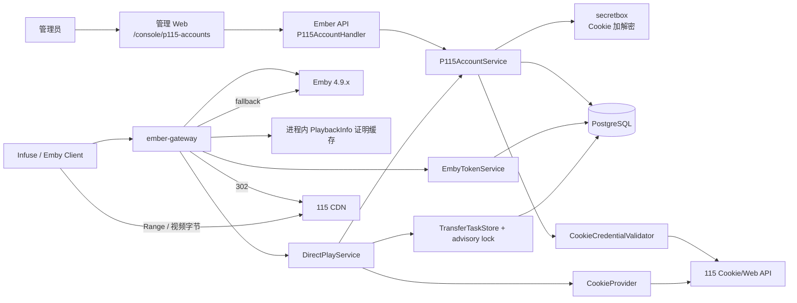
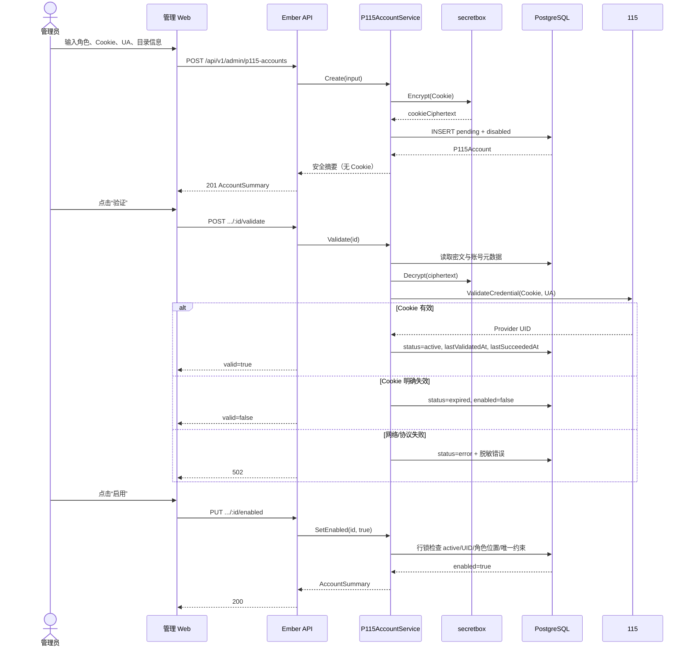
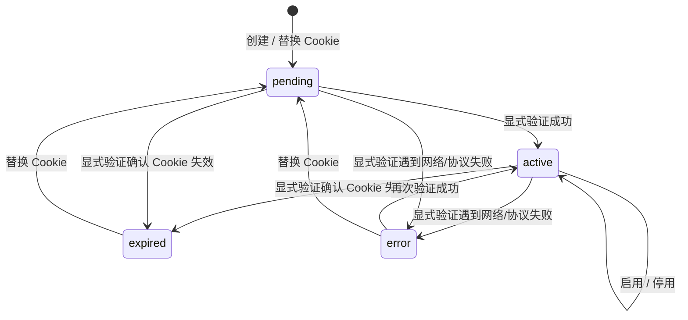
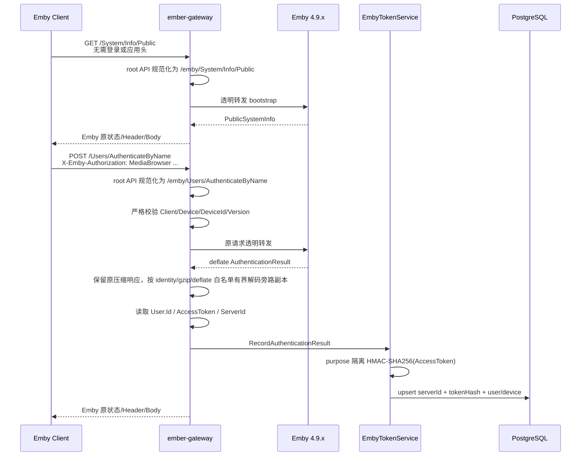
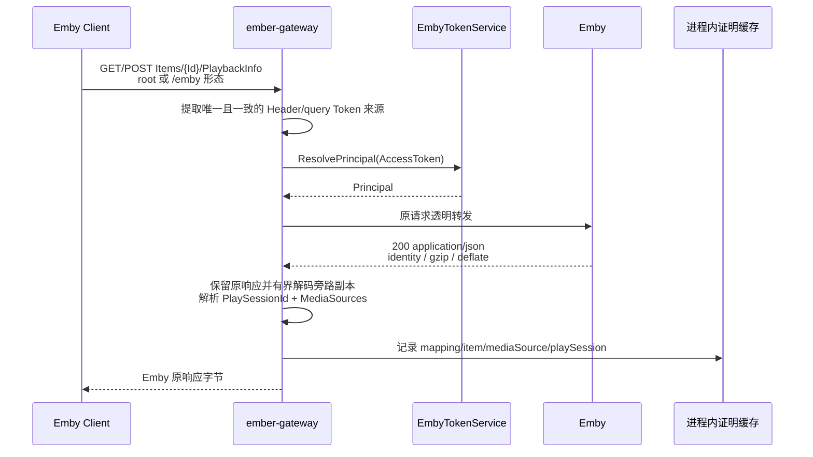
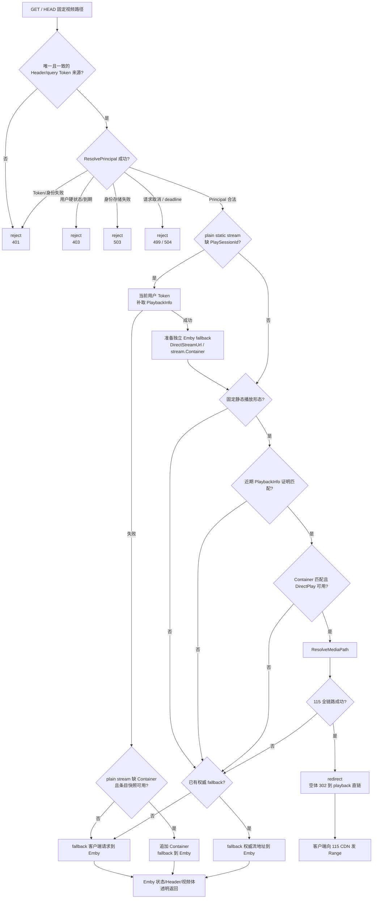
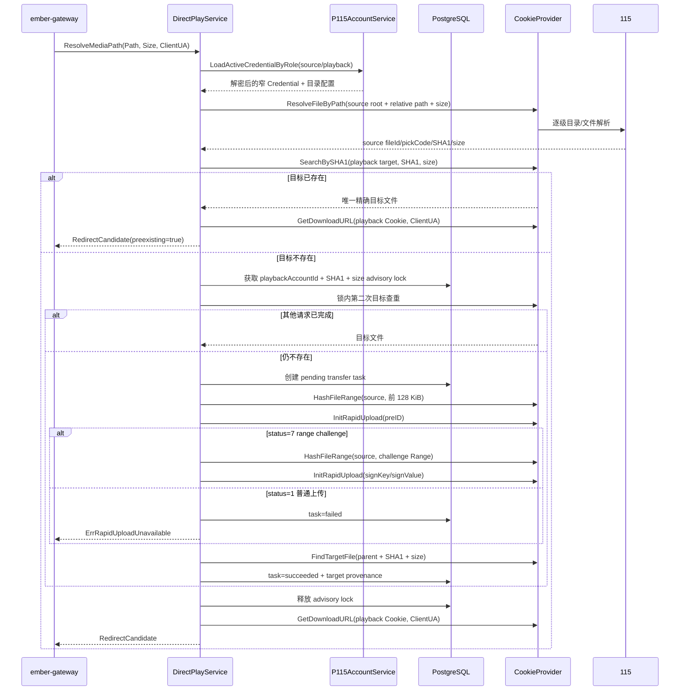
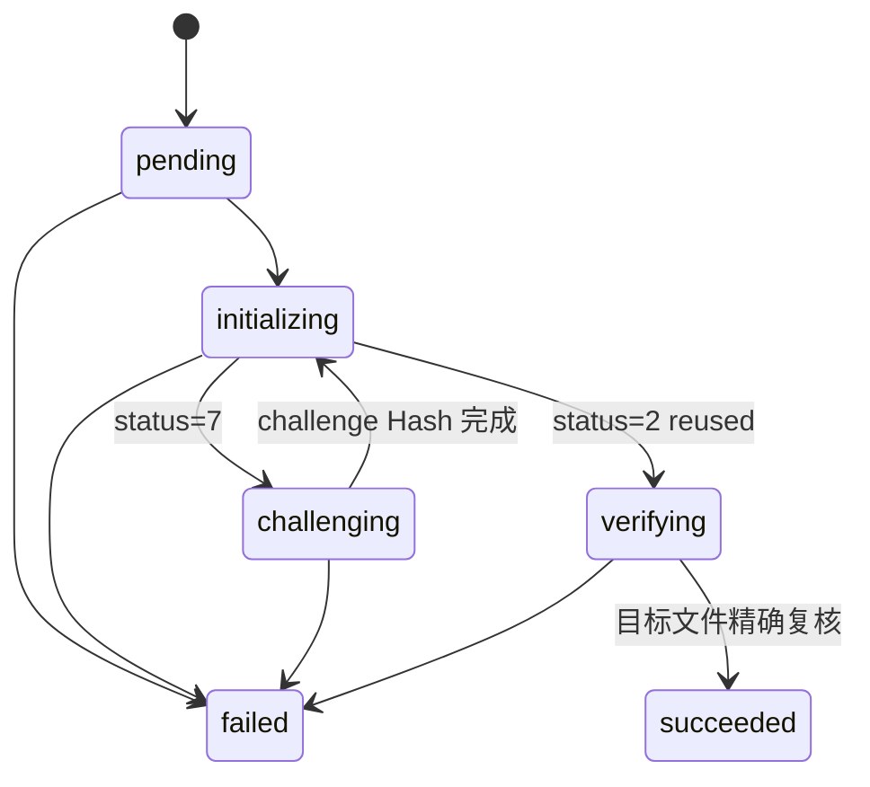

# 115 Cookie 直连播放端到端流程参考

本文档从当前代码出发，说明 Ember 的 115 Cookie 账号控制面、Emby 身份桥接、PlaybackInfo 短期证明、保留式秒传、302 直连、Emby fallback、安全 reject、持久化与日志边界。

它回答“现在实际怎么运行”，不替代协议合同和实施计划：

- Emby method/path/Header/DTO：看 [Emby 4.9 系列播放代理 API 合同](./emby-playback-proxy-contract.md)。
- 115 Cookie/Web API、上传加密和直链安全：看 [115 Cookie 播放兼容合同](./p115-cookie-playback-contract.md)。
- 尚未完成项和阶段安排：看 [Emby 115 直连播放网关实施计划](../plan/architecture/emby-115-direct-play-gateway.md)。

## 1. 核心原则

当前实现只有三种视频请求决策：

| 决策 | 条件 | 客户端结果 |
| --- | --- | --- |
| `reject` | Token/身份/用户硬状态失败 | Gateway 固定拒绝，不访问 Emby 或 115 |
| `redirect` | Principal、PlaybackInfo 证明、请求资格和 115 全链路均成功 | Gateway 返回空体 `302`，客户端直连 115 CDN |
| `fallback` | Principal 合法，但请求不适合加速或任一 115 步骤失败 | 原始请求透明代理到 Emby，保持正常播放 |

最重要的边界是：

> Emby 正常代理播放是基线，115 是可选加速。只有安全失败可以拒绝；合法用户不能因为没有 115 条件而失去正常播放能力。

## 2. 组件与职责



| 组件 | 当前职责 | 明确不负责 |
| --- | --- | --- |
| 管理 Web | 创建账号、替换 Cookie、显式验证、启停、配置 source 位置 | 不保存或回填 Cookie，不直接请求 115 |
| P115AccountService | 加密凭证、角色/状态/唯一性、活动账号加载 | 不做播放编排 |
| CookieProvider | 固定 Cookie/Web 协议、路径解析、查重、秒传、目标复核、下载 URL、Range Hash | 不做用户资格和 Gateway 决策 |
| EmbyTokenService | Token HMAC 映射、实时用户资格、软撤销 | 不保存 Token 明文，不替代 Emby Token |
| Playback Gateway | Emby 透明代理、身份门控、证明观察、视频决策、302/fallback/reject 日志 | 不持久化播放决策，不把 source Cookie/URL 给客户端 |
| DirectPlayService | source 解析、目标查重、保留式秒传、任务/锁、直链候选 | 不注册 HTTP 路由，不删除保留文件 |
| PostgreSQL | 账号密文、Token 摘要、transfer provenance、唯一约束与 advisory lock | 不保存完整 115 URL、Token 或播放证明 Path |

### 2.1 Gateway 启动边界

`ember gateway` 按 `InitDB → Migrate → VerifySchema → load ConfigService → GET /emby/System/Info → build EmbyToken/DirectPlay/Gateway → listen` 启动。只有目标 Emby 的 ServerId 非空，且四段数字 Version 满足 `>= 4.9.0.0 && < 4.10.0.0` 时才打开 Listener；`4.9.3.0` 是协议证据基线，不是唯一运行版本；`/health` 只在完整构造后可用。

Compose 的 `gateway` profile 复用 `ember-api` 镜像，只把 command 改为 `gateway`；Gateway 进程固定监听容器内 `8081`，Compose 再将可配置的宿主机回环端口映射到该端口。公网 HTTPS 和原始 Emby 网络隔离不由 Compose 自动完成。

## 3. 管理员账号控制面

### 3.1 两种账号角色

| 角色 | 用途 | 必填运行位置 |
| --- | --- | --- |
| `source` | 定位 Emby 原始文件并读取秒传所需的有界 Range | `embyPathPrefix + sourceRootId` |
| `playback` | 保存保留式秒传文件并签发最终客户端直链 | `targetParentId` |

运行期要求恰好存在一个 `enabled + active` source 和一个 `enabled + active` playback。数据库 partial unique 保证同一角色最多启用一条记录，并禁止同一 Provider UID 同时成为两个启用角色。

这两个账号是管理员配置的全局基础设施，不属于单个 Ember 用户；普通用户继续只使用自己的 Emby 账号，不绑定、不查看也不提供 115 Cookie。

### 3.2 创建、验证、启用时序



Cookie 替换会把账号重置为 `pending + disabled`，同时清空 Provider UID、验证时间、成功时间、冷却和错误字段；必须重新验证后才能启用。

### 3.3 账号状态



`enabled` 是独立布尔轴：`active` 不等于已启用。显式验证确认 Cookie 失效时会同时停用；网络/协议错误会把 status 改为 `error` 但保留 enabled，运行期查询仍因非 active 而拒绝，后续验证成功可自动恢复。`cooling_down` 虽已出现在模型、SQL 和 Web 状态文案中，但当前没有生产代码写入该状态，见“已知问题”。

## 4. Emby 登录与 Token 映射



关键语义：

- Emby 登录响应始终是客户端真相；旁路映射失败不能改写 Emby 成功响应。
- 固定 OpenAPI API family 的 root path 与已有 `/emby/...` 共用同一门控和处理器；family/前缀大小写不敏感，重复 `/emby/emby/...`、尾斜杠、额外层级和 alternate escaping 失败关闭，根 `/web/...` 留给后续 Web Surface 合同。
- `System/Info/Public` 是唯一不要求已映射 AccessToken 和应用头的登录前公开接口；Gateway 只规范化并透明转发，其他 bootstrap 不随之放宽。
- 数据库只保存 32 字节 Token HMAC，不保存 AccessToken 明文。
- 后续受保护请求按 [客户端兼容矩阵](./emby-client-compatibility-matrix.md) 收集 `X-Emby/X-MediaBrowser` 直接 Token Header、严格应用头和固定 query aliases；所有非空来源同值才接受，空值、重复、冲突和非法格式失败关闭。任意 Bearer、Quick Connect/PIN 不进入 Gateway 身份来源。
- Store 请求取消/deadline 分别返回 `499/504`，只有 driver 保证未发送到 PostgreSQL 的幂等读错误才重试一次；真正存储失败继续 `503` 并记录脱敏连接池统计。
- 用户停用、Emby 禁用、访问禁用、解绑/删除和设备强制退出会写本地软撤销；普通到期使用实时资格拒绝，不永久撤销映射。

### 4.1 用户条目 Container 快照

Infuse 可能不先调用 PlaybackInfo，而是在成功获取 `/Users/{UserId}/Items/{ItemId}` 后直接请求 `/Videos/{Id}/stream?MediaSourceId=...&Static=true`。Gateway 对用户和响应 Id 均匹配的条目 `200` 响应只缓存有界 Container：

```text
mappingId + itemId + mediaSourceId -> container
```

该缓存不包含 Token、Path、Size 或响应体，不是 115 授权证明。按需 PlaybackInfo 失败后，plain stream 仍完全缺少必填 Container 时，它才用于克隆正常 Emby fallback 并追加 Container；该降级分支不会进入 DirectPlay。

### 4.2 缺 PlaySessionId 的按需 PlaybackInfo

plain stream 带唯一 MediaSourceId 和 `Static=true`、但没有 PlaySessionId 时：

1. 先复用同一 mapping/item/source 最新、未过期的 PlaybackInfo 证明，并再次核对当前 server/user/Emby user/device 身份；身份变化时不得复用旧 PlaySessionId。
2. 未命中时使用当前用户 Token 请求内部 Emby `GET /Items/{Id}/PlaybackInfo?UserId=...`；不使用管理员 API Key，Token 不进入 URL。
3. 相同 key 的并发请求 singleflight 合并；调用固定 10 秒超时，等待方可独立取消。
4. 成功响应必须匹配 item/source 并提供 PlaySessionId/Container；合格 DirectPlay source 写入原证明缓存。
5. 分别准备两份请求：追加缺失参数的 115 决策请求，以及严格验证 `DirectStreamUrl` 后形成的正常 Emby fallback 请求。
6. DirectStreamUrl 缺失或无效时，正常 fallback 使用 Emby 官方 Web 的 `/Videos/{Id}/stream.{Container}`；只有扩展名也无法安全形成时才使用补齐后的 plain stream。
7. DirectStreamUrl 中的 URL Token 全部删除，改用当前用户 Token Header；原 method、Range、应用 Header 和非播放身份参数继续保留。
8. resolver 失败时不伪造参数，回到原请求或 4.1 的 Container 降级 fallback。

## 5. PlaybackInfo 短期证明



证明键固定为：

```text
mappingId + itemId + mediaSourceId + playSessionId
```

缓存包含 Principal 身份、`Path/Container`、Emby Size 观察值和 Direct Play 能力，TTL 5 分钟、最多 4096 条、仅当前 Gateway 进程可见。Emby Size 不参与 proof 或路径解析；进程重启、证明缺失/过期/错配只会失去 115 加速，合法请求仍 fallback Emby。

## 6. 视频请求决策



尝试 115 的请求当前必须同时满足：

- `GET` 或 `HEAD`；
- `/emby/Videos/{Id}/stream`、`stream.{Container}` 或 `{StreamFileName}`；
- 唯一非空 `MediaSourceId`；
- 唯一非空 `PlaySessionId`；
- 精确 `Static=true`；
- 请求容器与证明中的 Container 匹配；
- 证明中的 MediaSource 支持 Direct Play。

HLS/DASH manifest、转码分片、不完整参数、未映射路径、账号不可用、Provider 错误、秒传失败、目标复核失败、链接不兼容等都进入 fallback，不拒绝合法用户。

其中按需 PlaybackInfo 成功时会补齐真实 PlaySessionId/Container，并可能获得 115 `302`；115 不适用或失败时使用与决策请求分离的权威 Emby fallback。失败后 plain `/stream` 再命中近期用户条目快照时，固定记录 `fallback/route/container_recovered`，该降级分支不尝试 115。

## 7. DirectPlay 保留式秒传



### 7.1 Transfer task 状态



如果第一次查重直接命中外部预存文件，可以不创建 task；`preexisting=true` 仍允许播放。第一阶段所有 playback 文件都保留，Playing/Stopped/TTL 不调用 `DeleteFile`。

## 8. 302、fallback 与日志

### 8.1 302

- 只允许 playback 账号的直链成为客户端 `Location`。
- source 下载 URL 只允许在 Provider 内执行 preID/challenge Range。
- 候选必须是 HTTPS、允许的 hostname、未过期、并发信息有效，并且 HeaderMode 只允许 `none` 或 `same_user_agent`。
- `same_user_agent_and_cookie` 首期不兼容，不能向播放器泄露 playback Cookie。

### 8.2 fallback

fallback 复用原始 request，保留 method、path、query、Range、User-Agent、`X-Emby-Token`、应用认证 Header 和其他 Emby Header。fallback 表示 Gateway 选择了 Emby 路径，不代表 Emby 已经成功播放；日志需要结合 `statusCode/upstreamStatus/proxyErrorCode` 判断。

### 8.3 单条决策日志

每个固定视频请求在默认 Info 只打印一条播放决策；设置中心数据库项 `LOG_LEVEL=debug` 时才额外打印 Gateway 统一的 `request_completed` 请求摘要，API 保存后由 Gateway 下一次业务请求读取生效：

```text
level=info code=direct_play_redirect message="115直链成功" result=success statusCode=302 target=p115 targetState=created|reused
level=info|warn code=direct_play_fallback message="115直链失败，Emby回退成功|失败" directPlayResult=failure fallbackResult=success|failure
level=warn code=playback_rejected message="播放请求已拒绝" result=rejected
```

三类日志继续保留 `decision=redirect|fallback|reject`、固定 `stage/reasonCode` 和必要请求标识，便于机器检索。直链成功时 `targetState=created|reused` 明确区分首次转存与已有文件复用；DirectPlay 失败时仅允许记录固定 `providerOperation=resolve_source_path|hash_source_preid|rapid_upload|hash_source_challenge|rapid_upload_retry|verify_playback_target|search_playback_target|get_download_url`，账号加载失败只记录 `accountRole=source|playback`。这些字段来自内部类型化诊断，不接受 Provider 原始错误。

Debug 请求摘要记录有界 method/Host/原始 request path、query key、route、status/outcome/耗时和脱敏认证 Header 形态；Info 对响应级合同成立后的每个唯一 MediaSource 记录 `playback_info_media_source_observed`，完整显示合法 `mediaPath`、Size/播放能力和 proof 接受/拒绝原因。按需 PlaybackInfo 选中的路径即使没有形成 proof 也进入最终决策；真正进入 DirectPlay 后再记录 `embyPathPrefix/sourceRootId/mappedRelativePath`，以核对 Emby 原路径和 115 source 映射。与当前结果无关的空 `fallbackSource/upstreamStatus/proxyErrorCode/taskId` 和空映射字段不打印；Debug 不重复生成第二条决策。所有日志仍禁止 query value、Header 原值、Token、Cookie、完整 SHA1、115 URL、PlaybackInfo 原文或上游原始错误。当前明确不建日志表。

## 9. 数据与秘密边界

| 数据 | 存放位置 | 禁止位置 |
| --- | --- | --- |
| 115 Cookie 明文 | 创建/替换请求与调用栈内存 | 数据库、响应、日志、前端持久状态 |
| Cookie 密文 | `p115_accounts.cookie_ciphertext` | JSON 响应 |
| Emby AccessToken 明文 | 客户端 Header、Gateway 调用栈 | 数据库、日志、管理页面 |
| Token HMAC | `emby_access_tokens.token_hash` | JSON、日志、客户端 |
| Media Path | PlaybackInfo 进程内证明、DirectPlay 调用栈、已授权的持久观察/决策日志 | 数据库、公开 API、完整外部响应体 |
| SHA1 | Provider/DirectPlay、`playback_transfer_tasks` | JSON、普通日志与 URL |
| pickCode/fileId | Provider、成功 task provenance | 客户端响应、普通日志 |
| 115 下载 URL | 当前请求内存与 302 `Location` | 数据库、日志、API JSON |
| source Range 字节 | Provider HTTP body 内部 | Service、数据库、日志 |
| Gateway 请求摘要与播放决策 | 脱敏应用日志 | 数据库表 |

## 10. 当前验证证据

| 层级 | 已证明 | 没有证明 |
| --- | --- | --- |
| Go 单元/fake HTTP | 账号生命周期、Provider method/query/Header/响应、加密向量、Token aliases、Yamby 空数组、条目快照、按需 PlaybackInfo 的压缩/错配/失败/singleflight/证明复用、DirectStreamUrl Token 清理/Item 校验、扩展名 fallback、补全后 302、取消/deadline 和 Gateway 决策 | 真实 115 风控、SenPlayer/Yamby 等客户端实机行为和完整播放 |
| PostgreSQL 集成 | migration、账号唯一约束、Token 并发映射/撤销、transfer task、advisory lock、并发只秒传一次 | 多 Gateway 副本真实负载 |
| 2026-08-22 受控 115 检查 | source 只读、一次 challenge 秒传、目标复核、playback downurl/128 KiB Range、preexisting 复跑、文件保留 | Gateway/Infuse 端到端播放 |
| GitHub Actions 预览构建 | 单 `ember` 二进制 API 镜像可实际构建和推送 | 目标部署网络与原始 Emby 隔离 |
| Gateway/Infuse | 2026-08-23 已确认登录/普通资源 `200`、按需 PlaybackInfo `proofCount=1`，以及原始、Container-only、补齐参数后的 plain fallback 都返回 `404`。2026-08-29 Infuse `8.5.2` 的 `Size=0` 条目在解耦版本中确认 `proofAccepted=true`、source 路径映射、Provider Size 转存成功，并由 Gateway 首次及多次复用返回 `302`；Playing 返回 `204` | 115 CDN 实际媒体字节/Range、字幕、UA/IP 绑定、Progress/Stopped；连续请求后 `provider_unavailable` 的具体步骤需用新 `providerOperation` 复验，扩展名 fallback 当前仍返回 `404` |

自动化测试不得请求真实 Emby/115。真实验证必须使用测试账号/文件并取得明确授权，不能把 fake、数据库或一次性 Provider 检查表述为 Infuse 已可用。

## 11. 系统性审查结论

【品味评分】

🟡 凑合。安全边界、凭证隔离、版本范围、fallback 和 transfer 幂等设计是清楚的；但运行期健康状态、会话/策略和真实客户端验收仍没有闭环。

【致命问题】

- `P1-1`：Infuse 登录、普通资源、按需 PlaybackInfo、source 映射、首次转存和 Gateway `302` 已通过，但权威 DirectStreamUrl/扩展名 fallback 仍出现 `404`；115 CDN 字节、HEAD/Range、字幕和完整进度合同尚未闭环。
- `P1-2`：如果原始 Emby 公网入口未隔离，所有 Gateway 本地门控都可以被绕过。

【改进方向】

- 先部署新决策日志并用 `providerOperation` 定位连续请求后的 Provider 故障，再继续完成 115 CDN 字节、HEAD/Range、字幕、进度和 Emby fallback 合同验收。
- 随后收口账号运行期健康回写、冷却、会话/并发和容量治理。

问题总表：

| 优先级 | 问题 |
| --- | --- |
| `P0` | 本轮未发现 P0 |
| `P1` | `P1-1` 本地视频权威 Emby fallback 仍返回 404 且播放合同未闭环；`P1-2` 原始 Emby 旁路风险 |
| `P2` | `P2-1` 账号运行期健康未回写；`P2-2` 会话/策略/并发未实现；`P2-3` HEAD 探测副作用；`P2-4` 保留文件无容量治理；`P2-5` 两次历史 Store error 根因待新日志复验 |
| `P3` | `P3-1` playback 目录仍需手工填写内部 ID |

### P1

#### 【P1-1】本地视频权威 Emby fallback 仍返回 404 且播放合同未闭环

- 触发条件：Infuse 直接请求没有 Container/PlaySessionId 的 plain stream；原始、Container-only 和按需 PlaybackInfo 补齐参数后的 plain fallback 都由目标 Emby 返回 `404`。
- 实际后果：媒体库浏览与按需 PlaybackInfo 正常，115 不适用或不可用时本地视频仍无法播放。
- 定位：`services/api/internal/playbackgateway/playback_info_resolver.go`、`video.go`、`docs/reference/emby-playback-proxy-contract.md`。
- 建议：先用新 `providerOperation` 定位 115 连续请求失败步骤，并继续核对 `fallbackSource=playback_info_direct_stream|playback_info_extension_stream` 为什么由目标 Emby 返回 `404`；fallback 能稳定返回 `200/206` 后再完成 CDN Range、字幕和进度验收。
- 证据边界：三种 plain fallback、DirectStreamUrl 和扩展名 fallback 的 `404` 已由目标环境证明；URL Token 清理和失败边界有 fake 证据。Gateway `302` 已确认，但不证明客户端读取了 115 CDN 媒体字节。

#### 【P1-2】原始 Emby 公网入口未隔离时可以绕过 Ember 门控

- 触发条件：客户端仍能直接访问原始 Emby 地址。
- 实际后果：本地 Token 撤销、用户硬状态和 Gateway 日志全部可以被绕过。
- 定位：`infrastructure/docker/docker-compose.yml` 只提供 Gateway 回环端口；外部防火墙/反向代理隔离必须由部署者完成。
- 建议：Infuse 验收前先确认公网只有 Gateway 域名，原始 Emby 只允许内网或运维 allowlist。

### P2

#### 【P2-1】播放运行期没有回写账号失效、冷却和成功状态

- 触发条件：播放时 Cookie 失效、115 限流/网络失败，或直链/秒传成功。
- 实际后果：`p115_accounts.status/cooldownUntil/lastSucceededAt` 只反映显式验证，不反映真实播放；`cooling_down` 没有生产写入路径，连续视频请求会重复打 Provider，管理页面可能仍显示旧状态。
- 定位：`services/api/internal/services/directplay/service.go` 的账号接口只有 `LoadActiveCredentialByRole`；`P115AccountStatusCoolingDown` 仅定义于模型，仓库搜索没有运行期状态写入。
- 建议：增加窄 `AccountHealthReporter`，按类型化错误更新 expired/cooling/error/lastSucceededAt；冷却期间直接 fallback Emby，禁止逐请求探测。

#### 【P2-2】持久播放会话、套餐开关和 Gateway 并发尚未实现

- 触发条件：同一播放产生 HEAD、GET、Range、重连，或套餐需要限制 115 加速。
- 实际后果：当前只依赖短期证明和 transfer 锁；没有 `direct_play_sessions`、plan policy 或 Gateway 同时流限制，不能形成可审计的播放状态，也不能按套餐关闭/限流加速。
- 定位：`services/api/internal/playbackgateway/`、`services/api/internal/services/directplay/`；数据库没有对应 session/policy 表。
- 建议：Infuse 请求合同确认后再落 session migration、Playing/Progress/Stopped/TTL 和套餐策略，避免围绕错误的 PlaySessionId 行为建表。

#### 【P2-3】HEAD/预加载会同步进入完整 DirectPlay 流程

- 触发条件：播放器只做 HEAD 或预加载探测，但请求具备完整静态播放参数和证明。
- 实际后果：探测请求可能执行多次 115 查询，甚至触发保留式秒传和最长目标复核等待；没有 redirect cache/session 时，后续 GET 仍会再次解析 source、查重和签发 downurl。
- 定位：`services/api/internal/playbackgateway/video.go:61-119` 对 GET/HEAD 共用 `ResolveMediaPath`；`directplay.Service` 同步完成查重/秒传/复核。
- 建议：先通过 Infuse 实测确认 HEAD 顺序，再决定 HEAD 是否允许创建任务；至少按 accountId+pickCode+UA 增加短期直链缓存并与 session 归并。

#### 【P2-4】playback 文件无限保留但没有容量治理

- 触发条件：长期播放大量新内容。
- 实际后果：playback 专用目录持续增长；虽然不会误删正在播放的文件，但最终可能耗尽账号容量。
- 定位：DirectPlay 生产接口刻意不包含 `DeleteFile`，Stopped/TTL 没有清理调用方。
- 建议：保留首期“不自动删”不变；阶段 2 基于 `lastAccessedAt + 无活跃会话 + 容量水位` 做串行清理，默认 dry-run，并要求明确 provenance。

#### 【P2-5】两次历史 Token Store error 的底层原因仍需新日志复验

- 触发条件：Infuse 并发扫描 Items/Latest 时，旧日志分别在 `find_mapping` 和 `find_user_by_id` 记录 `*errors.errorString`。
- 实际后果：对应请求被误写为 `503 token_store_unavailable`；旧日志无法区分客户端取消、deadline、坏连接或未知存储错误。
- 定位：`services/api/internal/services/embytoken/store.go`、`services/api/internal/playbackgateway/gateway.go`。
- 建议：部署新分类后观察固定 `reasonCode` 与 pool 统计；`context_canceled/deadline_exceeded` 不再算 Store outage，只有最终真实存储错误才继续按 `503` 处理。没有新运行证据前，不把历史两次失败断言为连接池耗尽。

### P3

#### 【P3-1】playback 目标目录仍要求管理员手工填写内部 ID

- 影响：配置门槛高，容易填错，但运行时会失败关闭，不会回退到根目录。
- 定位：管理页面创建 playback 账号直接要求 `targetParentId`；`ResolveDirectoryByPath` 已存在但没有管理 API/Web 调用面。
- 建议：按现行计划新增 write-only Cookie 的目录解析接口，交互使用路径、运行时继续只信任 ID。

## 12. 建议的后续顺序

1. 部署通用客户端矩阵与 Token Store 分类，确认 Infuse 扫库不再出现误导性 `503`，并取得真实失败时的固定 reason/pool 证据。
2. 完成外部 HTTPS 和原始 Emby 隔离后，继续受控 Infuse 验收并固定 PlaybackInfo、视频、字幕和进度事件 fixture。
3. 接入账号运行期健康回写和冷却，避免 115 故障时逐请求重试。
4. 实现持久 session、事件/TTL、套餐开关和 Gateway 并发。
5. 在 session 可证明“无活跃播放”后设计保留文件容量治理。
6. 最后收口 playback 目录路径解析等管理员体验。
