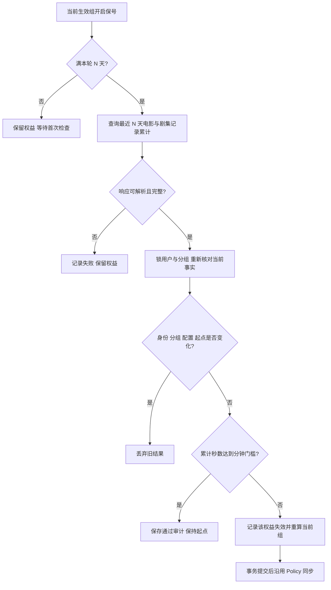

# 观看保号配置与排障

## 开启前

- 应用 `20261008_01_watch_retention.sql`；默认关闭，不会在升级时使存量权益失效。新建 `watch_retention_checks` 审计表，旧 SQL 不改写。
- 目标协议为 Emby 4.9.3.0 + Playback Reporting 2.1.0.7。2026-10-08 用户确认部署版本一致；本轮只用 mock 验证，未主动访问服务器。
- Emby 进程时区必须与 `CRON_TIMEZONE` 一致。插件须持续记录目标用户的 Movie/Episode，历史保留期至少覆盖最大的考核周期；插件停用、记录丢失或清理历史后，应先关闭考核、恢复完整采集，再重新开启并给予完整周期。
- **成功 SQL 不能证明此前没有丢失记录。** API 能拒绝 SQL 错误、缺列、畸形数值和不完整响应，但无法识别插件已经删除的历史；不得将本轮 mock 检查当作插件历史完整性验收。

## 分组与调度

分组只有三项可编辑规则：观看保号开关、考核周期天数、最低观看分钟数。周期默认 30 天，可配置 1..3650 天；分钟数关闭时可为 0，开启时必须明确填写 1..5256000。数值上限仅用于输入与存储约束，不代表插件实际保留能力。

设置中心的 `WATCH_RETENTION_SCHEDULE` 控制考核 cron，默认 `0 2 * * *`，受 `CRON_ENABLED` 总开关控制，使用 `CRON_TIMEZONE`，禁止在表达式中另设时区。修改后重启 API 生效；用户首次检查日期使用进程实际注册的表达式，避免提前展示尚未生效的新时间。总开关关闭时保留观看要求，但不展示首次检查日期或“每天检查”。

首次启用或修改分组周期/分钟门槛，会更新分组重开时间，使当前有效用户获得完整周期；未生效权益等实际接替再起算。重复保存相同配置不重置。关闭保号停止考核，不恢复已失效权益。

## 实际流转

正常付费组 B 生效时，保底组 A 不考核；A 实际接替时重开完整 N 天。再次从 B 回到 A 仍重新给 N 天。只考核当前生效组，其他持有权益不同时扣减资格。自然到期继续由既有到期任务处理。

统计按 `[执行时刻 - N 个业务日, 执行时刻)` 选取开始播放的记录，累计 `PlayDuration - PauseDuration`。多设备相加，不逐秒拆分跨窗口会话，不去除设备重叠；不使用排行榜快照或排行榜门槛。

查询在事务外执行；落库前重新锁用户和分组，核对 Emby 身份、当前组、期限、考核起点及规则。失效标记和当前组回退在同一事务提交，人工禁用/停用不被清除。其他有效组可接替，全部不可用时关闭资源访问。

## 查看与恢复

- 用户概览仅显示当前组要求；账号中心逐条展示开启保号的权益要求。文案使用“观看要求”，提供首次日期或每日检查提示，不使用“观察期”术语。
- `watch_retention_checks` 保存用户、组、窗口、本轮起点、周期、门槛、累计秒数和是否失效。`[WatchRetention]` 日志区分读取失败、统计失败、状态变化、考核落库和同步失败，不记录外部完整响应。
- 自动失效由 `user_entitlements.watch_retention_invalidated_at` 表示，与永久/限时类型独立。普通重算、关闭开关或后续观看不自动恢复。
- 重新购买相应组，或管理员通过现有权益操作明确授予/恢复，清除该组失效标记；实际生效时重新起算。购买其他组保留原组失效状态。
- Policy 同步失败保留已经提交的本地结果，使用既有失败任务与管理员重试；不能声称远端已成功禁用。

## 验证边界

本轮覆盖 Go mock/SQL mock、Web 单元与组件测试、Bot 格式化测试；新增 `TestIntegrationWatchRetentionLifecycle` 供专用 PostgreSQL 环境执行，验证迁移幂等、起算、失效不可复活与重新购买。2026-10-08 已从本机私有 `~/.config/zsh/local.zsh` 加载 `EMBER_INTEGRATION_DATABASE_URL`，在真实专用 PostgreSQL 上通过该用例及六项相关权益/换组/筛选/兑换回归，临时 schema 自动清理。未启动服务，未验证真实播放或浏览器。
